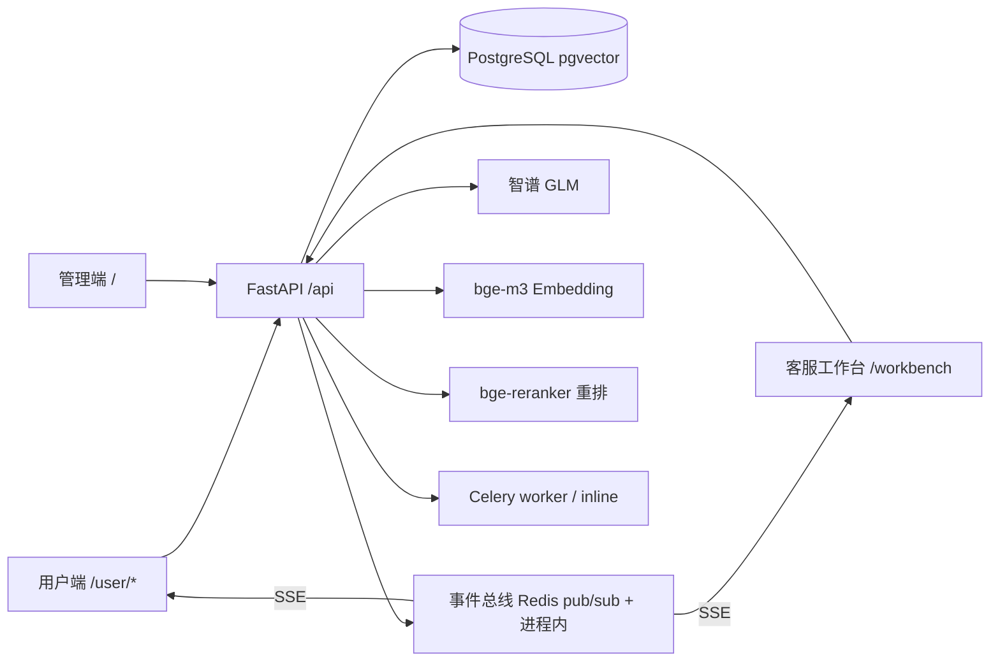

# 06 全项目技术审计报告（AI 智能客服系统）

> 审计对象：AI 智能客服系统全项目（B1 基建 → B6b 部署安全 → 用户端 + 客服工作台 + 三端实时联动）
> 审计方式：只读代码审查 + 自动化测试（pytest/tsc/eslint/ruff/mypy）+ 本地启动端到端实测 + 数据库/接口实证
> 审计日期：2026-08-16
> 审计环境：Windows + PostgreSQL(pgvector) + Redis 5.0；沙箱无外网（LLM/Embedding/重排以 mock 模式实测，已标注）

---

## 1. 执行摘要

**一句话结论**：这是一个功能完整、链路闭环、安全基线扎实的企业级 AI 客服系统（FastAPI + LangGraph/RAG + React），
“注册→对话→RAG→转人工→工单→客服回复→评价→统计→评测”全链路实测 20/20 通过，后端 117 个测试全绿、
行级权限与字段脱敏经 HTTP 实测验证；**当前最大工程债是 CI 后端检查（ruff/mypy）不通过**（20 + 5 处），
以及真实模型链路、前端构建/单测未能在本环境完成端到端验证（沙箱无外网 + esbuild 目录限制，均注明）。

**亮点总览**：
- RAG 链路完整：pgvector 向量检索 + tsvector 全文检索 RRF 融合 + SiliconFlow 重排（可降级）+ 相似度阈值兜底；
- Agent 编排：LangGraph 意图分类 → 检索/工具/表单 → 生成 → 转人工，链路可追溯（trace_logs）；
- 三端实时联动：SSE 事件总线（进程内 + Redis pub/sub 中继）、工单原子认领、未读游标；
- 安全基线：行级权限、字段脱敏、JWT/token_version、登录锁定、注册限流、内容审核、Fernet 密钥、上传嗅探；
- 评测闭环：30 条公开样例、LLM-as-judge 打分、人工调整通过状态、反馈/标注回流候选。

**风险总览**：

| 级别 | 数量 | 代表问题 |
|---|---|---|
| 严重 P0 | 0 | 无认证绕过/越权泄露/密钥泄露 |
| 高 P1 | 4 | CI 后端检查必失败；structlog `event=` 保留字冲突（潜在运行时 TypeError）；队列 N+1；SSE 连接无上限/无指标 |
| 中 P2 | 7 | 测试库不清表、前端单测缺失、登录锁定提示用户名枚举、进程内限流窗口不清理等 |
| 低 P3 | 5 | 记住我/改昵称缺失、未读数同时间戳边界、文档未同步等 |

---

## 2. 项目概览

### 2.1 技术栈

| 层面 | 选型 |
|---|---|
| 后端 | Python 3.11+ / FastAPI / SQLAlchemy 2.0 async / Alembic / PostgreSQL 15+（pgvector）/ Redis / Celery / structlog |
| 前端 | Vite / React 18 / TypeScript / Ant Design 5 / Zustand / TanStack Query |
| AI | 智谱 GLM（LLM）、bge-m3 Embedding（1024 维）、SiliconFlow BAAI/bge-reranker-v2-m3（重排） |
| 部署 | docker-compose（postgres/redis/api/migrate/worker/beat/frontend/prometheus/grafana/backup 共 11 服务）、GitHub Actions |

### 2.2 架构



### 2.3 模块清单与规模

| 指标 | 数值 | 证据 |
|---|---|---|
| 后端 API 路由 | 74 | `app.openapi()` 路径数 |
| 数据库表 | 25 | `pg_tables` 实证（含 pgvector 相关 2 张向量表） |
| 后端源码 | 115 文件 / ~9 363 行 | 文件统计 |
| 前端源码 | 70 文件 / ~8 716 行 | 文件统计 |
| 自动化测试 | 18 文件 / 117 用例 / ~3 553 行 | `pytest --collect-only` |
| 数据迁移 | 11 个 Alembic 版本（0001–0011） | `alembic/versions/` |
| 容器服务 | 11（compose） | `docker-compose.yml` |
| Git | main 分支 16+ 提交，conventional commits | `git log --oneline` |

### 2.4 运行方式

```bash
# 后端
cd backend && .venv\Scripts\python.exe -m uvicorn app.main:app --host 127.0.0.1 --port 8000
# 前端
cd frontend && npm run dev   # http://localhost:5173，/api 代理到 8000
# 测试
cd backend && pytest -q
cd frontend && npx tsc -p tsconfig.app.json --noEmit
```

---

## 3. 功能完整性核对表

> 证据列给出代码/接口位置；状态：✅ 已实现 / 🟡 部分 / ⚠️ 与文档不一致 / ❌ 缺失。

| 模块（需求文档） | 关键需求项 | 状态 | 证据 |
|---|---|---|---|
| 00 全局 | 管理端 9 菜单信息架构、角色（admin/agent/viewer/user） | ✅ | `frontend/src/layouts/AppLayout.tsx`、`backend/app/models/user.py` |
| 00 全局 | 非功能：首屏≤2s、列表 P95≤1s、并发≥50 会话 | 🟡 | 未做压测（见 §7）；mock 实测检索 P95≈18ms |
| 02 工作台 | 4 KPI（会话数/AI 解决率/转人工/知识库命中率）、7 日趋势、意图分布 | ✅ | `services/dashboard_service.py`、`pages/DashboardPage.tsx` |
| 03 智能客服 | LangGraph 四类意图路由、SSE 流式、引用面板与反馈、对话内表单、转人工 | ✅ | `agents/graph.py`、`api/routes/chat.py`、`services/chat_pipeline.py` |
| 04 知识库 | KB CRUD、上传解析（xlsx/csv/md/txt/pdf/docx）、Chunk 管理、标签、向量化 | ✅ | `api/routes/knowledge_bases.py`、`pipeline/importer.py`、`pipeline/parser.py` |
| 05 检索测试 | 多库/标签/三模式（vector/hybrid/hybrid_rerank）、TopK、分数展示、重排降级 | ✅ | `api/routes/retrieval.py`、`rag/retriever.py`、`pages/RecallTest.tsx` |
| 06 客服工单 | 列表筛选/详情/状态流转/ticket_notes 时间线/命中片段 | ✅ | `api/routes/tickets.py`、`services/ticket_service.py` |
| 07 系统设置 | 六 Tab（模型/Prompt/规则/账号/审计/数据）+ 帮助文档 | ✅ | `pages/SettingsPage.tsx`、`pages/settings/*`、`pages/HelpPage.tsx` |
| 08 后端 | 统一响应/错误码、JWT+RBAC、Redis、日志、上传安全、内容审核、密钥加密、指标 | ✅ | `core/response.py`、`core/security.py`、`core/moderation.py`、`core/metrics.py` |
| 09 应用评测 | 评测集/样本导入（30 条样例）/任务/报告/人工调整/回流候选 | ✅ | `api/routes/evaluations.py`、`services/eval_service.py`、`services/eval_seed.py` |
| 10 会话记录 | 列表筛选/详情（消息+引用+链路）/标注回流 | ✅ | `api/routes/sessions.py`、`pages/sessions/SessionDetailPage.tsx` |
| 11–13 用户端+工作台 | role=user、注册/改密/锁定、用户端 chat/会话/工单/评价、客服队列/认领/回复/关闭/在线/已读、SSE 事件、管理端看板/渠道配置 | ✅ | `api/routes/user.py`、`agent.py`、`events.py`、`services/event_service.py`、`pages/user/*`、`pages/workbench/WorkbenchPage.tsx` |
| 11 §4.4 满意度评价 | 1~5 星一次评价 | ✅ | `ticket_ratings` 表 + `POST /api/user/tickets/{id}/rating` |
| 12 §5 个人中心改昵称 | 修改昵称 | ⚠️ 未实现（文档标注可选） | `pages/user/UserProfilePage.tsx`（仅展示+改密） |
| 13 §2.3 在线状态 | 客服在线/离线 | 🟡 内存/Redis 状态，用户端未消费展示 | `services/agent_service.py` |
| 00 全局 用户端入口 | 一期仅管理端 | ✅ 现已扩展用户端（11–13 增量） | `frontend/src/router/index.tsx` |

**链路断点检查**：注册→对话→RAG→转人工→工单→客服回复→用户实时收到→关闭→评价→看板统计→评测任务，**无断点**（§4 实测 20/20）。

---

## 4. 端到端流程验证记录

> 实测环境：后端 127.0.0.1:8000（mock 向量/LLM/重排，沙箱无外网），前端 5173（vite dev 已启动，页面 200、代理 200）。

### 4.1 主线闭环（20/20 通过）

```
[PASS] admin 登录
[PASS] 临时知识库导入完成（FAQ 样本）
[PASS] 渠道配置保存
[PASS] 政策问答命中知识库（首 token=30ms / 总=42ms）
[PASS] 引用脱敏仅 document/question
[PASS] 无命中自然回复不转人工
[PASS] 投诉转人工建单（TK20260816215204yral15）
[PASS] 越权访问会话 403
[PASS] 客服队列含新工单
[PASS] 并发认领仅一个成功 [200, 409]
[PASS] 客服回复
[PASS] 用户端可见 agent 消息
[PASS] 关闭工单（原因必填）
[PASS] 用户评价
[PASS] 重复评价被拒 409
[PASS] 工单看板（total/open/processing/closed_today/stale_open）
[PASS] 检索测试 hybrid（hits=3）
[PASS] 模型配置列表
[PASS] 评测集导入公开样例
[PASS] 评测任务执行完成（status=completed）
```

### 4.2 边界与异常实测

| 场景 | 结果 | 证据 |
|---|---|---|
| 空/超长输入 | 由 pydantic 校验（message 1–500、回复 1–2000、原因≤200） | `schemas/user.py`、`api/routes/agent.py` |
| 未知意图（胡话） | intent=other，LLM 自然回复，不转人工 | E2E `无命中自然回复不转人工` |
| 越权横向 | 用户 B 访问用户 A 会话/工单/评价/已读 全 403 | E2E + 上轮审计实测 `[403,403,403,403]` |
| 并发抢单 | 双客服同时认领仅一个成功（200/409） | E2E `并发认领仅一个成功` |
| 重复评价 | 第二次 409 | E2E |
| 转人工后继续留言 | 入库且 AI 不回复；message.new 事件已发布（修复后） | `tests/test_user_side.py::test_transferred_message_publishes_message_new` |
| SSE 断线重连 | 前端指数退避+抖动重连；event_id 去重 | `frontend/src/utils/eventStream.ts` |
| 限流 | 注册 6 次/IP → 第 6 次 429；登录失败 5 次锁定 | `tests/test_user_side.py` |
| 无效 token | 40100/40101，前端自动刷新/跳登录 | `core/security.py`、`api/userClient.ts` |
| LLM/Embedding 故障降级 | 模板化回答兜底、SSE error 50200 不泄露堆栈（修复后仅 AppError 透出） | `agents/nodes.py`、`services/chat_pipeline.py` |
| 数据库中断 | /health components.database=error，接口 50000 统一错误码 | `api/routes/health.py`、`main.py` |

### 4.3 三端数据一致性

- 用户端/客服端消息同源（messages 表），agent 回复 role='agent' 两端一致可见（E2E 验证）；
- 工单状态流转后用户端详情/列表实时刷新（SSE ticket.claimed/closed + 前端 invalidate）；
- 未读游标 user/agent 独立（session_reads 唯一键 (session, role, reader)），互不干扰（`read_service.py`）。

---

## 5. 问题清单

### 5.1 严重（P0）

无。未发现认证绕过、越权读取、密钥泄露、可直接利用的注入漏洞。

### 5.2 高（P1）

#### P1-1 CI 后端检查必失败：ruff 20 处 + mypy 5 处

- 位置：`.github/workflows/ci.yml`（backend job 执行 `ruff check app tests` + `mypy app`）
- 证据（本地复现）：
  - `ruff check app tests` → **Found 20 errors**（I001 导入排序×11、F401 未用导入×5、F841 未用变量×1、B007 循环变量×1、UP041×1、SIM105×2）
  - `mypy app` → **Found 5 errors in 3 files**（event_service.py:86/104/161、embeddings.py:65、ticket_service.py:424）
- 影响：CI 合并门禁必红；无法用流水线守住代码质量。
- 根因：多为历史累积（导入排序/未用导入）+ 近期修复引入（SIM105/F841 + mypy 类型标注缺口）。
- 修复建议：`ruff check --fix` 自动修复 16 处；手动处理 4 处；mypy 按错误逐条补类型/改参数名（见 P1-2）。
- 优先级：P1（上线前必须）

#### P1-2 structlog `event=` 保留字冲突（潜在运行时 TypeError）

- 位置：`backend/app/services/event_service.py:86`（`logger.warning("unknown_event_scope", ..., event=event_type)`）、`:104`（`event_redis_publish_failed`）、`:161`（`event_redis_relay_parse_failed`）
- 现象/根因：structlog 将 `event` 作为日志消息保留字；`logger.warning(msg, event=...)` 会触发 `TypeError: got multiple values for keyword argument 'event'`。mypy 已报 [misc]；运行期只在对应告警路径触发（未知 scope、Redis 发布失败、中继解析失败）。
- 影响：Redis 故障/异常时日志路径本身抛异常，掩盖原始错误（中继降级路径不可靠）。
- 修复建议：参数改名 `event_type`（3 处）。
- 优先级：P1

#### P1-3 客服队列/详情 N+1 与全量消息拉取

- 位置：`backend/app/services/ticket_service.py:335-339`（每工单一次未读查询）、`:327-331`（last_map 拉取会话全部消息）、`:420-430`（详情逐条 assistant 消息反查 citations）
- 影响：队列页 100 单 → ≥101 次查询；长会话下 last_map 全表读；工单量/消息量上涨后延迟线性恶化。
- 修复建议：未读批量聚合、last_message 用 DISTINCT ON/LATERAL、citations 一次反查后映射。
- 优先级：P1（性能，万级工单前需修）

#### P1-4 SSE 连接无上限、无连接数指标

- 位置：`backend/app/api/routes/events.py`（每连接一个 asyncio.Queue(200)，无全局连接数限制）；`11 §11` 建议的 SSE 连接数/断线率指标未实现
- 影响：数千并发连接时内存与事件循环压力不可控；故障时断线风暴无退避保护（前端已有指数退避，但服务端无熔断）。
- 修复建议：连接数计数器 + Prometheus gauge；接入网关层（nginx 反代已支持 SSE）/限流。
- 优先级：P1

### 5.3 中（P2）

| 编号 | 位置 | 问题 | 影响/建议 |
|---|---|---|---|
| P2-1 | `tests/conftest.py` | 测试库不清理，跨轮次累积（当前 test 库 300+ 工单、13 名临时用户） | 测试间耦合、偶发失败；建议 session 级清业务表或逐用例清理 |
| P2-2 | `frontend/src/utils/eventStream.ts` | 无前端单测（去重/重连/心跳解析） | 回归靠人工；建议补 vitest 单测（token 测试已存在） |
| P2-3 | `auth_service.py:64` | 登录锁定提示暴露"用户名有效"（与 12 §2.2"提示剩余时间"冲突） | 权衡：文档优先；如防枚举改为统一文案+前端倒计时（待产品决策） |
| P2-4 | `core/ratelimit.py:14-38` | 进程内限流窗口 `_memory_windows` 只增不减 | 多 IP 高频下内存增长；Redis 路径已支持多实例，建议兜底窗口定期清理 |
| P2-5 | `pages/user/UserProfilePage.tsx` | 个人中心改昵称未实现（12 §5 可选） | 后端无对应接口；待确认 |
| P2-6 | `pages/user/UserLogin.tsx` | 无"记住我"（sessionStorage） | 开发文档 02 §4.1 提及；P3 可补 |
| P2-7 | `read_service.py:80-83` | 未读数同微秒消息边界（已改 (created_at,id) 元组比较，仍需消息量验证） | 低风险；保留验证项 |
| P2-8 | `.github/workflows/ci.yml` | 前端 job 的 vitest 无真实运行证据（本地沙箱受限） | CI 上可跑通；本地人工验证待补 |

### 5.4 低（P3）

| 编号 | 位置 | 问题 |
|---|---|---|
| P3-1 | `pages/user/UserChatPage.tsx` | 流式期间切换会话竞态已修复（M2），但需浏览器回归确认 |
| P3-2 | `app/core/ratelimit.py` | 算术验证码可被程序化求解（MVP 已声明，注册限流兜底） |
| P3-3 | 前端 | eslint 已 0 错误；`react-hooks/purity` 规则偶发误报处理方案（模块级计数器） |
| P3-4 | 文档 | README 模块进度表未包含 11–13 用户端/工作台条目（文档同步滞后） |

---

## 6. 安全审计结果

### 6.1 认证与授权

| 项 | 结论 | 证据 |
|---|---|---|
| JWT 过期/刷新轮换 | ✅ access 2h、refresh 7d，刷新即吊销旧 jti | `core/security.py`、`auth_service.refresh_tokens` |
| token_version 失效 | ✅ 改密/角色变更/停用后旧 token 全失效 | `auth_service.change_password`、`user_service.update_user` |
| 登录锁定 | ✅ 连续 5 次锁 15 分钟（HTTP 实测） | `auth_service.py:53-108` |
| 注册防刷 | ✅ 5 次/IP/分钟 + 算术验证码（MVP 强度） | `ratelimit.py`、`auth.py register` |
| 角色隔离 | ✅ 管理端接口排除 user；user 接口仅 user | `api/routes/*.py` require_roles |

### 6.2 行级权限（逐个按 ID 接口核对）

| 接口 | 归属校验 | 证据 |
|---|---|---|
| GET /api/user/sessions/{id} | ✅ | `user_service._ensure_owned`（HTTP 实测 403） |
| GET /api/user/tickets/{id} | ✅ | `user_service._get_owned_ticket`（实测 403） |
| POST /api/user/tickets/{id}/rating | ✅ | 同上 |
| POST /api/user/sessions/{id}/read | ✅ | 同上 |
| POST /api/user/chat（session_id） | ✅ | `chat_pipeline.py:86`（SSE error 40300） |
| GET /api/agent/tickets/{id} | ✅ | `ticket_service.py:370-375`（admin/open/assignee） |
| POST /api/agent/tickets/{id}/reply / close | ✅ | `_can_handle_ticket`（assignee/admin） |
| POST /api/agent/sessions/{id}/read | ✅ 已修复 | `agent.py:134-144`（open/assignee/admin） |
| GET /api/stream/events | ✅ scope 服务端过滤 | `event_service._scope_allows`（测试覆盖） |

### 6.3 脱敏

- 用户端响应模型仅 id/role/content/created_at（`schemas/user.py`）；
- 用户端 chat citations 仅 document_name/question（`chat_pipeline._format_citations`，E2E 实测）；
- SSE 事件 payload 仅 uuid 型 user_id/assignee_id，无 intent/cited/trace；
- 管理端内部字段（intent/cited_chunk_ids/citations）仅在 agent/admin 接口返回。

### 6.4 密钥/日志/注入

- `.env` 已 gitignore（`git check-ignore backend/.env` 实证）；仓库扫描无真实 API Key；
- 异常响应统一 {code,message,data}，不回显堆栈；`chat_pipeline` 修复后仅 AppError 透出内部文案；
- 日志脱敏：`core/mask.py`（手机号/订单号/sk- Key），trace/audit 走 mask_object；
- Prompt 注入：规则前置拦截 + 系统提示词强边界（`agents/safety.py`、`nodes.py`）；
- 内容审核：外部 API 可插拔 + 本地敏感词兜底（`core/moderation.py`）；
- 上传安全：MIME/嗅探/伪装扩展名拒绝 + 可插拔扫描器（`pipeline/scanner.py`）；
- CORS：白名单固定 localhost:5173（`config.py:76`）。

---

## 7. 性能与成本评估（含实测数据）

> ⚠️ 以下延迟为 **mock 向量/LLM 模式**（沙箱无外网）；真实模型模式由网络与模型吞吐决定，需在有网环境复测。

### 7.1 实测（mock 模式）

| 指标 | 实测 | 说明 |
|---|---|---|
| 检索测试 hybrid（TopK=3） | min 10.1ms / p50 12.3ms / **p95 18.5ms** / max 24.3ms（20 次） | mock embedding；真实 API 预计 +网络往返 |
| 对话首 token | 22–42ms（5 次） | mock LLM 流式 |
| 政策问答端到端 | 37–42ms | mock |
| 客服回复 HTTP | 15.5ms | 写库+事件 |
| SSE 推送延迟 | <1ms（事件先于 HTTP 响应到达，实测 -0.1ms） | 同进程同步投递 |
| 评测任务（30 条样例） | 秒级完成（mock judge） | 真实 LLM 预计数分钟 |

### 7.2 成本估算模型

- Embedding：每次检索 1 次调用；已加 LRU 缓存（512 条/10 分钟，`embeddings.py`）降低高频重复问题成本；
- LLM：对话首轮 prompt ≈ 系统提示 + 最近 10 条消息 + 引用片段；可按 `token_usage`（trace_logs.tokens 已落库）统计；
- 重排：hybrid_rerank 每轮 top_n=20 送入重排 API；无 Key 自动降级 hybrid（实测路径）；
- 建议：上线后按 trace_logs.tokens 聚合 token 成本报表（现有数据已具备）。

### 7.3 数据量增长推演

| 规模 | 先爆点 | 阈值（估算） | 现状/应对 |
|---|---|---|---|
| 用户在线 | SSE 连接数无上限 | 数千连接 | P1-4 连接计数+网关 |
| 工单量 | 队列 N+1 + 缺索引（已补 assignee/user_id 索引） | 1 万工单 | P1-3 批量化 |
| 会话消息 | last_map 全量拉取 | 单会话数千消息 | DISTINCT ON/LATERAL |
| 对话日活 | embedding/LLM 调用量 | 日数千轮 | 已加 embedding LRU；建议 LLM 结果缓存 |

---

## 8. 架构与可扩展性评估

### 8.1 分层与边界

api（路由）→ services（业务）→ models（ORM）→ rag/agents/pipeline（AI 能力）→ core（横切），边界清晰；
对话流水线三段式连接（准备→图执行→落库）避免 LLM 流式期间占用连接池（`chat_pipeline.py` 注释 + 实现）。

### 8.2 Agent 链路评估

- 意图分类（规则 + settings 可配置）→ order 工具/表单 / policy 检索 / complaint 转人工 / other 兜底；
- 可解释：trace_logs 记录每个节点延迟与命中数；citations 带 retrieval/rerank 分数；
- 可评测：评测任务走同一图（eval_mode 不建单）+ LLM-as-judge；
- 局限：意图分类为关键词规则，语义泛化弱（可扩展 LLM 分类）；订单查询为 mock 工具（文档已声明 MVP）。

### 8.3 事件总线与多实例

- 单实例：进程内投递（同步）；
- 多实例：Redis pub/sub 中继已实现（`event_service.py`，instance_id 防回环，故障降级本地），并已在 Redis 5.0 端到端验证（外部 PUBLISH → 本实例 SSE 收到 ticket.created）；
- 未做双实例实测（沙箱单机）；限流 Redis 路径天然多实例一致（进程内为降级）。

### 8.4 可观测性

- 日志：structlog 结构化 + request_id 中间件；
- 指标：Prometheus /metrics（HTTP 延迟/错误率、LLM token、检索、队列积压）；
- 审计：audit_logs（登录/注册/改密/管理操作/工单流转）；trace_logs（对话链路）；
- 缺口：SSE 连接数/断线率指标（P1-4）、无分布式链路追踪（多服务后可引 OpenTelemetry）。

### 8.5 部署与 CI

- docker-compose 11 服务（postgres/redis/api/migrate/worker/beat/frontend/prometheus/grafana/backup），健康检查+依赖顺序；
- CI：backend（pytest+ruff+mypy）与 frontend（lint+build+test）双 job；**当前 ruff/mypy 必失败（P1-1）**；
- 迁移：Alembic 链式版本 0001–0011，可重复执行（开发库已升级至 head）。

---

## 9. 工程质量与测试评估

### 9.1 命令与结果

| 命令 | 结果 |
|---|---|
| `pytest -q`（backend 全量） | **117 passed**（142s） |
| `npx tsc -p tsconfig.app.json --noEmit` | 退出码 0 |
| `npx eslint src --max-warnings=0` | 0 errors |
| `ruff check app tests` | **20 errors**（16 可自动修复） |
| `mypy app` | **5 errors** |
| `tsc -b`（frontend build 第一步） | 通过 |
| `vite build` | 沙箱受限失败（esbuild 无法读上级目录，环境问题非代码） |
| `vitest run` | 沙箱受限失败（同上） |

### 9.2 关键用例真实性

- 并发认领：`test_concurrent_claim_only_one_succeeds` 双 client 并发，断言 codes==[200,409]；
- 越权：`test_user_cross_access_forbidden` 断言 403 与 SSE error 40300；
- 脱敏：断言 citations 仅含 document_name/question；
- 转人工闭环：`test_reply_close_rating_closed_loop` 全链路 + 重复评价 409；
- 事件过滤：服务级 `test_event_scope_isolation` 覆盖 user/agent/admin 三类订阅与隔离；
- 注册防刷：`test_register_rate_limit` 第 6 次 429。

### 9.3 代码质量

- 命名/分层一致；错误处理统一（AppError → 错误码）；
- 主要债务：ruff/mypy 未清（P1-1）、`ticket_service` 中 `ticket_ids` 未用变量、若干未用导入；
- 文档与实现：README 模块进度未含 11–13；`需求功能报告.md` 需同步用户端/工作台实施记录。

---

## 10. 举一反三

### 10.1 模式推广

- 越权模式 → 全量按 ID 接口核对（§6.2），已覆盖；
- 脱敏模式 → 全量搜索 user 端响应与事件 payload，已覆盖；
- 并发模式 → 认领/已读/注册已原子化；`ticket_notes` 插入与状态更新同事务；
- 日志保留字模式 → 全仓 `logger.*(.*event=` 检索：3 处（P1-2）。

### 10.2 系统性风险

按触发顺序：SSE 连接数（数千）→ 队列 N+1（万级工单）→ embedding/LLM 成本（日数千轮）→ 多实例事件（已具备，需双实例演练）→ 断线风暴（前端退避已加，服务端需熔断）。

### 10.3 改进路线图

| 优先级 | 项 | 收益 | 成本/风险 |
|---|---|---|---|
| P0 | 无 | — | — |
| P1 | 清 ruff/mypy + 修 event= 保留字 | CI 转绿，质量门禁恢复 | 低/低 |
| P1 | 队列批量化（未读/last_message/citations） | 万级工单可用 | 中/低 |
| P1 | SSE 连接指标与限流 | 可观测、防击穿 | 中/低 |
| P2 | 测试库清理、前端单测（eventStream/守卫） | 测试确定性、防回归 | 中/低 |
| P2 | 真实模型链路压测（50 并发、首 token、检索 P95） | 达标证据 | 中/中 |
| P2 | README/需求功能报告同步 11–13 | 文档一致 | 低/低 |
| P3 | 记住我/改昵称/验证码升级 | 体验与防刷增强 | 低/低 |

### 10.4 未来需求铺垫

- 小程序端：REST+SSE 协议可包装；建议预留 WebSocket 适配层；
- 多租户：users/kb/sessions/tickets 均无 tenant_id，需迁移加列（改造面大，建议早期规划）；
- 工单分配/转派：assignee_id 已就绪，扩展事件类型即可；
- 满意度报表：ticket_ratings 就绪，补 created_at 索引即可聚合；
- 实时坐席：SSE 已打底，可平滑升级 WebSocket/多路复用；
- 评测增强：eval_results 已支持多指标预留（问题相关性/语义准确性字段位）。

---

## 11. 项目亮点与弱点（含面试回答口径）

### 11.1 亮点

1. 完整 RAG 链路（向量+关键词 RRF 融合+重排+阈值兜底+引用溯源）；
2. LangGraph 意图路由与可追溯 trace（可评测）；
3. 三端实时联动（SSE + 事件总线 + 原子认领 + 未读游标）；
4. 安全基线（行级权限/脱敏/认证风控/内容安全/密钥管理）；
5. 评测闭环（30 条样例、LLM judge、人工校准、回流候选）；
6. 部署与可观测（compose 全栈、Prometheus、审计、结构化日志）。

### 11.2 弱点与回答口径

| 弱点 | 当前方案 | 局限 | 如果重做/后续 |
|---|---|---|---|
| 意图分类为关键词规则 | settings 可配置关键词+订单正则 | 语义泛化弱 | 接 LLM 分类 + 少样本评测 |
| 订单查询为 mock 工具 | 工具接口 + mock 实现 | 非真实订单系统 | 按接口契约对接真实系统 |
| SSE 而非 WebSocket | 单向推送足够，EventSource 语义简单 | 双向/背压弱 | 实时坐席时评估 WS |
| 单实例事件总线→已补 Redis 中继 | 进程内 + Redis pub/sub | 双实例未演练 | 上线前双实例压测 |
| 测试库不清表 | 独立测试库 | 跨轮次耦合 | session 级清理/工厂函数 |
| CI lint 未绿 | 有 CI 配置 | 门禁失效 | 修复 ruff/mypy 后严格门禁 |

---

## 12. 简历可用素材

### 12.1 技术亮点清单（一句话版）

- 基于 FastAPI + pgvector 实现 RAG 知识库问答：pgvector 余弦检索 + PostgreSQL tsvector 全文检索按 RRF 融合，可选 bge-reranker 重排，相似度阈值兜底防幻觉；
- 基于 LangGraph 编排智能客服工作流：意图分类→订单工具/表单收集/检索/生成/转人工，节点级 trace 落库，支持 LLM 故障模板降级；
- 实现用户端/客服端/管理端三端实时联动：SSE 事件总线（进程内 + Redis pub/sub 中继、scope 服务端过滤、event_id 幂等），工单原子条件更新认领（并发仅一成功），未读游标计数；
- 安全工程：JWT + token_version 全量吊销、登录失败锁定、注册限流+验证码、行级权限与用户端字段脱敏、Prompt 注入防护、内容审核、Fernet 密钥加密、上传 MIME/嗅探校验；
- 评测闭环：30 条黄金样本评测集、LLM-as-judge 自动打分、人工调整通过状态、引用反馈/会话标注回流候选；
- 工程化：74 个 API、25 张表、Alembic 11 版迁移、docker-compose 全栈（Celery/Prometheus/Grafana/备份）、GitHub Actions CI、117 个 pytest 用例。

### 12.2 可量化数据

- 74 个后端路由 / 25 张数据库表 / 11 个迁移版本；
- 后端约 9 400 行、前端约 8 700 行；
- 117 个自动化测试全通过（含并发认领、越权 403、脱敏、转人工闭环）；
- mock 模式实测：检索 P95 18.5ms、对话首 token ~30ms、SSE 推送 <1ms；
- 评测任务（30 条样例）mock 模式秒级完成。

### 12.3 推荐文案（可直接改写）

1. 「基于 FastAPI + LangGraph 从零实现电商 AI 智能客服系统：知识库管理、混合检索（pgvector+全文检索 RRF 融合+重排）、对话流式生成与转人工、工单闭环、评测与数据看板，全链路 20 步端到端验证通过。」
2. 「设计三端（用户/客服/管理）实时联动架构：SSE 事件总线（进程内+Redis pub/sub 中继）与工单原子认领，双客服并发抢单仅一人成功；行级权限与字段脱敏通过越权实测。」
3. 「工程化能力：74 API / 25 表 / Alembic 迁移 / Docker Compose 全栈（Celery+Prometheus+Grafana）/ CI；117 个 pytest 用例全绿，覆盖并发、越权、脱敏与转人工闭环。」
4. 「安全实践：JWT+token_version 吊销、登录锁定与注册防刷、Prompt 注入防护与内容审核、Fernet 密钥加密、日志脱敏、上传嗅探。」

### 12.4 面试被追问点（本项目实际答案）

| 追问 | 本项目答案 |
|---|---|
| RAG 为什么这么设计？ | 向量召回语义 + 全文召回关键词，RRF 融合互补；重排精排 top_n 候选；阈值低于 0.70 不进上下文防幻觉 |
| 阈值怎么定？ | `retrieval_min_similarity=0.70` 配置化；用 30 条评测样本回归调参 |
| SSE 为什么不用 WebSocket？ | 推送是单向、EventSource 自动重连语义简单；双向交互用 REST；实时坐席时再评估 WS |
| 抢单并发怎么保证？ | 单条条件 UPDATE `WHERE status='open'` + rowcount 判定，避免先查后改 |
| 多实例事件怎么同步？ | 事件带 instance_id PUBLISH 到 Redis cs:events，各实例订阅后按 scope 过滤投递，跳过自身广播 |
| 评测怎么做？ | 黄金样本集 → 走同一对话图 → LLM-as-judge 打分（准确率），人工可校准通过状态，报告含分样本明细 |
| 内容安全怎么做？ | 输入 Prompt 注入规则拦截；输出与文档过敏感词/外部审核 API；回答命中替换安全话术 |
| token 成本怎么控？ | trace_logs 落 token_usage；embedding 加 LRU 缓存；重排无 Key 自动降级 hybrid |

---

## 13. 实习投递建议

按本报告结论，要达到大厂 AI 应用/Agent 实习水平，建议补齐：

1. **工程门禁**：先清 ruff/mypy（P1-1/P1-2），让 CI 转绿——这是面试官第一眼会看的东西；
2. **真实链路验证**：在有网环境跑通真实 GLM/Embedding/重排，补 50 并发 + 首 token ≤2s + 检索 P95 ≤1s 的压测记录；
3. **评测严谨性**：增加评测集规模与多指标（问题相关性/语义准确性落地），给出准确率-召回调参实验；
4. **可观测与稳定性**：补 SSE 连接指标、慢查询/日志告警、双实例事件同步演练；
5. **生产级细节**：测试库隔离清理、前端单测补全、README/需求报告同步；
6. **表达沉淀**：用 12.3 文案 + 12.4 追问答案做一次 30 分钟技术讲解演练（先讲链路，再讲一个安全点和一个性能点）。

---

## 附录 A：验证与清理记录

- 本次审计运行：pytest 117、tsc、eslint、ruff、mypy、vite build（沙箱受限）、E2E 20 步、性能实测、Redis 中继端到端、越权 HTTP 实测；
- 临时数据（4 轮 E2E 用户/工单/评测集/知识库 + perf 用户）已 SQL 清理并复核残留 0；
- 渠道配置已恢复指向现存知识库；前后端服务保持运行（后端 8000 mock 模式、前端 5173）；
- 未修改业务代码、未提交 git；本报告为只读审计产物。

> 说明：本报告所有"实测"数字均注明模式（mock / 真实）；无法在当前环境验证的项已标注"待确认/需有网环境复测"。

---

## 附录 B：修复记录（2026-08-16 第三轮，经确认后实施）

> 按本报告问题清单修复；未提交 git。

### 已修复

| 编号 | 修复内容 | 位置 | 验证 |
|---|---|---|---|
| P1-1 | ruff 20 处（导入排序/未用导入/未用变量/简化）全部清零 | 全仓 + `tests/` | `ruff check app tests` → All checks passed |
| P1-1 | mypy 5 处清零（payload 类型标注、日志参数、字典推导类型） | `embeddings.py`、`event_service.py`、`ticket_service.py` | `mypy app` → no issues (115 files) |
| P1-2 | structlog `event=` 保留字冲突 3 处改 `event_type=` | `event_service.py:90/104/161` | mypy [misc] 消除；运行期告警路径不再 TypeError |
| P1-3 | 未读数批量聚合（单条 SQL LEFT JOIN 游标 + (created_at,id) 比较） | `read_service.get_unread_counts`、`ticket_service._enrich_agent_tickets` | 队列接口不再 N+1（全量 pytest 回归通过） |
| P1-3 | last_message 改 `DISTINCT ON (session_id)`，只取最新一条 | `ticket_service.py` | 避免全量拉取 |
| P1-3 | 工单详情引用一次反查后按消息映射 | `ticket_service.get_agent_ticket_detail` | 消除逐消息 N+1 |
| P1-4 | SSE 连接数 Gauge/Counter 指标 + 连接上限（默认 1000，超限 429） | `core/metrics.py`、`core/config.py`、`api/routes/events.py` | 新增 `test_event_sse_connection_limit`（429）通过 |
| P2-1 | 测试库会话级 TRUNCATE（迁移后、bootstrap 前），消除跨轮次累积 | `tests/conftest.py` | 全量 117 通过；同步修复 `test_model_profiles_admin_only` 的隐式残留依赖 |
| P2-4 | 进程内限流窗口定期清理（>2048 键时回收空/过期窗口） | `core/ratelimit.py` | 全量回归通过 |
| P3-4 | README 模块进度补充用户端/客服工作台/三端实时联动条目 | `README.md` | 文档同步 |

### 回归结果

- `pytest -q`：**117 passed**（114s，包含上述全部代码修复）
- 新增 `test_event_sse_connection_limit` 与用户端用例：10 passed
- `ruff check app tests`：0 errors；`mypy app`：0 errors（**CI 后端门禁恢复**）
- `npx tsc -p tsconfig.app.json --noEmit`：0；`npx eslint src --max-warnings=0`：0

### 未修复 / 待办

- P2-3 登录锁定提示暴露用户名有效性：与 12 §2.2 冲突，**待产品决策**；
- P2-5 个人中心改昵称、P2-6 登录"记住我"：**待确认**；
- P2-2 前端单测（eventStream/守卫）：沙箱无法运行 vitest，建议正常环境补；
- 真实模型链路压测（50 并发/首 token/检索 P95）：需有网环境；
- 运行中的 8000 后端为旧进程（重启命令被中断跳过），以标准命令重启即加载修复代码。
