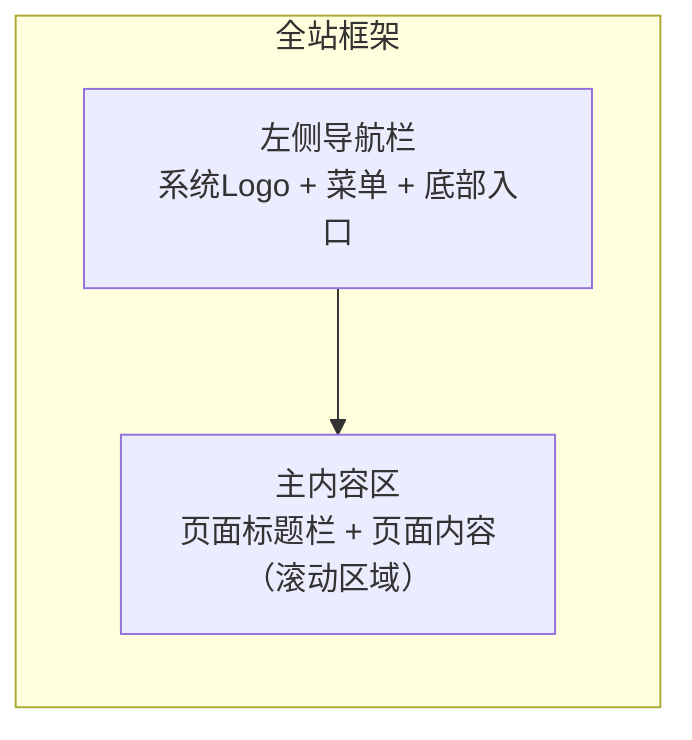
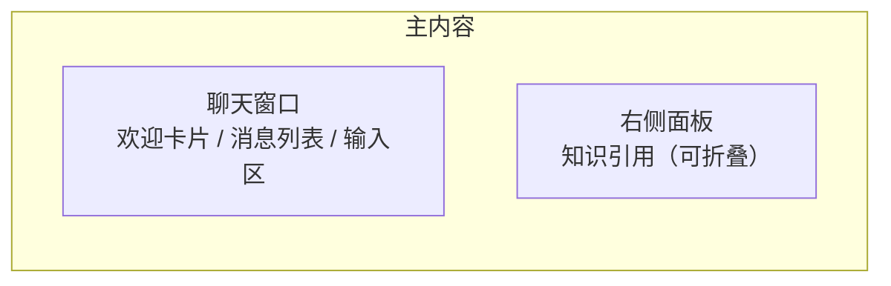
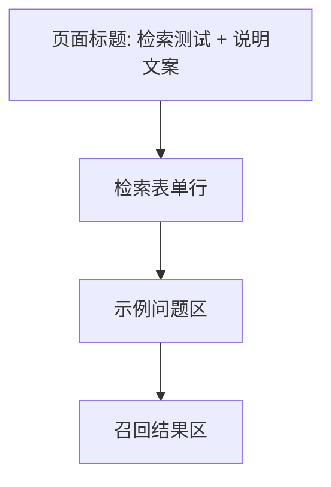
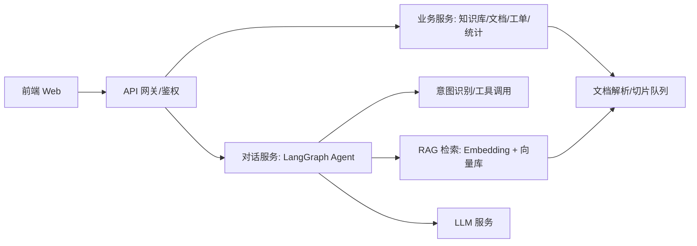

# AI 智能客服系统 需求功能说明书

> 文档版本：v1.1（前端细化版）
> 编写日期：2026-08-10
> 编写依据：`prototype/` 目录下 16 张前端原型截图（img01–img15 及总览图）、`notes.txt`、`mapping.txt`
> 文档说明：**前端需求已按页面级细化；后端部分仅给出框架（架构、数据模型概要、接口清单），待后续补充详细设计。**

---

## 目录

1. [文档说明](#1-文档说明)
2. [项目概述](#2-项目概述)
3. [用户角色与权限](#3-用户角色与权限)
4. [前端总体设计](#4-前端总体设计)
5. [页面级前端需求详述](#5-页面级前端需求详述)
6. [后端框架（待细化）](#6-后端框架待细化)
7. [非功能需求](#7-非功能需求)
8. [原型待确认问题清单](#8-原型待确认问题清单)
9. [开发里程碑建议](#9-开发里程碑建议)
10. [附录：原型截图与页面功能对照](#10-附录原型截图与页面功能对照)

---

## 1. 文档说明

### 1.1 文档目的

本报告以现有前端原型（截图）为事实来源，输出两部分内容：

- **前端（完整）**：从信息架构、路由、全局设计规范到每个页面的布局、控件、状态、交互、校验与验收标准；
- **后端（框架）**：仅给出架构方向、核心数据模型概要与接口清单，接口契约、字段定义、错误码等留待后续补充。

### 1.2 参考来源

| 来源 | 内容 |
| --- | --- |
| `prototype/img01.png` | 工作台（高清大图，3000px 宽） |
| `prototype/img02.png` | 知识库文件列表 + FAQ 模板 Chunk 详情 |
| `prototype/img03.png` | 工作台（全屏模式） |
| `prototype/img04.png` | 创建知识库弹窗（背景为早期版本“AI 数据搜索系统”） |
| `prototype/img05.png` | 知识库文件列表（空状态） |
| `prototype/img06.png` | 客服工单列表 |
| `prototype/img07.png` | 工作台（全屏模式，无数据） |
| `prototype/img08.png` | 工作台（有数据仪表盘；与 notes 标注有出入，见 §8） |
| `prototype/img09.png` | 智能客服对话页（欢迎语/快捷问题） |
| `prototype/img10.png` | 检索测试页（空结果；与 notes 标注有出入，见 §8） |
| `prototype/img11.png` | 智能客服对话页（含右侧知识引用面板） |
| `prototype/img12.png` | 帮助文档页（内嵌系统截图） |
| `prototype/img13.png` | 检索测试页（空结果；与 notes 标注有出入，见 §8） |
| `prototype/img14.png` | 检索测试页（含召回结果与相关度） |
| `prototype/img15.png` | 检索测试页（含召回结果与相关度，RAG Recall Lab） |
| `prototype/_overview.png` | 全量页面缩略图总览（2×5 网格） |

> 注意：部分截图底部带有录屏直播弹幕叠加层（如“少说话多学习：五分钟”“Tempo：2 个小时吧 加上修改”等），属于视频录制残留，**不属于系统界面内容**，本报告已剔除。

### 1.3 阅读对象

产品经理、UI/UX 设计师、前端开发工程师、后端开发工程师、测试工程师、项目经理。

### 1.4 术语表

| 术语 | 含义 |
| --- | --- |
| RAG | Retrieval-Augmented Generation，检索增强生成，先检索知识库再生成回答 |
| LangGraph | 基于图结构的 LLM Agent 编排框架，用于有状态的对话流程 |
| Chunk | 文档切片，导入文档的最小检索单元（本系统为“问题-答案”结构） |
| Top K | 检索返回的相关片段数量（原型默认 3） |
| 召回（Recall） | 检索阶段命中的文档片段及其相关度 |
| 相关度 | 查询与片段之间的相似度评分（原型示例：95%、11%、6%） |
| 意图（Intent） | 用户问题的语义分类（查询订单、退换货政策、投诉转人工等） |
| 工单（Ticket） | AI 转人工后生成的客服处理单 |
| 知识库命中率 | 会话中知识库回答命中的比例（工作台 KPI） |

---

## 2. 项目概述

### 2.1 项目背景

企业（以电商售后为示例场景）需要一套基于大模型的智能客服系统，实现：

- 7×24 小时自动应答高频售后问题（退换货、退款、物流、投诉等）；
- 回答可溯源：每个答案附知识库原文引用；
- 复杂/敏感问题自动转人工，并生成客服工单；
- 管理者可维护、测试知识库，并通过工作台监控服务效果。

### 2.2 产品定位

**AI 智能客服系统**：面向企业管理者的 Web 端 AI 客服工作台，覆盖“知识管理 → 检索测试 → 智能应答 → 工单流转 → 数据看板”全链路，技术栈为 **LangGraph + RAG**。

### 2.3 目标用户

| 角色 | 使用场景 |
| --- | --- |
| 系统管理员/客服运营 | 维护知识库、测试检索质量、查看工作台数据、管理工单 |
| 客服人员 | 处理 AI 转交的人工工单 |
| 终端用户（消费者） | 通过客服入口与 AI 对话（原型聚焦管理端，“智能客服”页模拟用户侧交互） |

### 2.4 核心价值

1. **降低人工成本**：高频问题由 AI 自动解决；
2. **回答有据可依**：RAG 引用原文，减少大模型幻觉；
3. **知识资产化**：FAQ 模板一键导入、切片管理、检索质量可视化；
4. **数据驱动**：工作台实时展示会话量、解决率、命中率与意图分布。

### 2.5 产品演进（原型观察）

原型 img04 背景页面显示早期版本 **“AI 数据搜索系统”**（副标题“您的智能搜索助手 - LangChain, RAG”，导航：工作台 / 智能表单 / 知识库 / 智能测试 / 智能工具）；最终版本升级为 **“AI 智能客服系统”**（副标题 LangGraph + RAG，导航：工作台 / 智能客服 / 知识库 / 检索测试 / 客服工单 / 系统设置）。评审时需确认早期能力是否保留（见 §8）。

---

## 3. 用户角色与权限

原型未包含登录页与权限管理界面，以下为建议，需评审确认：

| 角色 | 权限范围 |
| --- | --- |
| 管理员 | 全部模块：知识库维护、检索测试、工单管理、系统设置、数据查看 |
| 客服 | 工单处理、智能客服会话查看；不可修改系统设置 |
| 只读访客 | 工作台、帮助文档只读访问 |

建议能力：账号密码/SSO 登录与会话超时；菜单级与操作级权限控制；删除知识库/文档、修改设置等敏感操作记录审计日志。

---

## 4. 前端总体设计

### 4.1 技术选型（建议）

| 层面 | 选型建议 | 说明 |
| --- | --- | --- |
| 框架 | React 18 + TypeScript 或 Vue 3 + TypeScript | 单页应用（SPA） |
| 构建 | Vite | 开发体验与构建速度 |
| UI 组件库 | Ant Design 5 或 Element Plus | 表格、弹窗、表单、下拉等基础组件 |
| 样式 | Tailwind CSS / CSS Modules + 设计变量 | 统一设计令牌 |
| 图表 | ECharts 或 Recharts | 柱状图、环形图、折线图 |
| 对话流式 | SSE（EventSource）/ WebSocket | AI 回答流式输出 |
| 文档渲染 | Markdown 渲染库（react-markdown / marked） | 帮助文档 |
| 状态管理 | Zustand / Pinia + React Query / TanStack Query | 服务端状态缓存 |
| 路由 | React Router / Vue Router | 见 §4.3 |

### 4.2 布局框架

全站统一“**左侧导航 + 右侧内容区**”布局：



| 区域 | 规格 | 说明 |
| --- | --- | --- |
| 侧边栏 | 固定宽度 240–260px，通栏高 | 系统名/Logo、导航菜单、底部“帮助文档/系统设置”入口 |
| 内容区 | 自适应剩余宽度，独立滚动 | 顶部为页面标题/操作栏，下方为页面内容 |
| 顶栏（可选） | 内容区顶部 | 页面标题/面包屑 + 右侧操作（帮助、通知、用户头像） |

**侧边栏设计**：

- 顶部：系统名“AI 智能客服系统” + 副标题“LangGraph + RAG”；
- 菜单项：图标 + 文字，选中态为浅色底 + 主色文字 + 左侧指示条，hover 态浅灰底；
- 底部：帮助文档、系统设置、用户信息/退出入口。

### 4.3 导航与路由

| 菜单/路由 | 路径（建议） | 页面 | 原型截图 |
| --- | --- | --- | --- |
| 工作台 | `/dashboard` | 工作台 | img01/03/07/08 |
| 智能客服 | `/chat` | 智能客服对话 | img09/11 |
| 知识库 | `/knowledge` | 知识库列表/选择 | img04/05 |
| 知识库-文档 | `/knowledge/:kbId` | 知识库文档列表 | img02/05 |
| 知识库-文件详情 | `/knowledge/:kbId/documents/:docId` | Chunk 管理 | img02 |
| 检索测试 | `/recall-test` | 检索测试 | img10/13/14/15 |
| 客服工单 | `/tickets` | 客服工单列表/详情 | img06 |
| 系统设置 | `/settings` | 系统设置（规划） | — |
| 帮助文档 | `/help` | 帮助文档 | img12 |

### 4.4 全局设计规范

#### 4.4.1 色彩（基于原型浅色主题）

| 语义 | 色值（建议） | 用途 |
| --- | --- | --- |
| 主色 Primary | `#3B82F6` / `#4A9EFF` | 主按钮、选中态、链接、图表主色 |
| 页面背景 | `#F5F6FA` | 内容区底色 |
| 卡片背景 | `#FFFFFF` | 卡片、弹窗、表格 |
| 边框/分割线 | `#E5E7EB` | 表格线、输入框描边 |
| 正文文本 | `#1F2937` | 标题/正文 |
| 次要文本 | `#6B7280` | 说明、表头 |
| 占位文本 | `#9CA3AF` | placeholder |
| 成功 | `#16A34A` / `#22C55E` | 已完成、命中率高 |
| 警告 | `#F59E0B` | 解析中、中等优先级 |
| 危险 | `#EF4444` | 删除、失败、高优先级 |
| 信息/处理中 | `#3B82F6` | 进行中状态 |

#### 4.4.2 字体与排版

| 层级 | 字号/字重 | 用途 |
| --- | --- | --- |
| 页面标题 | 20px / SemiBold | 内容区顶部标题 |
| 卡片标题 | 16px / Medium | 卡片标题（会话趋势等） |
| KPI 数值 | 30–36px / Bold | 数据卡片主数值 |
| 正文 | 14px / Regular | 默认正文、表格 |
| 辅助说明 | 12–13px | 表头、标签、占位、时间 |
| 数字 | tabular-nums / 等宽数字 | 工单编号、数值、百分比 |

字体栈：`-apple-system, "PingFang SC", "Microsoft YaHei", "Segoe UI", sans-serif`。

#### 4.4.3 间距与圆角

- 页面内边距：24–32px；区块间距：16–24px；卡片内边距：20–24px；
- 圆角：卡片/弹窗 12–16px，按钮/输入框 8–12px，标签/徽标 999px（胶囊）；
- 阴影：卡片默认 `0 1px 3px rgba(0,0,0,.06)`，hover 增强至 `0 4px 12px rgba(0,0,0,.10)`。

#### 4.4.4 通用组件规范

| 组件 | 规范要点 |
| --- | --- |
| 主按钮 | 主色底白字，圆角 8px；hover 加深；loading 态禁用；删除等危险操作用红色按钮 |
| 次按钮 | 白底 + 边框 + 主色文字；用于取消、查看 |
| 输入框 | 高度 36–40px，占位符灰字；聚焦边框主色；带前缀图标（搜索） |
| 下拉选择 | 单选，展开面板；选项 hover 高亮；TopK、知识库选择等 |
| 表格 | 表头浅灰底 13px 灰字；行高 48–56px；行 hover 浅色底；操作列右对齐 |
| 标签/徽标 | 胶囊样式，状态色底 + 深色文字（已完成绿、解析中蓝、失败红） |
| 弹窗 | 遮罩 `rgba(0,0,0,.45)`；居中卡片，圆角 16px；标题 16px + 右上角 ×；底部按钮右对齐（次要+主要） |
| 空状态 | 居中图标 + 主文案 + 辅助文案 + 操作按钮（如“上传文件”） |
| Toast | 右上角，成功/错误/警告图标 + 文案，3s 自动消失 |
| 分页 | 表格底部，页码 + 上一页/下一页 + 总数 |

### 4.5 通用状态规范

每个页面/数据区域必须覆盖以下状态：

| 状态 | 表现 | 说明 |
| --- | --- | --- |
| 初始/未操作 | 页面默认内容（如空结果提示） | 首次进入未触发操作 |
| 加载中 | 骨架屏（Skeleton）或 Spinner | 列表/图表/检索/上传均需加载态 |
| 空态 | 图标 + 文案 + CTA | 无数据时友好引导，禁止空白页 |
| 错误 | 错误提示 + “重试”按钮 | 接口失败、上传失败、检索失败 |
| 成功 | Toast / 状态变更 | 创建、删除、保存、上传等操作反馈 |
| 禁用 | 控件置灰、不可点 | 无权限、提交中、输入不合法 |

---

## 5. 页面级前端需求详述

> 每个页面按统一模板描述：功能概述 → 路由与入口 → 页面布局 → 元素明细 → 状态设计 → 交互与校验 → 验收要点。

---

### 5.1 工作台（Dashboard）

#### 5.1.1 功能概述

登录后默认首页，展示当日核心 KPI、近 7 日会话趋势与意图分布，供管理者快速掌握客服运行情况。

#### 5.1.2 路由与入口

- 路由：`/dashboard`；侧边栏“工作台”，系统默认落地页。

#### 5.1.3 页面布局

```mermaid
graph TD
    A[页面标题: 工作台 + 刷新按钮] --> B[KPI 卡片行: 4 列网格]
    B --> C[图表行: 左 会话趋势 | 右 意图分布]
```

| 区域 | 说明 |
| --- | --- |
| 标题栏 | 页面标题“工作台”；右侧手动刷新按钮（建议自动刷新 30–60s，可开关） |
| KPI 卡片行 | 4 张卡片等宽排列（grid 4 列，间距 16–24px），换行显示 |
| 图表行 | 左右 1:1 两张图表卡片；小屏（<1200px）改为上下堆叠 |

#### 5.1.4 元素明细

**KPI 卡片**（4 张，结构一致）

| 元素 | 说明 |
| --- | --- |
| 卡片 | 白底、圆角 12–16px、浅阴影；hover 阴影增强 |
| 图标 | 左侧圆形浅色底 + 线性图标（如会话/对勾/转接/目标） |
| 标签 | 灰色 13–14px（今日会话数 / AI 自动解决率 / 转人工数量 / 知识库命中率） |
| 数值 | 30–36px Bold；百分比指标显示“%”（如 50%） |
| 跳转（建议） | 卡片可点击：会话数→会话明细、转人工数→工单页；无对应页面前暂不跳转 |

**会话趋势卡片**

| 元素 | 说明 |
| --- | --- |
| 标题 | “会话趋势” + 副标题“近 7 日” |
| 图表 | 柱状图/折线图；X 轴日期（MM-DD，如 07-11 ~ 07-17），Y 轴会话数 |
| Tooltip | hover 显示日期与数值 |
| 空态 | 无数据时显示占位文案（如“暂无会话数据”），图表区保留坐标轴 |

**意图分布卡片**

| 元素 | 说明 |
| --- | --- |
| 标题 | “意图分布” |
| 图表 | 环形图（Donut），扇区颜色按意图区分（原型示例意图：普通问题 / 查询问题 / 知识库问答 / 人工回复） |
| 图例 | 颜色块 + 意图名 + 占比/数值 |
| 空态 | 无数据显示“暂无意图数据” |

#### 5.1.5 状态设计

| 状态 | 表现 |
| --- | --- |
| 加载中 | KPI 数值与图表区域显示骨架屏 |
| 空态 | 图表显示空态文案；KPI 显示 0/0% |
| 错误 | 顶部 Toast“数据加载失败” + 重试按钮 |
| 刷新 | 手动/自动刷新时防重复请求，数据不变不闪烁 |

#### 5.1.6 验收要点

- 4 项 KPI 数值、单位与后端口径一致；
- 近 7 日图表 X 轴日期正确、有值日渲染柱/点、hover 提示正确；
- 意图分布颜色与图例一一对应，占比合计 100%；
- 无数据、加载、错误三种状态均有正确 UI，无白屏。

---

### 5.2 智能客服（AI 对话）

#### 5.2.1 功能概述

模拟终端用户咨询入口：提问 → 意图识别 + RAG 检索 → 流式回答 + 知识引用；投诉/无法解答时转人工并创建工单。

#### 5.2.2 路由与入口

- 路由：`/chat`；侧边栏“智能客服”。

#### 5.2.3 页面布局



| 区域 | 说明 |
| --- | --- |
| 聊天窗口 | 占主区域约 60–70%；从上到下：欢迎区 → 消息列表（滚动）→ 输入区 |
| 右侧引用面板 | 固定宽度约 320px；标题“知识引用”；无引用时可折叠/显示空态 |

#### 5.2.4 元素明细

**欢迎区（新会话默认展示）**

| 元素 | 说明 |
| --- | --- |
| 头像/Logo | AI 客服头像（圆形，主色底） |
| 欢迎语 | “你好，我是 AI 智能客服” + 能力说明（可回答退换货、退款、物流等问题） |
| 快捷问题 | 胶囊按钮：查询订单 / 退款政策 / 商品签收几天可以退货 / 我要投诉转人工；点击即发送 |

**消息列表**

| 元素 | 说明 |
| --- | --- |
| 消息气泡 | AI 消息靠左（带头像），用户消息靠右（主色底白字）；圆角 12px，最大宽度 70% |
| 流式输出 | AI 回复逐字/逐 token 输出，末尾显示光标动画；输出中可“停止生成”（建议） |
| 引用标记 | AI 消息内可含引用编号 [1][2]，点击定位到右侧引用面板 |
| 系统消息 | 居中灰字小气泡：如“已为您转接人工客服，工单号 TK…，请稍候” |
| 时间 | 首条消息与跨 10 分钟消息显示时间（建议） |

**输入区**

| 元素 | 说明 |
| --- | --- |
| 文本框 | 多行 textarea，自动增高（1–4 行），占位“请输入您的问题…” |
| 发送按钮 | 主色圆角按钮；空内容禁用；Enter 发送、Shift+Enter 换行 |
| 字数限制 | 建议单条 ≤ 500 字，超出阻止并提示 |
| 生成中 | 发送按钮转为“停止”或禁用，输入区可继续编辑（建议） |

**知识引用面板**

| 元素 | 说明 |
| --- | --- |
| 来源卡片 | 文件名 + 页码/行号 + 片段摘要（原型示例：FAQ知识库导入模板.xlsx 第 2/4/5 行） |
| 展开原文 | 点击卡片展开完整问题/答案 |
| 空态 | 未命中时显示“本次回答未引用知识库内容” |
| 折叠 | 面板可折叠为窄条，保留入口 |

#### 5.2.5 状态设计

| 状态 | 表现 |
| --- | --- |
| AI 思考中 | 气泡内三点动画或“正在检索知识库…” |
| 流式输出中 | 逐字渲染 + 光标；可停止 |
| 检索无结果 | AI 兜底话术：“未在知识库中找到相关内容，建议转人工客服。” |
| 转人工 | 系统消息提示 + 右侧/气泡展示工单号 |
| 接口错误 | 错误气泡 + “重试”按钮 |
| 知识库为空 | 提示“知识库尚未配置，请联系管理员” |

#### 5.2.6 交互与校验规则

1. 快捷问题点击后立即作为用户消息发送并触发回答；
2. 订单查询类问题缺少订单号时，AI 追问“请提供订单号”；校验订单号格式（如 15 位数字）；
3. 连续 2 次（建议）AI 无法回答或用户表达投诉/转人工时，触发转人工：停止 AI 接管 → 创建工单 → 系统提示；
4. 消息列表自动滚动到底部；新消息不打断用户上滑阅读（有向上偏移时不强制滚动）；
5. 页面刷新后保留当前会话（建议会话持久化，可新建会话）。

#### 5.2.7 验收要点

- 四类示例问题路由正确（订单→工具、政策→RAG、投诉→转人工）；
- RAG 回答附引用，点击编号定位来源；无引用时有说明；
- 多轮追问上下文连续；流式输出无卡顿、可停止；
- 转人工后工单列表出现对应记录，字段完整。

---

### 5.3 知识库 - 列表/选择

#### 5.3.1 功能概述

知识库模块首页：左侧展示知识库列表，右侧展示所选知识库的文档列表；未选择时显示引导空态。

#### 5.3.2 路由与入口

- 路由：`/knowledge`；侧边栏“知识库”。

#### 5.3.3 页面布局

| 区域 | 说明 |
| --- | --- |
| 左侧列表 | 宽度约 240px：标题“知识库” + “创建知识库”按钮 + 知识库条目列表 |
| 右侧主区 | 所选知识库的文档列表（见 §5.5）；未选择时显示空态 |

#### 5.3.4 元素明细

| 元素 | 说明 |
| --- | --- |
| 创建按钮 | 列表顶部主按钮“+ 创建知识库”，点击弹窗（见 §5.4） |
| 知识库条目 | 图标（文件夹）+ 名称 + 文档数（建议）；hover 高亮并显示编辑/删除操作；点击选中 |
| 选中态 | 主色/浅紫底 + 主色文字 + 左侧指示条 |
| 右侧空态 | 图标 + “请选择知识库” + “选择左侧知识库查看文档” |
| 删除知识库 | 二次确认弹窗：“删除后将同时删除其中所有文档与切片，且不可恢复”；确认后删除并刷新 |

#### 5.3.5 状态设计

- 加载中：列表骨架屏；
- 无知识库：空态 + “立即创建”按钮；
- 删除成功/失败：Toast 反馈。

#### 5.3.6 验收要点

- 创建后新知识库立即出现在列表并自动选中；
- 删除知识库二次确认、删除后右侧主区回到空态；
- 列表刷新、选中切换正确。

---

### 5.4 创建知识库弹窗

#### 5.4.1 触发入口

知识库页“创建知识库”按钮。

#### 5.4.2 弹窗规格

| 元素 | 说明 |
| --- | --- |
| 弹窗 | 宽约 480px；标题“创建知识库”；右上角 ×；遮罩半透明；支持点击遮罩/ESC 关闭（建议） |
| 名称输入框 | 必填；占位“例如：知识库”；长度 ≤ 50 字；失焦/提交时校验唯一性 |
| 描述输入框 | 多行；占位“描述知识库的功能”；长度 ≤ 200 字；显示字数统计 |
| 取消按钮 | 关闭弹窗，不保存，不校验 |
| 确定按钮 | 主色；提交中禁用并显示 loading；校验通过后提交 |

#### 5.4.3 校验规则

| 场景 | 提示 |
| --- | --- |
| 名称为空 | “请输入知识库名称” |
| 名称超长 | “名称不超过 50 字” |
| 名称重复 | “该名称已存在” |
| 描述超长 | “描述不超过 200 字” |

#### 5.4.4 状态设计

- 提交成功：关闭弹窗 + Toast“创建成功” + 新知识库选中；
- 提交失败：弹窗内红字错误提示，保留已填内容，不关闭。

#### 5.4.5 验收要点

- 必填、长度、唯一性校验全部生效；
- 关闭方式（×/遮罩/ESC）均可用；提交中防重复提交。

---

### 5.5 知识库 - 文档列表

#### 5.5.1 功能概述

展示所选知识库内全部文档，支持上传、搜索、查看详情与删除。

#### 5.5.2 路由与入口

- 路由：`/knowledge/:kbId`；从知识库列表选中进入。

#### 5.5.3 页面布局

| 区域 | 说明 |
| --- | --- |
| 工具行 | 返回按钮（←）+ 知识库名称/描述 + 搜索框 + 上传按钮 |
| 表格区 | 文件列表表格 + 分页 |

#### 5.5.4 元素明细

**工具行**

| 元素 | 说明 |
| --- | --- |
| 返回 | 返回知识库列表 |
| 搜索框 | 占位“搜索文件名”；输入防抖（300ms）实时过滤；带搜索图标与清空按钮 |
| 上传按钮 | 主按钮“上传文件”/上传图标；支持点击选择与拖拽上传（拖拽区域高亮） |

**文件表格**

| 列 | 说明 |
| --- | --- |
| 文件名 | 文件类型图标 + 名称；过长省略（省略号 + title 完整名） |
| 类型 | 扩展名标签（如 xlsx） |
| 状态 | 标签：已完成（绿）/ 解析中（蓝，带转圈图标）/ 失败（红，可“重新解析”） |
| Chunk 数量 | 数字，如 6；点击可进入详情（建议） |
| 操作 | “查看详情”（主色文字按钮）、删除（红字）；删除需二次确认并提示级联删除 |

**分页**

- 默认每页 10 条；显示总数；支持页码切换。

**空态**

- 无文件：“暂无文档，请上传文件” + 上传按钮；
- 搜索无结果：“未找到匹配的文件” + 清空搜索按钮。

#### 5.5.5 上传交互

1. 选择文件后立即上传，显示进度条（顶部或卡片内）；
2. 支持一次多选；同名校验（覆盖/跳过提示，建议）；
3. 上传完成自动刷新列表；解析状态异步更新（解析中 → 已完成/失败）；
4. 支持格式：`.xlsx`（必支持），建议同时支持 `.csv/.md/.txt/.pdf/.docx`，单文件 ≤ 20MB（建议）。

#### 5.5.6 验收要点

- 上传后状态正确流转；解析失败可重试；
- 搜索防抖生效、可清空；分页正确；
- 删除二次确认且生效后列表与检索结果同步移除。

---

### 5.6 文件详情 / Chunk 管理

#### 5.6.1 功能概述

查看文档解析出的 Chunk 列表（问题/答案/元信息），支持编辑与删除，保证知识库内容可维护。

#### 5.6.2 路由与入口

- 路由：`/knowledge/:kbId/documents/:docId`；文件列表“查看详情”进入。

#### 5.6.3 页面布局

| 区域 | 说明 |
| --- | --- |
| 顶部 | 面包屑：知识库名 / 文件名；返回按钮 |
| 列表区 | Chunk 卡片列表，每张卡片一个“问题-答案”对 |

#### 5.6.4 元素明细

| 元素 | 说明 |
| --- | --- |
| Chunk 卡片 | 序号（Chunk 1…）+ 问题标题 + 答案全文 + 元信息行（页码/行号、字数）+ 操作（编辑/删除） |
| 编辑弹窗 | 问题输入框 + 答案多行文本；保存/取消；保存后提示“已更新，正在重新向量化”（异步） |
| 删除 | 二次确认；删除后列表即时移除 |
| 新增 Chunk（建议） | 列表底部“+ 添加 Chunk”，弹窗填写问题/答案 |
| 重新解析（建议） | 顶部按钮，触发文档整体重新切片 |
| 空态 | “暂无 Chunk，请重新解析文档或手动添加” |

#### 5.6.5 校验规则

- 问题必填、≤ 200 字；答案必填、≤ 2000 字（建议）；
- 编辑保存中禁用按钮防重复提交。

#### 5.6.6 验收要点

- Chunk 内容与导入模板逐条一致（原型 6 条）；
- 编辑/删除后重新检索结果同步变化；
- 面包屑与返回路径正确。

---

### 5.7 检索测试（RAG Recall Lab）

#### 5.7.1 功能概述

评估知识库检索质量：输入问题、选择知识库与 TopK，查看召回命中的文档、页码、片段与相关度。

#### 5.7.2 路由与入口

- 路由：`/recall-test`；侧边栏“检索测试”。

#### 5.7.3 页面布局



#### 5.7.4 元素明细

**检索表单行**

| 元素 | 说明 |
| --- | --- |
| 知识库选择 | 下拉，列出全部知识库，默认选中第一个（原型示例：售后知识库） |
| 问题输入框 | 占位“请输入您的问题或关键词…”；支持示例填充；长度 ≤ 200 字 |
| Top K 下拉 | 默认 3，可选 1–10；修改后重新检索 |
| 搜索按钮 | 主色；空问题禁用；检索中显示 loading |

**示例问题区**

- 文案：“快速测试：”+ 3 个示例（商品签收后几天可以退货？/ 软件激活后还能退吗？/ 退款审核通过后多久到账？）；
- 点击示例：填充输入框并自动触发检索。

**召回结果区**

| 元素 | 说明 |
| --- | --- |
| 标题行 | “召回结果” + 命中数（如“3 条命中”） |
| 结果卡片 | 排名 + 来源文档名 + 页码/行号 + 问题 + 答案片段 + 相关度 |
| 相关度展示 | 百分比 + 颜色条/标签：≥80% 绿（高），60–79% 橙（中），<60% 灰/红（低）；排序降序 |
| 卡片操作 | 点击卡片查看原文片段/定位对应 Chunk；建议支持勾选标记有效结果（评估用） |
| 未检索空态 | “提交问题后会返回片段” |
| 无命中空态 | “0 条命中 / 暂无召回结果” |
| 加载态 | 结果区骨架屏或 Spinner |

#### 5.7.5 交互规则

- TopK 变化、知识库切换后自动重新检索（或点击搜索）；
- 检索期间禁止重复提交；结果按相关度降序排列；
- 相关问题重复检索时，结果应一致（建议结果可缓存）。

#### 5.7.6 验收要点

- 原型示例查询“商品签收后几天可以退货？”（TopK=3）返回 3 条：第 2 页 95%、第 5 页 11%、第 4 页 6%，顺序与相关度正确；
- TopK 动态调整生效；空态/加载态/错误态 UI 正确；
- 示例问题一键填充并检索。

---

### 5.8 客服工单

#### 5.8.1 功能概述

管理 AI 转人工产生的工单：列表查看、搜索筛选、处理与状态流转。

#### 5.8.2 路由与入口

- 路由：`/tickets`；侧边栏“客服工单”。

#### 5.8.3 页面布局

| 区域 | 说明 |
| --- | --- |
| 工具行 | 页面标题 + 搜索框 + 状态/优先级筛选 + 时间范围 |
| 表格区 | 工单表格 + 分页 |
| 详情区（建议） | 点击行打开详情（侧滑抽屉或新页） |

#### 5.8.4 元素明细

**筛选与搜索**

| 元素 | 说明 |
| --- | --- |
| 搜索框 | 按工单编号/内容关键词搜索；防抖 300ms |
| 状态下拉 | 全部 / 待处理 open / 处理中 processing / 已关闭 closed |
| 优先级下拉 | 全部 / 高 / 中 / 低 |
| 时间范围（建议） | 创建时间起止选择 |

**工单表格**

| 列 | 说明 |
| --- | --- |
| 工单编号 | 等宽字体，可复制（原型示例：TK20260716182115ea280e） |
| 类型 | 标签（原型示例：human_service） |
| 内容 | 单行省略 + hover 完整 Tooltip（原型示例：“转入人工”） |
| 状态 | 标签色：open 橙 / processing 蓝 / closed 灰 |
| 优先级 | 标签色：high 红 / medium 橙 / low 灰绿 |
| 创建时间 | 格式 `YYYY-MM-DD HH:mm:ss` |
| 操作 | 查看/处理按钮；行内红色圆形按钮（原型样式） |

**详情抽屉（建议）**

| 内容 | 说明 |
| --- | --- |
| 工单信息 | 编号、类型、状态、优先级、创建时间、来源会话 ID |
| 关联会话 | 展示转人工前的对话摘要/完整记录 |
| 处理记录 | 备注时间线（处理人、备注、状态变更） |
| 操作区 | 备注输入 + “开始处理”“关闭工单”按钮；状态按 open→processing→closed 流转 |

#### 5.8.5 状态设计

- 空态：“暂无工单” + 说明“AI 转人工后工单会自动出现在这里”；
- 筛选无结果：“未找到匹配的工单” + 清空筛选；
- 分页：默认 10 条/页。

#### 5.8.6 验收要点

- 搜索、组合筛选、分页正确；
- 状态流转（open→processing→closed）与权限校验正确；
- 工单编号与转人工会话关联可追溯。

---

### 5.9 帮助文档

#### 5.9.1 功能概述

系统使用说明，图文结合（原型页内嵌系统截图）。

#### 5.9.2 页面布局

| 区域 | 说明 |
| --- | --- |
| 左侧目录 | 固定宽度约 200px；章节列表；当前章节高亮；可滚动 |
| 右侧内容 | Markdown 渲染：标题层级、正文、表格、图片、代码块、步骤说明；图片可点击放大（建议） |
| 顶部 | 页面标题 + 搜索文档内容（可选） |

#### 5.9.3 建议章节

1. 快速开始（导入 FAQ 模板 → 检索测试 → 接入客服）；
2. 知识库使用指南（创建、上传、Chunk 编辑）；
3. 智能客服说明（意图识别、转人工规则）；
4. 检索测试使用（TopK、相关度解读）；
5. 常见问题（FAQ）。

#### 5.9.4 交互规则

- 点击目录跳转锚点，滚动联动高亮当前章节（建议）；
- 文档内容支持复制；长代码/表格横向滚动；
- 加载失败显示重试。

#### 5.9.5 验收要点

- 目录与内容锚点跳转正确；图片渲染正常；
- 移动端目录可折叠（建议）。

---

### 5.10 系统设置（规划，无原型截图）

侧边栏存在“系统设置”入口，原型未提供截图。建议按 Tab 组织：

| Tab | 内容建议 |
| --- | --- |
| 模型配置 | 对话模型/Embedding 模型选择、API Key、向量库与检索参数（TopK 默认、相关度阈值） |
| Prompt 配置 | 系统人设、兜底话术、转人工判定规则（可编辑文本 + 恢复默认） |
| 客服规则 | 转人工条件、工单优先级规则、人工客服账号分配 |
| 账号权限 | 用户管理（增删改、角色分配、重置密码） |
| 日志审计 | 操作日志、对话日志、保留策略 |
| 数据管理 | 全量重建向量索引、备份/导出知识库 |

表单规范统一遵循 §4.4；危险操作（删除、重建索引）需二次确认。

---

## 6. 后端框架（待细化）

> 本章为框架级设计，接口契约、字段定义、错误码、鉴权细节等**留待后续补充**。

### 6.1 架构总览



| 组件 | 职责（框架） |
| --- | --- |
| API 网关 | 路由、鉴权、限流、日志 |
| 业务服务 | 知识库 CRUD、文档上传/解析、Chunk 管理、工单、统计 |
| 对话服务 | LangGraph 智能体：意图路由、工具调用、RAG 检索、流式回复、转人工判定 |
| 解析/切片队列 | 异步解析 xlsx/文本 → Chunk → Embedding → 入库 |
| 向量库 | 片段向量存储与相似度检索（Milvus / pgvector / FAISS 等） |
| LLM 服务 | 对话生成 + Embedding（可通过系统设置配置） |

### 6.2 核心数据模型（概要）

**知识库 knowledge_base**：id、name（唯一）、description、created_at、updated_at

**文档 document**：id、kb_id、file_name、file_type、status（解析中/已完成/失败）、chunk_count、file_size、file_url、created_at

**切片 chunk**：id、doc_id、chunk_index、question、answer、page/row、word_count、embedding（向量库侧）

**会话 session / 消息 message**：session_id、user_id、channel、role（user/assistant/system）、content、intent、cited_chunks（JSON）、created_at

**工单 ticket**：id、ticket_no（TK+时间戳+随机）、type、content、status（open/processing/closed）、priority（high/medium/low）、session_id、created_at、updated_at

**统计 dashboard_stats**：按日聚合会话数、自动解决数/率、转人工数、知识库命中率、意图分布

### 6.3 接口清单（框架）

| 模块 | 接口 | 说明 |
| --- | --- | --- |
| 认证 | `POST /api/auth/login`、`GET /api/auth/me` | 登录、当前用户 |
| 工作台 | `GET /api/dashboard/stats` | 今日 KPI |
| 工作台 | `GET /api/dashboard/trend?days=7` | 会话趋势 |
| 工作台 | `GET /api/dashboard/intents?days=7` | 意图分布 |
| 知识库 | `GET/POST /api/knowledge-bases`、`PUT/DELETE /api/knowledge-bases/:id` | 知识库 CRUD |
| 文档 | `POST /api/knowledge-bases/:kbId/documents`（multipart） | 上传文档 |
| 文档 | `GET /api/documents/:id`、`DELETE /api/documents/:id` | 文档详情/删除 |
| 文档 | `POST /api/documents/:id/reparse` | 重新解析（建议） |
| Chunk | `GET/PUT/DELETE /api/chunks/:id`、`POST /api/chunks` | Chunk 管理 |
| 检索测试 | `POST /api/retrieval/test` `{query, kb_id, top_k}` | 召回片段 + 相关度 |
| 对话 | `POST /api/chat`（SSE 流式） | 用户消息 → AI 回复 + 引用 |
| 工单 | `GET /api/tickets?status=&priority=&keyword=&page=` | 工单列表/筛选 |
| 工单 | `GET/PUT /api/tickets/:id` | 详情/处理（状态流转、备注） |
| 设置 | `GET/PUT /api/settings/*` | 系统配置 |

### 6.4 后端待细化清单

- 各接口请求/响应字段、分页参数、错误码与错误信息规范；
- 鉴权与角色权限校验方案（JWT/RBAC）；
- 文档解析支持格式与解析规则（xlsx 行 → Chunk）；
- 向量库选型与检索评分公式、相关度归一化（0–100%）；
- 对话 Agent 状态机（意图路由、工具调用、转人工判定条件）；
- 工单自动创建与编号规则、状态流转权限；
- 统计口径与聚合任务（定时/实时）；
- 日志、监控、限流与数据备份方案。

---

## 7. 非功能需求

### 7.1 性能

- 页面首屏加载 ≤ 2s（常规网络）；列表接口 P95 ≤ 1s；
- 检索测试：单次召回 P95 ≤ 1s；
- 对话：首 token ≤ 2s，流式回答平均 ≤ 10s；
- 文件上传/解析异步化，不阻塞页面；
- 支持并发：建议单机 ≥ 50 并发会话（按部署规模调整）。

### 7.2 可用性与稳定性

- 模型/检索服务故障时提供兜底话术与降级策略，页面不白屏；
- 关键操作（上传、删除、转人工）有 loading 与结果反馈；
- 数据自动备份，知识库可恢复。

### 7.3 安全与合规

- 登录认证与接口鉴权，敏感操作审计；
- 知识库文档为业务敏感数据：HTTPS 传输、存储加密、按知识库隔离权限，**严禁外泄**；
- 防 Prompt 注入：检测用户输入中的越权指令；
- 回答与文档内容过敏感词/内容审核；
- 日志脱敏（订单号、手机号等）。

### 7.4 兼容性与体验

- 支持主流浏览器（Chrome/Edge 近两年版本）；桌面端优先（原型基准宽度 1514px）；
- 响应式适配 1280–1920 分辨率；移动端适配待评估；
- 中文界面；统一组件风格、状态色、空态与异常态。

### 7.5 可维护性

- 模块化工程，配置外部化（模型、向量库、参数）；
- 全链路日志（对话、检索、工单）与监控告警；
- 知识库结构变化支持平滑升级（重新向量化）。

---

## 8. 原型待确认问题清单

| # | 问题 | 说明 |
| --- | --- | --- |
| 1 | 原型标注与截图内容不一致 | img08 实为“工作台”而非知识库；img10/13/15 实为“检索测试”而非知识库/智能客服页。建议重新整理截图标注 |
| 2 | 录屏弹幕残留 | img03/11/12/13/14 底部为直播弹幕叠加层，不属于系统界面 |
| 3 | 早期版本关系 | img04 背景为“AI 数据搜索系统”（LangChain），与最终版（LangGraph）的关系；早期功能（智能表单/智能测试/智能工具）是否保留 |
| 4 | 登录与权限 | 原型无登录页，是否引入账号体系与角色权限 |
| 5 | 系统设置 | 侧边栏存在但无截图，需补充具体设置项（§5.10 为建议） |
| 6 | 工单详情 | 原型仅列表，详情/处理交互需补充确认 |
| 7 | 会话历史 | 是否需要会话历史查询/回放；用户侧入口（网页/IM/App）如何接入 |
| 8 | 订单/物流查询 | 示例问题涉及订单查询，需确认对接的业务系统与接口 |
| 9 | 模板与格式 | FAQ 模板列结构（问题/答案/分类）、支持文件格式范围 |
| 10 | 移动端 | 是否需要移动端适配或独立 H5 客服入口 |
| 11 | 多语言 | 是否需要英文等多语言支持（原型头部出现 “Customer Service” 英文标识） |

---

## 9. 开发里程碑建议

| 阶段 | 范围 | 交付物 |
| --- | --- | --- |
| M1 前端框架 | 全站布局、路由、通用组件、设计规范落地 | 可运行前端骨架 |
| M2 知识底座 | 知识库 CRUD、上传解析、Chunk 管理、FAQ 模板 | 知识库模块可用 |
| M3 检索验证 | 检索测试（TopK、相关度、召回结果）、向量库接入 | RAG 链路跑通 |
| M4 智能应答 | LangGraph 对话、意图路由、知识引用、转人工 | 智能客服可用 |
| M5 运营闭环 | 工单管理、工作台统计、会话历史 | 运营闭环打通 |
| M6 收尾完善 | 系统设置、帮助文档、权限、日志审计、性能优化 | 正式上线 |

---

## 10. 附录：原型截图与页面功能对照

| 截图 | 实际页面 | 对应章节 |
| --- | --- | --- |
| img01 / img03 / img07 / img08 | 工作台 | §5.1 |
| img09 / img11 | 智能客服（对话 + 知识引用） | §5.2 |
| img04 / img05 | 知识库（列表/选择、创建弹窗、空态） | §5.3 / §5.4 |
| img02 / img05 | 知识库文档列表、文件详情/Chunk | §5.5 / §5.6 |
| img10 / img13 / img14 / img15 | 检索测试（空态 + 召回结果） | §5.7 |
| img06 | 客服工单 | §5.8 |
| img12 | 帮助文档 | §5.9 |
| _overview | 全量页面总览 | — |

---

*本报告前端部分基于原型截图细化，后端为框架级，所有“建议/待确认”项需评审后定稿。*

---

## 11. 实施记录（B1 基建 + M1 前端框架）

> 记录时间：2026-08-12
> 本段落由开发实施同步维护，需求内容如有调整在此标注【新增】/【变更】/【建议】。

### 11.1 本次交付

- 【新增】后端 `backend/`：FastAPI 分层骨架（08 §3.4）、pydantic-settings 配置、SQLAlchemy 2.0（async）+ Alembic（初始迁移含 pgvector 扩展）、Redis 连接、统一响应与错误码（08 §7）、JWT 登录/刷新/`/me` + RBAC（users 表 + admin/agent/viewer）、structlog 结构化日志、登录审计（audit_logs）、`/health` 健康检查。
- 【新增】前端 `frontend/`：Vite + React 18 + TypeScript + Ant Design 5，"左侧导航 + 右侧内容区"布局，9 个一级菜单路由（工作台/智能客服/知识库/检索测试/客服工单/应用评测/会话记录/系统设置/帮助文档），设计令牌按 01 §4 落地（色彩/字体/圆角/阴影），axios 统一响应封装 + 401 自动刷新 + 路由守卫。
- 【新增】默认管理员种子（本地开发）：`admin / admin123`，仅 dev 环境，生产禁用。
- 【新增】测试约定：pytest 使用独立测试库 `ai_customer_service_test`（由 `.env` 的 DATABASE_URL 推导），自动执行迁移；冒烟测试覆盖 /health、登录成功/失败、刷新轮换、RBAC 403、参数校验 422、pgvector 扩展存在性。

### 11.2 实施决策

- 【新增】登录页与路由守卫：M1 骨架新增 `/login` 页与 `RequireAuth` 守卫，对接 B1 JWT 接口；原型无登录页（全局待确认问题 #4），本实施先按账密 + JWT 落地骨架。
- 【变更】侧边栏 9 个一级菜单按确认结果落地（08 §11 #16：应用评测、会话记录作为一级菜单）。
- 【建议】`users.role / status` 采用 String + CheckConstraint（`native_enum=False`）而非数据库原生枚举，便于后续角色/状态演进，避免枚举类型迁移成本。
- 【建议】Redis 降级策略：B1 阶段 Redis 不可用时仅告警、`/health` 报告 `unavailable`，应用正常启动；B2 起 Celery 依赖 Redis，届时建议改为启动强校验。
- 【建议】本机开发数据库使用 PostgreSQL 18 + pgvector 0.8.6（Windows 预编译包）；无本机 PG/Redis 的环境可用 `backend/docker-compose.yml` 一键启动。

### 11.3 验收清单（B1 + M1）

1. 后端 `uvicorn app.main:app` 可启动；`GET /health` 返回 `{"code":0,...}`，数据库组件 ok。
2. `POST /api/auth/login`（admin/admin123）签发 access+refresh；`GET /api/auth/me` 返回当前用户；错误密码返回 40100；viewer 访问仅 admin 接口返回 40300。
3. `alembic upgrade head` 成功：pgvector 扩展、users、audit_logs 就绪。
4. `pytest -q` 全绿（10 passed）。
5. 前端 `npm run dev` 打开 `http://localhost:5173`，9 个菜单可达，登录后可进入布局；`/api` 代理到后端 8000。
6. 密钥（RERANK_API_KEY 等）仅存在于 gitignored 的 `.env`，未写入代码与文档。

---

## 12. 实施记录（B2 知识库）

> 记录时间：2026-08-12
> 对应需求：`04_知识库.md` 全模块、`08_后端详细设计.md` §4.2/§5.2/§6.2。

### 12.1 本次交付

- 【新增】后端数据层与迁移 `0002`：`knowledge_bases` / `documents` / `chunks` 三张表，`chunks.embedding` 为 pgvector 1024 维（bge-m3，08 §11 #2）+ HNSW 余弦索引（08 §5.3）。
- 【新增】上传解析管线（08 §3.4 `app/pipeline`）：xlsx/csv 按 FAQ 模板（问题|答案|分类|标签）逐行生成 Chunk；md/txt/pdf/docx 按固定长度 500 字、重叠 50 字分块（04 §3.5 新增参数）；清洗规则（去空行、空问题跳过、答案截断 2000 字）。
- 【新增】Embedding 客户端（`app/rag/embeddings.py`）：配置 `EMBEDDING_API_KEY` 走 OpenAI 兼容接口；未配置时使用确定性 mock 向量（离线开发可用，生产必须配置真实 Key）。
- 【新增】任务执行开关 `TASK_BACKEND=inline|celery`（默认 inline，本机无 Redis 时响应后进程内异步处理）；Celery worker 骨架按 08 §3.4 保留，有 Redis 环境可切换。
- 【新增】接口：知识库 CRUD、文档上传/列表/详情/删除/重新解析、Chunk 列表/新增/编辑/删除（编辑后单条重新向量化，08 §4.2）。
- 【新增】审计：删除知识库、删除文档写入 `audit_logs`（08 §4.8）。
- 【新增】前端知识库三页面：知识库列表（左列 + 创建/编辑弹窗 + 删除二次确认）、文档列表（搜索防抖 300ms、上传进度、状态轮询 2s、重新解析、分页）、Chunk 管理（卡片列表、新增/编辑/删除弹窗、标签选择器）。
- 【新增】测试：pytest 20 项（KB CRUD、上传解析与向量维度、非法扩展名、解析失败重试、文本分块、Chunk 手工 CRUD、级联删除、RBAC、mock 向量确定性）。

### 12.2 实施决策

- 【新增】`chunks.category` 字段：承载 FAQ 模板“分类”列（08 §5.2 表结构未含该列，04 §4.6 模板已含）。
- 【新增】`documents.deleted_at`：知识库软删除时级联标记文档；删除操作先物理清空切片与向量，再软删除知识库（与 04 §1.4“不可恢复”提示一致）。
- 【变更】支持格式按 04 §3.5（变更）落地：`.xlsx/.csv/.md/.txt/.pdf/.docx`，单文件 ≤ 20MB（08 MVP 原为仅 xlsx）。
- 【建议】权限：知识库模块 admin 读写、agent 只读、viewer 不可访问。
- 【建议】Chunk 编辑后重新向量化当前为同步执行（单条耗时可忽略），数据量大后可异步化。
- 【建议】文本分块参数（500/50）目前为代码默认值，规划在“系统设置 → 数据管理”中可调（04 §3.5）。

### 12.3 验收清单（B2）

1. 知识库：创建/列表/更新/软删除；名称重复返回 40900；删除后文档与 Chunk 级联清空。
2. 上传：扩展名白名单与 20MB 校验；xlsx 样例 6 行 → 6 个 Chunk，标签/分类/行号正确，向量维度 1024；解析失败置 failed 并可重新解析。
3. Chunk：手工新增（序号续排）、编辑后重新向量化、删除后文档 chunk_count 同步。
4. 权限：viewer 403，agent 可读不可写。
5. 前端 `/knowledge`：创建弹窗校验、左列选中、文档表格状态轮询、上传进度、Chunk 卡片管理均可用。
6. `pytest -q` 全绿（20 passed）；`npm run build` 通过；前后端联调（上传 → 解析 → 查 Chunk）通过。

---

## 13. 实施记录（B3 检索验证）

> 记录时间：2026-08-12
> 对应需求：`05_检索测试.md` 全模块、`08_后端详细设计.md` §4.3/§6.2/§11（#11 混合检索 + 重排已确认）。

### 13.1 本次交付

- 【新增】接口 `POST /api/retrieval/test`：支持 `kb_ids`（多库，1–20）、`tags`（标签过滤，≤10）、`top_k`（1–10，默认 3）、`retriever_mode`（vector / hybrid / hybrid_rerank，默认 hybrid）。
- 【新增】向量检索：pgvector 余弦相似度（`<=>`，08 §4.3 必须携带 kb_ids）；关键词检索：`chunks` 新增 tsvector 生成列（question+answer，`simple` 配置）+ GIN 索引，查询转字符 bigram `to_tsquery`（OR 聚合）。
- 【新增】RRF 融合（K=60）→ 检索分 min-max 归一化 0–100（08 §4.3）；候选池 `top_n = max(top_k, 20)`。
- 【新增】`hybrid_rerank`：候选送入 SiliconFlow `{base_url}/rerank`（模型 `BAAI/bge-reranker-v2-m3`），输入"问题+答案"，返回 `rerank_score`（服务商分数原样展示，保留 4 位），按重排分降序。
- 【新增】降级：未配置 `RERANK_API_KEY / BASE_URL / MODEL` 时自动降级为混合检索，响应 `actual_mode=hybrid` + `rerank_skipped=true` 标注。
- 【新增】多库逐库权限校验：不存在/已软删除的库剔除；全部无效返回 40000；viewer 403（admin/agent 可检索）。
- 【新增】前端 `/recall-test` 完整页面：知识库多选（默认选中第一个）、问题输入、TopK（1–10 默认 3）、标签过滤、检索方式切换（自动重检）、示例问题一键填充、召回结果卡片（来源库/文档/页码行号/检索分/重排分，颜色规则 ≥70 绿 / 40–69 橙 / <40 红）、"重排前 #x → 重排后 #y"对比徽标、降级提示、空态/加载/错误重试。
- 【新增】测试：pytest 8 项（vector 排序、hybrid 默认、重排 mock 排序变化、无 Key 降级、标签过滤、多库与无效剔除、top_k/query 校验、RBAC）。

### 13.2 实施决策

- 【变更】mock 向量算法升级：B2 的随机哈希无语义结构，无法支撑"排序可解释"验收；改为字符 n-gram（单字+相邻双字）哈希叠加的确定性向量，词汇重叠度映射为余弦相似度（仅开发用；配置真实 `EMBEDDING_API_KEY` 后走正式模型）。存量 mock 向量需重新解析文档刷新。
- 【新增】重排输入为"问题+答案"而非仅问题（更贴近真实相关性判断，实测目标 Chunk 重排分 0.9975）。
- 【建议】中文全文检索使用 `simple` 配置 + bigram 查询为工程折中；生产建议换 zhparser / pg_jieba 分词。
- 【建议】重复检索结果缓存（05 §6"建议结果可缓存"）留待性能优化阶段。

### 13.3 验收清单（B3）

1. 示例问题"商品签收后几天可以退货？"（TopK=3，售后知识库）：
   - vector：目标 Chunk（第 2 行）检索分 100 排 #1；
   - hybrid：RRF 融合后仍 #1（100），后续分数拉开（78.7 / 58.1）；
   - hybrid_rerank（真实 SiliconFlow）：目标 #1（检索 100 / 重排 0.9975），第 3 行 #2（0.1371），第 4 行 #3（0.015），排序与分数变化可解释，与原型 95%/11%/6% 形态一致。
2. 未配置重排 Key 时：`actual_mode=hybrid` + `rerank_skipped=true`。
3. 标签过滤只返回含所选标签的 Chunk；多库检索含无效库时自动剔除；viewer 403。
4. `pytest -q` 全绿（28 passed）；`npm run build` 通过；前端 `/recall-test` 页面可用。
5. 密钥（RERANK_API_KEY 等）仅存在于 gitignored 的 `.env`，未写入代码/文档/日志。

---

## 14. 实施记录（B4 智能应答）

> 记录时间：2026-08-12
> 对应需求：`03_智能客服.md` 全模块、`08_后端详细设计.md` §4.4/§5.2/§6.2。

### 14.1 本次交付

- 【新增】LangGraph 对话图（08 §4.4）：`ChatState`（messages / intent / kb_ids / order_no / form_data / escalation_count / citations / ticket）与节点 `classify_intent` / `lookup_order`（MVP mock）/ `collect_form` / `retrieve` / `generate` / `escalate` / `fallback`；路由：订单/物流 → 工具，政策 → RAG 检索，投诉/转人工 → 建单，其他 → 兜底（连续 2 次转人工）。
- 【新增】意图规则可配置：默认关键词规则 + `settings(group=intent)` 覆盖；`GET/PUT /api/settings/intent`（admin 写）。
- 【新增】SSE 流式协议 `POST /api/chat`：`message_start / token / citations / done / error`，并扩展 `form` 事件下发对话内表单卡片（03 §4.5）。
- 【新增】转人工：complaint/transfer 或 escalation_count ≥ 2 → 创建工单（编号 TK+yyyyMMddHHmmss+6 位随机，priority complaint=high），会话置 transferred，系统消息携带工单号。
- 【新增】多知识库：会话按 kb_ids 检索（逐库权限校验），引用标注来源库（kb_id + document_name + 页码/行号 + 分数）。
- 【新增】引用反馈 `POST /api/feedbacks`（delete / invalid / add，附原因可选）写入 `message_feedbacks`。
- 【新增】会话与消息落库：`sessions`（新增 `escalation_count`）/ `messages`；最近 10 条消息重建上下文（08 §4.4）；`GET /api/sessions` 与 `GET /api/sessions/{id}` 支持刷新恢复会话。
- 【新增】`trace_logs` 链路日志（intent/retrieval/generate 耗时），为 B5 会话详情链路面板铺路。
- 【新增】LLM 客户端（`app/agents/llm.py`）：配置 `LLM_API_KEY` 走 OpenAI 兼容 chat/completions 流式；未配置时模板化 mock 生成（离线可演示）。
- 【新增】模型快速切换：`model_profiles` 表 + 种子"智谱免费 GLM" + `GET /api/settings/model-profiles`（admin，Key 脱敏）+ `PUT .../activate`；对话请求可携带 `model_profile_id`，前端下拉仅 admin 可见。
- 【新增】前端 `/chat` 完整页面：欢迎区 + 快捷问题、消息气泡、SSE 逐字流式渲染（可停止）、输入区（Enter 发送/Shift+Enter 换行，≤500 字）、右侧知识引用面板（来源卡片 + 检索分/重排分 + 编号 [n] 定位 + 删除/标记无效/补充引用）、对话内表单卡片（订单号 15 位/手机号校验，提交后作为上下文继续）、转人工系统消息与工单号、会话切换/新建、admin 模型下拉。
- 【新增】测试：pytest 11 项（订单带号/无号表单收集、政策引用、投诉建单、兜底升级、已转人工会话拦截、反馈三操作、会话恢复、意图规则可配置、模型配置 RBAC、chat RBAC）。

### 14.2 实施决策

- 【新增】`sessions.escalation_count`：08 §5.2 会话表未含该字段，用于兜底升级计数。
- 【新增】SSE `form` 事件：08 §4.4 协议未含表单下发，属协议扩展（03 §4.5）。
- 【建议】表单提交内容以"上下文注入"方式追加到最近一条用户消息（订单号正则识别），持久化仍保留原始消息。
- 【建议】模型配置 B4 仅实现列表/默认切换；新增/编辑/删除/测试连通留 B6 系统设置。
- 【建议】补充引用候选池 B4 简化为当前回答引用列表；完整候选接口留后续。
- 【建议】无 Redis 环境会话状态直接落库重建；Redis 缓存对话上下文留后续优化。

### 14.3 验收清单（B4）

1. 四类路由：订单（带单号 → 工具查询；无单号 → 表单收集）、政策（→ RAG 引用）、投诉/转人工（→ 工单 TK…）、其他（→ 兜底，连续 2 次转人工）。
2. SSE 事件序列 message_start → token* → citations → done（/ error）正确；token 逐块输出可停止。
3. 引用编号 [n] 定位到右侧面板；引用反馈 delete/invalid/add 落库。
4. 表单卡片（订单号 15 位/手机号）校验与提交正确，提交内容进入后续上下文。
5. 转人工后工单落库（tickets），会话状态 transferred，系统消息含工单号；已转人工会话禁止 AI 继续接管。
6. 会话与消息落库，刷新后可恢复（GET /api/sessions、/api/sessions/{id}）。
7. `pytest -q` 全绿（39 passed）；`npm run build` 通过；前端 `/chat` 联调通过。

---

## 15. 实施记录（B4.5 应用评测闭环）

> 记录时间：2026-08-12
> 对应需求：`09_应用评测.md` 全模块、`08_后端详细设计.md` §4.9/§5.2/§6.2。

### 15.1 本次交付

- 【新增】数据模型与迁移 `0005_evaluation`：`eval_sets / eval_samples / eval_tasks / eval_results / eval_candidates` 五张表 + 索引（串联在并发的 `0005_ticket_kb_visibility` 之后，单 head）。
- 【新增】评测集 CRUD、样本导入（逐条 / JSON 批量 / 一键导入内置 30 条公开样例，幂等 409）、删除二次确认级联清理。
- 【新增】评测任务：创建（评测集 + 对话模型 Profile + 检索知识库）、异步执行（inline / Celery，走对话图逐条生成回答）、进度/状态查询、重新运行、删除；失败记录 `error_message` 可重试。
- 【新增】报告：平均分、通过率、分指标（回答准确性先行，问题相关性/语义准确性预留字段）、分样本明细；人工调整通过状态后统计重算；CSV 导出（前端生成）。
- 【新增】LLM-as-judge：配置 `LLM_API_KEY` 走真实模型打分；未配置用确定性 bigram 重合度（可复现、离线可用）。
- 【新增】回流闭环：引用反馈可选 `include_in_eval` 标记 → 生成 `eval_candidates` 候选 → 管理员确认加入指定评测集 / 拒绝（来源标注 feedback）。
- 【新增】ChatState `eval_mode`：评测逐条执行时转人工节点不真实建单（避免评测污染工单数据）。
- 【新增】前端 `/evaluation`：评测集 / 评测任务 / 回流候选三个 Tab；创建与导入弹窗（逐条/JSON/30 条公开样例）、创建任务弹窗、报告页（3 指标卡 + 明细表 + 通过开关 + CSV 导出）、运行中进度轮询与失败重试、空态齐全。
- 【新增】测试：pytest 9 项（集 CRUD、30 条导入幂等、批量/逐条导入、任务执行与报告、eval_mode 不建单、人工调通过、候选确认/拒绝、RBAC、judge 确定性）。

### 15.2 实施决策

- 【新增】`eval_tasks.kb_ids`：09/08 未指明评测检索知识库，创建任务时必选 1–20 个知识库。
- 【新增】`eval_candidates` 表与 `FeedbackCreate.include_in_eval` 字段：承载"反馈 → 候选 → 确认入集"闭环（08 §5.2 未含）。
- 【新增】`eval_tasks.error_message`：任务失败原因（供失败重试提示）。
- 【建议】评测模块权限：仅 admin（评测为运营/管理功能）。
- 【建议】评测"报告历史快照"（09 §7 建议项）：本期评测集删除时级联删除任务与报告，历史快照留后续。
- 【说明】通过率受知识库覆盖度影响：30 条公开样例覆盖退换货/退款/物流/投诉等，若知识库仅含少量 FAQ，mock judge 下通过率可能偏低；属预期行为，可人工调整通过状态。

### 15.3 验收清单（B4.5）

1. 30 条公开样例一键导入成功（重复导入 409），评测任务运行完成，报告指标与 30 条明细完整。
2. 回答准确性打分确定性可复现（同一输入两次结果一致）；人工调整通过状态后平均分/通过率重算。
3. 引用反馈标记"纳入评测集"→ 候选出现 → 确认后样本进入目标评测集（/ 拒绝）。
4. 评测执行不产生真实工单（eval_mode）。
5. `pytest -q` 全绿（48 passed）；`npm run build` 通过；前端 `/evaluation` 三个 Tab 与报告页可用。

---

## 16. 实施记录（B5 运营闭环：客服工单 + 工作台 + 会话记录）

> 记录时间：2026-08-12
> 对应需求：`06_客服工单.md`、`02_工作台.md`、`10_会话记录.md`、`08_后端详细设计.md` §4.5/§4.6/§5.2/§6.2。
> 说明：B4/B4.5 已存在 tickets / sessions / message_feedbacks 表与接口，并包含近期修复（tickets.cited_chunk_ids、会话引用明细、注入防护、脱敏、知识库可见性、模型配置 CRUD），本模块在其上扩展，未重复实现。

### 16.1 本次交付

- 【新增】工单：列表/组合筛选（状态/优先级/时间范围/关键词，防抖 300ms 由前端实现）/分页；详情（关联会话、知识库命中片段 cited_chunk_ids 反查明细、处理记录时间线）；状态流转 open→processing→closed（单向校验 + ticket_notes 落库 + 审计）；`GET /api/tickets`、`GET /api/tickets/{id}`、`POST /api/tickets/{id}/action`。
- 【新增】迁移 `0006_operations`：`ticket_notes` / `dashboard_stats` / `session_annotations` 三表。
- 【新增】工作台：`GET /api/dashboard/stats`（今日会话数 / AI 自动解决率 / 转人工数量 / 知识库命中率，口径按 02 §7）、`GET /api/dashboard/trend?days=7`（近 7 日会话趋势）、`GET /api/dashboard/intents?days=7`（意图分布聚合）。
- 【新增】会话记录：`GET /api/sessions` 列表扩展筛选（时间/意图/状态/是否转人工/关键词/标注状态）+ 派生字段（消息数/意图/是否转人工/工单号/标注状态）；`GET /api/sessions/{id}` 详情增强（消息+引用明细+链路 trace+关联工单+标注）；`POST /api/sessions/{id}/annotations` 人工标注（标签/备注/是否纳入评测集）。
- 【新增】标注回流：标注 `include_in_eval=true` 复用 B4.5 `eval_candidates`（source=annotation），管理员确认后入集。
- 【新增】前端：`/tickets` 工单页（筛选/表格/详情抽屉/命中片段/备注与状态流转/会话跳转）、`/dashboard` 工作台（4 张 KPI 卡可点击跳转、近 7 日趋势柱图、意图分布环形图、30s 自动刷新可开关、加载/空态/错误重试）、`/sessions` 列表与 `/sessions/:id` 详情（消息流/引用面板/链路/标注区/关联工单跳转，按 10 与 sessions.html 原型）；引入 recharts。
- 【新增】测试：pytest 8 项（工单流转与时间线、命中片段展示、组合筛选、工作台口径与图表数据、会话筛选、标注回流候选、会话详情、RBAC 只读/agent 处理）。

### 16.2 实施决策

- 【建议】AI 自动解决率口径落地：02 §7 的"AI 独立完结会话数"在无"关闭"事件机制下，以"当日创建且未转人工的会话数"近似（转人工即视为 AI 未能独立完结）；代码注释与本文档同步说明。
- 【新增】`session_annotations` 每会话一条（upsert），`include_in_eval=true` 时生成/更新评测候选。
- 【说明】"是否转人工"筛选以 `status=transferred` 判定（B4 转人工即置 transferred）。
- 【说明】工作台聚合：无 Redis/Celery → 按需计算 + 进程内 30s 缓存，并将当日结果落 `dashboard_stats`（为后续 Celery 定时聚合铺路，08 §4.6）。
- 【说明】B4 存量工单（投诉路径无检索）`cited_chunk_ids` 为空属历史数据；escalate 节点已补传命中片段，新工单可展示。
- 【建议】会话列表"标注状态"筛选（10 §6 建议项）本次一并实现。

### 16.3 验收清单（B5）

1. 工单状态流转 open→processing→closed 与 ticket_notes 时间线正确；重复/非法流转返回 400/422；已有 2 条工单（含 B4 生成）可在页面查看，命中片段可展示。
2. 工作台 4 项 KPI 与 02 §7 口径一致（数值来自真实会话/消息/工单聚合），趋势 7 日与意图分布图表有真实数据，KPI 跳转（会话数→/sessions、转人工→/tickets）可用。
3. 会话列表筛选/分页正确；详情可查看消息、引用明细、链路 trace 与关联工单；标注保存生效且 `include_in_eval` 样本出现在评测集候选。
4. 权限：admin 全部；agent 可处理工单/查看会话/标注；viewer 只读（可看工单/会话/工作台，操作返回 403）。
5. `pytest -q` 全绿（56 passed）；`npm run build` 通过；前端 `/dashboard`、`/tickets`、`/sessions` 联调通过。

---

## 17. 实施记录（B6a 系统设置与帮助文档）

> 记录时间：2026-08-12
> 对应需求：`07_帮助文档与系统设置.md`、`08_后端详细设计.md` §4.7/§4.8。
> 说明：模型配置 CRUD/测试/默认切换、意图规则、知识库可见性字段、审计日志表已在库，本模块直接对接并补齐缺口。

### 17.1 本次交付

- 【新增】系统设置六 Tab（仅 admin）：
  - 模型配置：列表/新增/编辑/删除/测试连通/设为默认（对话/Embedding/重排分用途，默认唯一、删除默认拦截、API Key 脱敏、重排未配置降级提示）；
  - Prompt 配置：系统人设/兜底话术/转人工判定规则（可编辑 + 恢复默认）；
  - 客服规则：意图关键词规则（对接 GET/PUT /api/settings/intent）+ 转人工阈值 + 工单优先级规则；
  - 账号权限：用户管理（新增/编辑/角色/启停/重置密码）+ 知识库可见范围配置（all/role/user + 角色/用户选择）；
  - 日志审计：操作日志列表（动作过滤/分页）+ 对话日志（跳转会话详情）；
  - 数据管理：文本分块参数（500/50 可调）、全量重建向量索引（二次确认）、导出知识库（JSON）。
- 【新增】帮助文档页：左侧目录 + Markdown 渲染 + 目录锚点滚动联动 + 搜索；七个章节（快速开始/知识库/智能客服/检索测试/应用评测/会话记录与标注/FAQ，结构完整占位文案）。
- 【新增】后端补齐接口：用户新增/编辑/重置密码（`POST/PUT /api/auth/users`、`PUT /api/auth/users/{id}/password`）、审计日志查询（`GET /api/audit-logs`）、Prompt/转人工/分块配置（`GET/PUT /api/settings/prompt|escalation|chunking`）、全量重建（`POST /api/admin/rebuild-vectors`）、导出（`GET /api/admin/export`）；知识库列表/详情返回可见性字段。
- 【变更】对话链路接入配置：兜底话术读 `settings(prompt.fallback_text)`；转人工阈值读 `settings(escalation.threshold)`（默认 2）；工单优先级读 `settings(escalation.priority_rules)`；文本分块参数读 `settings(chunking)`（解析管线运行时生效）。
- 【新增】测试：pytest 8 项（用户管理/审计/Prompt 与阈值生效/分块生效/知识库可见性/模型 CRUD 默认流转/重建导出/RBAC）。

### 17.2 实施决策

- 【建议】全量重建向量索引：逐文档重新解析 + 重新向量化，同步执行（无 Redis/Celery），大库后续切 Celery；前端二次确认。
- 【建议】导出知识库：JSON（知识库 + 文档 + Chunk 全量文本，不含向量，可重新向量化）。
- 【说明】系统设置与数据管理接口仅 admin 可访问（07 §2.1）。
- 【说明】模型配置测试连通：未配置 API Key（非 ollama）返回 ok=False 与提示，不崩溃。

### 17.3 验收清单（B6a）

1. 六个 Tab 与帮助文档全部可用；目录锚点/搜索/滚动联动正常。
2. 模型配置增删改测默认流转正确：删除默认被拦截、设为默认按用途唯一、测试连通返回耗时/错误。
3. Prompt/转人工/分块配置读写生效：兜底话术与转人工阈值影响对话链路；分块参数影响新上传文档。
4. 用户管理（新增/编辑/启停/重置密码）与知识库可见性生效：agent/viewer 仅能看到被授权的库。
5. 审计日志可查；重建向量与导出可用。
6. `pytest -q` 全绿（64 passed）；`npm run build`（tsc）通过；`/settings`、`/help` 联调通过。

---

## 18. 实施记录（B6b 部署与安全加固）

> 记录时间：2026-08-12
> 对应需求：08 §5 非功能、§8 安全、§9 可观测、§10 部署。

### 18.1 本次交付

- 【新增】部署：`backend/Dockerfile`、`frontend/Dockerfile` + `nginx.conf`（静态托管 + /api 反代）、`docker-compose.yml` 五服务（postgres(pgvector)/redis/api/worker/frontend），健康检查与 `depends_on` 依赖顺序，api 启动自动 `alembic upgrade head`；README 一键启动步骤。
- 【新增】`TASK_BACKEND=celery`：文档解析/向量化与评测任务经 Celery worker 执行（Redis broker），`inline` 保留为本地降级（配置开关，代码注释说明）。
- 【新增】`.env.example` 补全：RERANK_* / REDIS_URL / TASK_BACKEND / SCAN_ENABLED / MODERATION_* / METRICS_ENABLED / LOG_RETENTION_DAYS 与 docker 模式服务名示例。
- 【新增】上传安全：内容嗅探（按扩展名校验 magic bytes / 文本特征，拒绝伪装扩展名）+ 恶意文件扫描可插拔接口（`pipeline/scanner.py`，默认关闭，注明 ClamAV/外部 API 接入点）。
- 【新增】API Key 正式加密：`cryptography` Fernet（密钥派生自 JWT_SECRET），`decrypt_secret` 兼容旧版 XOR 密文，`model_profile_service` 读取时懒迁移重加密（旧数据可解密则自动升级）。
- 【新增】内容审核可插拔：`core/moderation.py`（外部审核 API 优先，未配置用本地敏感词兜底，词表存 settings 可配置）；接入文档解析（命中 → 文档 failed）与对话回答（命中 → 安全话术）。
- 【新增】可观测：`/metrics`（Prometheus 文本格式）覆盖 HTTP 延迟/错误率、LLM token 与成本估算、检索 P95（histogram）、队列积压 gauge（celery 读 Redis LLEN，inline 为 0）；日志告警占位（LLM 失败率 >20%、5xx >10%、队列积压 >100、任务失败数 >0 → warning）；`LOG_RETENTION_DAYS` 可配置。
- 【新增】性能抽测脚本 `scripts/perf_smoke.py`（并发会话/首 token/检索 P95）。
- 【新增】测试：pytest 6 项（上传嗅探、Fernet 往返与 legacy 懒迁移、文档敏感词拦截、check_text、注入拦截、/metrics）。

### 18.2 实施决策

- 【说明】API Key 加密从轻量 XOR 升级为 Fernet：密钥派生自 JWT_SECRET（无需额外密钥文件）；旧数据懒迁移，读取即重加密。
- 【说明】恶意文件扫描默认关闭（SCAN_ENABLED=false），接入点与调用方式见 `pipeline/scanner.py`。
- 【说明】内容审核默认开启本地敏感词兜底；配置 MODERATION_API_URL/KEY 后优先外部审核，失败自动回退本地。
- 【说明】docker compose 一键启动已交付；**本机 Docker daemon 未运行，未实测 compose 启动**（依赖顺序/健康检查/迁移命令按标准编写），需在有 Docker 环境执行 `docker compose up -d --build` 验证。
- 【记录】性能抽测（本机单进程，mock LLM）：50 并发会话 50/50 成功（总耗时 ~31s，含 mock 流式节奏，单进程 I/O 串行化明显）；单请求首 token ~50ms、5 并发 ~376ms（目标 ≤2s 达标）；检索 P95 639–856ms（目标 ≤1s 达标）。50 并发下脚本首 token 采样受 httpx 客户端缓冲影响为空，属测量脚本限制。
- 【建议】性能优化方向：并发瓶颈建议后续接入 Celery/多 worker、连接池调优与真实 LLM 后复测。

### 18.3 验收清单（B6b）

1. docker compose 五服务启动、健康检查与依赖顺序正确；api 自动执行 Alembic 迁移；frontend 经 nginx 反代 /api（本机未实测，需 Docker 环境验证）。
2. 上传伪装扩展名被拒（内容嗅探）；注入话术被拦截（返回兜底话术、不建单）；日志/审计经 mask 脱敏（沿用）。
3. API Key 以 Fernet 加密存储、脱敏展示；旧 XOR 数据读取即迁移。
4. 内容审核：文档命中敏感词 failed，回答命中替换安全话术；词表可配置。
5. `/metrics` 输出 HTTP/LLM/检索/队列指标；日志告警规则占位生效。
6. `pytest -q` 全绿（70 passed）；`npm run build` 通过；性能抽测结果记录如上。

---

## 19. 实施记录（全量审查问题修复）

> 记录时间：2026-08-12
> 内容：资深技术审查《问题清单》P1/P2 项的修复结果。

### 19.1 P1 修复（建议直接修项）

- 【修复】工单命中片段恒空：escalate 节点在创建工单时合并会话历史最近 assistant 消息的 `cited_chunk_ids`（`agents/nodes.py`），投诉/转人工工单可携带此前问答命中片段；实测"先政策后投诉"工单 cited=3。
- 【修复】资源级知识库可见性未覆盖详情/文档/Chunk 读取：新增 `knowledge_service.ensure_kb_accessible`（admin 全见，非 admin 按 all/role/user 校验，越权 40300），接入知识库详情、文档列表、文档详情、Chunk 列表路由；实测 agent 直读私有库详情/文档返回 403。

### 19.2 P2 修复

- 【修复】前端菜单按角色过滤（`AppLayout`）：admin 全部；agent 隐藏 应用评测/系统设置；viewer 仅 工作台/帮助。
- 【修复】Chat 引用反馈消息绑定：新增 `citationMessageId`，反馈绑定到实际展示引用的消息，避免历史消息操作错配到最新消息。
- 【修复】`GET /api/settings/intent` 收紧为仅 admin；`/metrics` 收紧为仅 admin（Prometheus 抓取需 Bearer token）。
- 【修复】docker-compose 增加 `migrate` 一次性服务（api/worker 依赖其完成后启动，避免迁移并发竞争），worker 增加 healthcheck。
- 【修复】清理存量空 assistant 消息（`scripts/cleanup_empty_messages.py`，dev 库已执行清理 2 条）。
- 【修复】`auth.py` 函数内 import 上移至模块顶部；`RecallTest` 自动重检增加 300ms 防抖。
- 【说明】补充引用候选：并发开发已实现 `POST /api/retrieval/candidates` + 前端候选弹窗（剔除当前引用），本次核实无误后未重复实现。
- 【说明】注入防护 LLM 二次判定、zip 系嗅探跨类型识别保持现状（08 §8 可选/解析阶段兜底），不属本次修复范围。

### 19.3 验证

- pytest 72 passed（新增：工单历史引用、知识库详情/文档/Chunk 越权 403、metrics 鉴权）；`npm run build` 通过。
- 实机复测：越权 403 ✓、metrics 401/200 ✓、工单历史引用 ✓。
