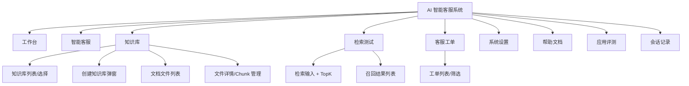

# 00 项目总览（全局上下文）

> 所属文档：AI 智能客服系统 需求功能说明书 v1.1
> 文件作用：提供项目级上下文（背景、角色、信息架构、全局约束、待确认问题、里程碑），供 agent 在任何模块任务前阅读。

---

## 1. 文档说明

### 1.1 文档目的

本需求以现有前端原型（截图）为事实来源，输出两部分内容：

- **前端（完整）**：从信息架构、路由、全局设计规范到每个页面的布局、控件、状态、交互、校验与验收标准；
- **后端（框架）**：仅给出架构方向、核心数据模型概要与接口清单，接口契约、字段定义、错误码等留待后续补充。

### 1.2 参考来源

| 来源 | 内容 |
| --- | --- |
| `prototype/img01.png` | 工作台（高清大图，3000px 宽） |
| `prototype/img02.png` | 知识库文件列表 + FAQ 模板 Chunk 详情 |
| `prototype/img03.png` | 工作台（全屏模式） |
| `prototype/img04.png` | 创建知识库弹窗（背景为早期版本“AI 数据搜索系统”） |
| `prototype/img05.png` | 知识库文件列表（空状态） |
| `prototype/img06.png` | 客服工单列表 |
| `prototype/img07.png` | 工作台（全屏模式，无数据） |
| `prototype/img08.png` | 工作台（有数据仪表盘；与 notes 标注有出入） |
| `prototype/img09.png` | 智能客服对话页（欢迎语/快捷问题） |
| `prototype/img10.png` | 检索测试页（空结果；与 notes 标注有出入） |
| `prototype/img11.png` | 智能客服对话页（含右侧知识引用面板） |
| `prototype/img12.png` | 帮助文档页（内嵌系统截图） |
| `prototype/img13.png` | 检索测试页（空结果；与 notes 标注有出入） |
| `prototype/img14.png` | 检索测试页（含召回结果与相关度） |
| `prototype/img15.png` | 检索测试页（含召回结果与相关度，RAG Recall Lab） |
| `prototype/_overview.png` | 全量页面缩略图总览（2×5 网格） |
| `prototype/html/evaluation.html` | 应用评测页 HTML 原型（新增，可交互，待真实截图替换） |
| `prototype/html/sessions.html` | 会话记录页 HTML 原型（新增，可交互，待真实截图替换） |

> 注意：部分截图底部带有录屏直播弹幕叠加层（如“少说话多学习：五分钟”等），属于视频录制残留，**不属于系统界面内容**，需求中已剔除。

### 1.3 阅读对象

产品经理、UI/UX 设计师、前端开发工程师、后端开发工程师、测试工程师、项目经理。

### 1.4 术语表

| 术语 | 含义 |
| --- | --- |
| RAG | Retrieval-Augmented Generation，检索增强生成，先检索知识库再生成回答 |
| LangGraph | 基于图结构的 LLM Agent 编排框架，用于有状态的对话流程 |
| Chunk | 文档切片，导入文档的最小检索单元（本系统为“问题-答案”结构） |
| Top K | 检索返回的相关片段数量（原型默认 3） |
| 召回（Recall） | 检索阶段命中的文档片段及其相关度 |
| 相关度 | 查询与片段之间的相似度评分（原型示例：95%、11%、6%） |
| 意图（Intent） | 用户问题的语义分类（查询订单、退换货政策、投诉转人工等） |
| 工单（Ticket） | AI 转人工后生成的客服处理单 |
| 知识库命中率 | 会话中知识库回答命中的比例（工作台 KPI） |
| 重排（Rerank） | 对召回结果二次排序的精排模型（如 bge-reranker），提升相关片段排序质量 |
| RRF | Reciprocal Rank Fusion，混合检索（向量 + 关键词）结果融合算法 |
| 评测集 / 黄金样本（Golden Set） | 由“问题-标准答案-期望引用”组成的标注样本，用于自动评测与回归 |
| 评测任务 | 针对某个评测集批量执行问答并自动打分的任务 |
| 标签（Tag） | 附加在 Chunk 上的业务分类标记（如退货/退款/物流），用于检索过滤 |
| 会话记录 | 会话消息、引用与链路的完整存档，支持人工标注 |
| 引用反馈 | 用户对回答引用的纠错操作（删除引用 / 标记无效 / 补充引用） |

---

## 2. 项目概述

### 2.1 项目背景

企业（以电商售后为示例场景）需要一套基于大模型的智能客服系统，实现：

- 7×24 小时自动应答高频售后问题（退换货、退款、物流、投诉等）；
- 回答可溯源：每个答案附知识库原文引用；
- 复杂/敏感问题自动转人工，并生成客服工单；
- 管理者可维护、测试知识库，并通过工作台监控服务效果。

### 2.2 产品定位

**AI 智能客服系统**：面向企业管理者的 Web 端 AI 客服工作台，覆盖“知识管理 → 检索测试 → 智能应答 → 工单流转 → 数据看板”全链路，技术栈为 **LangGraph + RAG**。

### 2.3 目标用户

| 角色 | 使用场景 |
| --- | --- |
| 系统管理员/客服运营 | 维护知识库、测试检索质量、查看工作台数据、管理工单 |
| 客服人员 | 处理 AI 转交的人工工单 |
| 终端用户（消费者） | 通过客服入口与 AI 对话（原型聚焦管理端，“智能客服”页模拟用户侧交互） |

### 2.4 核心价值

1. **降低人工成本**：高频问题由 AI 自动解决；
2. **回答有据可依**：RAG 引用原文，减少大模型幻觉；
3. **知识资产化**：FAQ 模板一键导入、切片管理、检索质量可视化；
4. **数据驱动**：工作台实时展示会话量、解决率、命中率与意图分布。

### 2.5 产品演进（原型观察）

原型 img04 背景页面显示早期版本 **“AI 数据搜索系统”**（副标题“您的智能搜索助手 - LangChain, RAG”，导航：工作台 / 智能表单 / 知识库 / 智能测试 / 智能工具）；最终版本升级为 **“AI 智能客服系统”**（副标题 LangGraph + RAG，导航：工作台 / 智能客服 / 知识库 / 检索测试 / 客服工单 / 系统设置）。评审时需确认早期能力是否保留。

---

## 3. 用户角色与权限

原型未包含登录页与权限管理界面，以下为建议，需评审确认：

| 角色 | 权限范围 |
| --- | --- |
| 管理员 | 全部模块：知识库维护、检索测试、工单管理、系统设置、数据查看 |
| 客服 | 工单处理、智能客服会话查看；不可修改系统设置 |
| 只读访客 | 工作台、帮助文档只读访问 |

建议能力：账号密码/SSO 登录与会话超时；菜单级与操作级权限控制；删除知识库/文档、修改设置等敏感操作记录审计日志。

- 【新增】资源级权限（建议）：知识库可配置可见范围（全部可见 / 指定角色可见 / 指定用户可见），检索与对话按知识库逐库校验权限；部门/群组等团队体系本期不做。

---

## 4. 信息架构与页面清单

### 4.1 导航结构

> 不同版本截图中的菜单文字略有差异（“检索测试/搜索测试/检测测试”等），以功能最终形态为准。

### 4.2 页面清单

| 页面 | 原型截图 | 详细需求文件 |
| --- | --- | --- |
| 工作台 | img01 / img03 / img07 / img08 | [02_工作台.md](./02_工作台.md) |
| 智能客服 | img09 / img11 | [03_智能客服.md](./03_智能客服.md) |
| 知识库（列表/创建/文档/Chunk） | img02 / img04 / img05 | [04_知识库.md](./04_知识库.md) |
| 检索测试 | img10 / img13 / img14 / img15 | [05_检索测试.md](./05_检索测试.md) |
| 客服工单 | img06 | [06_客服工单.md](./06_客服工单.md) |
| 帮助文档 / 系统设置 | img12 / 无 | [07_帮助文档与系统设置.md](./07_帮助文档与系统设置.md) |
| 应用评测 | 无（新增功能） | [09_应用评测.md](./09_应用评测.md) |
| 会话记录 | 无（新增功能） | [10_会话记录.md](./10_会话记录.md) |

### 4.3 路由总览

| 菜单/路由 | 路径（建议） | 页面 |
| --- | --- | --- |
| 工作台 | `/dashboard` | 工作台 |
| 智能客服 | `/chat` | 智能客服对话 |
| 知识库 | `/knowledge` | 知识库列表/选择 |
| 知识库-文档 | `/knowledge/:kbId` | 知识库文档列表 |
| 知识库-文件详情 | `/knowledge/:kbId/documents/:docId` | Chunk 管理 |
| 检索测试 | `/recall-test` | 检索测试 |
| 客服工单 | `/tickets` | 客服工单列表/详情 |
| 系统设置 | `/settings` | 系统设置（规划） |
| 帮助文档 | `/help` | 帮助文档 |
| 应用评测 | `/evaluation` | 评测集/评测任务/评测报告 |
| 会话记录 | `/sessions` | 会话列表 |
| 会话记录-详情 | `/sessions/:id` | 会话详情（消息、引用、链路、标注） |

---

## 5. 非功能需求（全局约束）

### 5.1 性能

- 页面首屏加载 ≤ 2s（常规网络）；列表接口 P95 ≤ 1s；
- 检索测试：单次召回 P95 ≤ 1s；
- 对话：首 token ≤ 2s，流式回答平均 ≤ 10s；
- 文件上传/解析异步化，不阻塞页面；
- 支持并发：建议单机 ≥ 50 并发会话（按部署规模调整）。

### 5.2 可用性与稳定性

- 模型/检索服务故障时提供兜底话术与降级策略，页面不白屏；
- 关键操作（上传、删除、转人工）有 loading 与结果反馈；
- 数据自动备份，知识库可恢复。

### 5.3 安全与合规

- 登录认证与接口鉴权，敏感操作审计；
- 知识库文档为业务敏感数据：HTTPS 传输、存储加密、按知识库隔离权限，**严禁外泄**；
- 防 Prompt 注入：检测用户输入中的越权指令；
- 回答与文档内容过敏感词/内容审核；
- 日志脱敏（订单号、手机号等）。

### 5.4 兼容性与体验

- 支持主流浏览器（Chrome/Edge 近两年版本）；桌面端优先（原型基准宽度 1514px）；
- 响应式适配 1280–1920 分辨率；移动端适配待评估；
- 中文界面；统一组件风格、状态色、空态与异常态。

### 5.5 可维护性

- 模块化工程，配置外部化（模型、向量库、参数）；
- 全链路日志（对话、检索、工单）与监控告警；
- 知识库结构变化支持平滑升级（重新向量化）。

---

## 6. 原型待确认问题清单

| # | 问题 | 说明 | 关联模块 |
| --- | --- | --- | --- |
| 1 | 原型标注与截图内容不一致 | img08 实为“工作台”而非知识库；img10/13/15 实为“检索测试”。建议重新整理截图标注 | 全局 |
| 2 | 录屏弹幕残留 | img03/11/12/13/14 底部为直播弹幕叠加层，不属于系统界面 | 全局 |
| 3 | 早期版本关系 | img04 背景为“AI 数据搜索系统”（LangChain），与最终版（LangGraph）的关系；早期功能是否保留 | 全局 |
| 4 | 登录与权限 | 原型无登录页，是否引入账号体系与角色权限 | 全局/设置 |
| 5 | 系统设置 | 侧边栏存在但无截图，需补充具体设置项 | 帮助文档与系统设置 |
| 6 | 工单详情 | 原型仅列表，详情/处理交互需补充确认 | 客服工单 |
| 7 | 用户端入口 | ✅ 本期不做：仅做管理端；智能客服页作为演示/测试入口；用户端（网页/IM/App）后续版本再规划 | 智能客服/全局 |
| 8 | 订单/物流查询 | 示例问题涉及订单查询，需确认对接的业务系统与接口 | 智能客服/后端 |
| 9 | 模板与格式 | FAQ 模板列结构（问题/答案/分类）、支持文件格式范围 | 知识库/检索测试 |
| 10 | 移动端 | 是否需要移动端适配或独立 H5 客服入口 | 全局 |
| 11 | 多语言 | 是否需要英文等多语言支持 | 全局 |
| 12 | 评测指标与样例来源 | ✅ 已定：先造 30 条公开样例；指标采用回答准确性 / 问题相关性 / 语义准确性（准确性先行实现，其余预留） | 应用评测 |
| 13 | 重排模型接入方式 | ✅ 已定：API 接入（SiliconFlow `BAAI/bge-reranker-v2-m3`，见 08 §11 #15） | 检索测试/后端 |
| 14 | FAQ 模板列结构 | ✅ 已定：问题 / 答案 / 分类（可选）/ 标签（可选，新增列） | 知识库 |
| 15 | 对话内表单 | ✅ 已定：本期实现（收集订单号/联系方式等） | 智能客服 |
| 16 | MCP 工具协议 | ⏸ 本期不引入，后期评估（见 08 §11 #14） | 智能客服/后端 |

---

## 7. 开发里程碑建议

| 阶段 | 范围 | 交付物 |
| --- | --- | --- |
| M1 前端框架 | 全站布局、路由、通用组件、设计规范落地 | 可运行前端骨架 |
| M2 知识底座 | 知识库 CRUD、上传解析、Chunk 管理、FAQ 模板 | 知识库模块可用 |
| M3 检索验证 | 检索测试（TopK、相关度、召回结果）、向量库接入、混合检索 + 重排（API 接入） | RAG 链路跑通 |
| M4 智能应答 | LangGraph 对话、意图路由、知识引用、引用反馈、对话内表单、转人工 | 智能客服可用 |
| M5 运营闭环 | 工单管理、工作台统计、会话记录、应用评测（30 条黄金样本基线） | 运营闭环 + 评测闭环打通 |
| M6 收尾完善 | 系统设置、帮助文档、权限、日志审计、性能优化 | 正式上线 |

---

## 8. 附录：原型截图与页面功能对照

| 截图 | 实际页面 | 对应模块文件 |
| --- | --- | --- |
| img01 / img03 / img07 / img08 | 工作台 | 02_工作台.md |
| img09 / img11 | 智能客服（对话 + 知识引用） | 03_智能客服.md |
| img04 / img05 | 知识库（列表/选择、创建弹窗、空态） | 04_知识库.md |
| img02 / img05 | 知识库文档列表、文件详情/Chunk | 04_知识库.md |
| img10 / img13 / img14 / img15 | 检索测试（空态 + 召回结果） | 05_检索测试.md |
| img06 | 客服工单 | 06_客服工单.md |
| img12 | 帮助文档 | 07_帮助文档与系统设置.md |
| _overview | 全量页面总览 | — |
