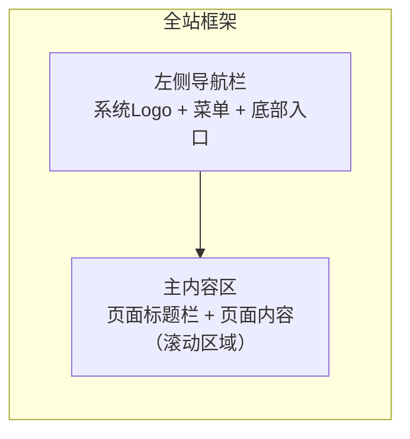

# 01 前端总体设计（全局规范）

> 所属文档：AI 智能客服系统 需求功能说明书 v1.1
> 文件作用：前端框架搭建与所有页面开发前的**必读规范**，包含技术选型、布局、路由、设计令牌、通用组件与状态规范。

---

## 1. 技术选型（建议）

| 层面 | 选型建议 | 说明 |
| --- | --- | --- |
| 框架 | React 18 + TypeScript 或 Vue 3 + TypeScript | 单页应用（SPA） |
| 构建 | Vite | 开发体验与构建速度 |
| UI 组件库 | Ant Design 5 或 Element Plus | 表格、弹窗、表单、下拉等基础组件 |
| 样式 | Tailwind CSS / CSS Modules + 设计变量 | 统一设计令牌 |
| 图表 | ECharts 或 Recharts | 柱状图、环形图、折线图 |
| 对话流式 | SSE（EventSource）/ WebSocket | AI 回答流式输出 |
| 文档渲染 | Markdown 渲染库（react-markdown / marked） | 帮助文档 |
| 状态管理 | Zustand / Pinia + React Query / TanStack Query | 服务端状态缓存 |
| 路由 | React Router / Vue Router | 见本文档 §3 |

## 2. 布局框架

全站统一“**左侧导航 + 右侧内容区**”布局：

| 区域 | 规格 | 说明 |
| --- | --- | --- |
| 侧边栏 | 固定宽度 240–260px，通栏高 | 系统名/Logo、导航菜单、底部“帮助文档/系统设置”入口 |
| 内容区 | 自适应剩余宽度，独立滚动 | 顶部为页面标题/操作栏，下方为页面内容 |
| 顶栏（可选） | 内容区顶部 | 页面标题/面包屑 + 右侧操作（帮助、通知、用户头像） |

**侧边栏设计**：

- 顶部：系统名“AI 智能客服系统” + 副标题“LangGraph + RAG”；
- 菜单项：图标 + 文字，选中态为浅色底 + 主色文字 + 左侧指示条，hover 态浅灰底；
- 底部：帮助文档、系统设置、用户信息/退出入口。

## 3. 导航与路由

| 菜单/路由 | 路径（建议） | 页面 | 原型截图 |
| --- | --- | --- | --- |
| 工作台 | `/dashboard` | 工作台 | img01/03/07/08 |
| 智能客服 | `/chat` | 智能客服对话 | img09/11 |
| 知识库 | `/knowledge` | 知识库列表/选择 | img04/05 |
| 知识库-文档 | `/knowledge/:kbId` | 知识库文档列表 | img02/05 |
| 知识库-文件详情 | `/knowledge/:kbId/documents/:docId` | Chunk 管理 | img02 |
| 检索测试 | `/recall-test` | 检索测试 | img10/13/14/15 |
| 客服工单 | `/tickets` | 客服工单列表/详情 | img06 |
| 系统设置 | `/settings` | 系统设置（规划） | — |
| 帮助文档 | `/help` | 帮助文档 | img12 |
| 应用评测 | `/evaluation` | 评测集/评测任务/评测报告 | —（新增功能） |
| 会话记录 | `/sessions` | 会话列表 | —（新增功能） |
| 会话记录-详情 | `/sessions/:id` | 会话详情（消息、引用、链路、标注） | —（新增功能） |

## 4. 全局设计规范

### 4.1 色彩（基于原型浅色主题）

| 语义 | 色值（建议） | 用途 |
| --- | --- | --- |
| 主色 Primary | `#3B82F6` / `#4A9EFF` | 主按钮、选中态、链接、图表主色 |
| 页面背景 | `#F5F6FA` | 内容区底色 |
| 卡片背景 | `#FFFFFF` | 卡片、弹窗、表格 |
| 边框/分割线 | `#E5E7EB` | 表格线、输入框描边 |
| 正文文本 | `#1F2937` | 标题/正文 |
| 次要文本 | `#6B7280` | 说明、表头 |
| 占位文本 | `#9CA3AF` | placeholder |
| 成功 | `#16A34A` / `#22C55E` | 已完成、命中率高 |
| 警告 | `#F59E0B` | 解析中、中等优先级 |
| 危险 | `#EF4444` | 删除、失败、高优先级 |
| 信息/处理中 | `#3B82F6` | 进行中状态 |

### 4.2 字体与排版

| 层级 | 字号/字重 | 用途 |
| --- | --- | --- |
| 页面标题 | 20px / SemiBold | 内容区顶部标题 |
| 卡片标题 | 16px / Medium | 卡片标题（会话趋势等） |
| KPI 数值 | 30–36px / Bold | 数据卡片主数值 |
| 正文 | 14px / Regular | 默认正文、表格 |
| 辅助说明 | 12–13px | 表头、标签、占位、时间 |
| 数字 | tabular-nums / 等宽数字 | 工单编号、数值、百分比 |

字体栈：`-apple-system, "PingFang SC", "Microsoft YaHei", "Segoe UI", sans-serif`。

### 4.3 间距与圆角

- 页面内边距：24–32px；区块间距：16–24px；卡片内边距：20–24px；
- 圆角：卡片/弹窗 12–16px，按钮/输入框 8–12px，标签/徽标 999px（胶囊）；
- 阴影：卡片默认 `0 1px 3px rgba(0,0,0,.06)`，hover 增强至 `0 4px 12px rgba(0,0,0,.10)`。

### 4.4 通用组件规范

| 组件 | 规范要点 |
| --- | --- |
| 主按钮 | 主色底白字，圆角 8px；hover 加深；loading 态禁用；删除等危险操作用红色按钮 |
| 次按钮 | 白底 + 边框 + 主色文字；用于取消、查看 |
| 输入框 | 高度 36–40px，占位符灰字；聚焦边框主色；带前缀图标（搜索） |
| 下拉选择 | 单选，展开面板；选项 hover 高亮；TopK、知识库选择等 |
| 表格 | 表头浅灰底 13px 灰字；行高 48–56px；行 hover 浅色底；操作列右对齐 |
| 标签/徽标 | 胶囊样式，状态色底 + 深色文字（已完成绿、解析中蓝、失败红） |
| 弹窗 | 遮罩 `rgba(0,0,0,.45)`；居中卡片，圆角 16px；标题 16px + 右上角 ×；底部按钮右对齐（次要+主要） |
| 空状态 | 居中图标 + 主文案 + 辅助文案 + 操作按钮（如“上传文件”） |
| Toast | 右上角，成功/错误/警告图标 + 文案，3s 自动消失 |
| 分页 | 表格底部，页码 + 上一页/下一页 + 总数 |
| 引用反馈控件 | 【新增】引用卡片右侧操作：删除引用、标记无效（附原因）、补充引用（从候选片段选择）；操作后 Toast 反馈并异步上报 |
| 对话内表单卡片 | 【新增】AI 消息内的表单卡片（如订单号/联系方式收集）；字段、必填校验与提交按钮；提交后作为上下文进入对话 |
| 标签选择器 | 【新增】多选标签（Tag）输入：下拉/复选 + 已选标签胶囊；用于 FAQ 模板“标签”列与检索过滤 |
| 评测报告卡片 | 【新增】指标名 + 分数（百分比）+ 状态（通过/待改进）；用于评测任务报告页 |

## 5. 通用状态规范

每个页面/数据区域必须覆盖以下状态：

| 状态 | 表现 | 说明 |
| --- | --- | --- |
| 初始/未操作 | 页面默认内容（如空结果提示） | 首次进入未触发操作 |
| 加载中 | 骨架屏（Skeleton）或 Spinner | 列表/图表/检索/上传均需加载态 |
| 空态 | 图标 + 文案 + CTA | 无数据时友好引导，禁止空白页 |
| 错误 | 错误提示 + “重试”按钮 | 接口失败、上传失败、检索失败 |
| 成功 | Toast / 状态变更 | 创建、删除、保存、上传等操作反馈 |
| 禁用 | 控件置灰、不可点 | 无权限、提交中、输入不合法 |
| 任务运行中 | 进度条/百分比 + 禁止重复提交 | 评测任务运行、批量标注 |
