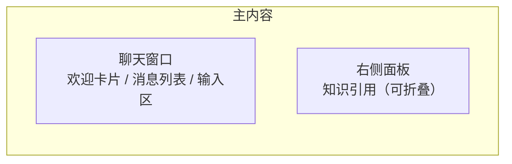

# 03 智能客服（AI 对话）

> 所属文档：AI 智能客服系统 需求功能说明书 v1.1
> 必读依赖：`00_总览.md`（全局上下文）、`01_前端总体设计.md`（设计规范）
> 原型截图：img09 / img11
> 页面性质：**管理端内的 AI 客服演示/测试入口**；用户端（后续版本）见 §9
> 本模块待确认问题：#7（用户端入口）、#8（订单/物流查询）、#4（权限）

---

## 1. 功能概述

管理端内的 AI 客服演示/测试入口：模拟终端用户咨询，提问 → 意图识别 + RAG 检索 → 流式回答 + 知识引用；投诉/无法解答时转人工并创建工单。

## 2. 路由与入口

- 路由：`/chat`；侧边栏“智能客服”。

## 3. 页面布局

| 区域 | 说明 |
| --- | --- |
| 聊天窗口 | 占主区域约 60–70%；从上到下：欢迎区 → 消息列表（滚动）→ 输入区 |
| 右侧引用面板 | 固定宽度约 320px；标题“知识引用”；无引用时可折叠/显示空态 |

## 4. 元素明细

### 4.1 欢迎区（新会话默认展示）

| 元素 | 说明 |
| --- | --- |
| 头像/Logo | AI 客服头像（圆形，主色底） |
| 欢迎语 | “你好，我是 AI 智能客服” + 能力说明（可回答退换货、退款、物流等问题） |
| 快捷问题 | 胶囊按钮：查询订单 / 退款政策 / 商品签收几天可以退货 / 我要投诉转人工；点击即发送 |

### 4.2 消息列表

| 元素 | 说明 |
| --- | --- |
| 消息气泡 | AI 消息靠左（带头像），用户消息靠右（主色底白字）；圆角 12px，最大宽度 70% |
| 流式输出 | AI 回复逐字/逐 token 输出，末尾显示光标动画；输出中可“停止生成”（建议） |
| 引用标记 | AI 消息内可含引用编号 [1][2]，点击定位到右侧引用面板 |
| 系统消息 | 居中灰字小气泡：如“已为您转接人工客服，工单号 TK…，请稍候” |
| 时间 | 首条消息与跨 10 分钟消息显示时间（建议） |

### 4.3 输入区

| 元素 | 说明 |
| --- | --- |
| 文本框 | 多行 textarea，自动增高（1–4 行），占位“请输入您的问题…” |
| 发送按钮 | 主色圆角按钮；空内容禁用；Enter 发送、Shift+Enter 换行 |
| 字数限制 | 建议单条 ≤ 500 字，超出阻止并提示 |
| 生成中 | 发送按钮转为“停止”或禁用，输入区可继续编辑（建议） |

### 4.4 知识引用面板

| 元素 | 说明 |
| --- | --- |
| 来源卡片 | 文件名 + 页码/行号 + 片段摘要（原型示例：FAQ知识库导入模板.xlsx 第 2/4/5 行） |
| 展开原文 | 点击卡片展开完整问题/答案 |
| 空态 | 未命中时显示“本次回答未引用知识库内容” |
| 折叠 | 面板可折叠为窄条，保留入口 |
| 反馈操作（新增） | 卡片操作：删除引用（从本次回答中移除）、标记无效（附原因）、补充引用（从候选片段中选择）；操作后 Toast 反馈并异步上报，数据回流评测集 |

### 4.5 对话内表单卡片（新增）

| 元素 | 说明 |
| --- | --- |
| 触发场景 | 订单查询缺少订单号、需收集联系方式、需用户确认信息等 |
| 表单字段 | 订单号（必填，15 位数字校验）/ 联系方式（手机号校验）；字段类型单行输入或下拉（后续可扩展） |
| 提交按钮 | 主色；校验通过后提交；提交后表单收起，内容作为上下文注入后续消息 |
| 状态 | 待填写 / 已提交 / 超时未提交（保留为未填，不阻塞对话） |
| 展示 | 以 AI 消息内的表单卡片渲染（见 `01_前端总体设计.md` §4.4“对话内表单卡片”） |

## 5. 状态设计

| 状态 | 表现 |
| --- | --- |
| AI 思考中 | 气泡内三点动画或“正在检索知识库…” |
| 流式输出中 | 逐字渲染 + 光标；可停止 |
| 检索无结果 | AI 兜底话术：“未在知识库中找到相关内容，建议转人工客服。” |
| 转人工 | 系统消息提示 + 右侧/气泡展示工单号 |
| 接口错误 | 错误气泡 + “重试”按钮 |
| 知识库为空 | 提示“知识库尚未配置，请联系管理员” |
| 表单待填写 | 表单卡片内联校验提示（如“请输入 15 位订单号”） |

## 6. 交互与校验规则

1. 快捷问题点击后立即作为用户消息发送并触发回答；
2. 订单查询类问题缺少订单号时，AI 追问“请提供订单号”；校验订单号格式（如 15 位数字）；
3. 连续 2 次（建议）AI 无法回答或用户表达投诉/转人工时，触发转人工：停止 AI 接管 → 创建工单 → 系统提示；
4. 消息列表自动滚动到底部；新消息不打断用户上滑阅读（有向上偏移时不强制滚动）；
5. 页面刷新后保留当前会话（建议会话持久化，可新建会话）；
6. 顶部提供模型快速切换下拉（**仅 admin 角色可见可用**，默认使用系统默认模型，见 `07_帮助文档与系统设置.md` §2.1），切换仅影响后续消息；agent/viewer 角色不显示该控件。
7. （新增）引用反馈：删除引用/标记无效/补充引用操作即时更新当前回答的引用面板，并异步上报后端；
8. （新增）对话内表单：触发表单场景时 AI 消息内展示表单卡片，用户提交后自动作为上下文继续对话；
9. （新增）多知识库：会话支持选择多个知识库（默认取知识库配置或系统默认），引用卡片标注来源知识库。

## 7. 业务规则（前端相关）

- 意图识别与路由：订单/物流查询 → 工具调用；退换货/退款政策 → RAG 检索；投诉 → 安抚 + 转人工；其他 → 兜底话术；
- RAG 回答必须附知识引用；无引用时明确提示，不得编造；
- 多轮上下文：同会话支持追问；
- 转人工：用户明确要求、投诉或 AI 连续无法解决时创建工单。
- （新增）引用反馈：引用可被删除/标记无效/补充，反馈写入 `message_feedbacks` 并回流评测集（见 `09_应用评测.md`）；
- （变更）多知识库：会话按 `kb_ids` 检索，多个知识库结果混合返回并标注来源库；
- （新增）意图分类可配置：意图标签（普通问题/查询问题/知识库问答/投诉转人工）与分类规则在“系统设置 → 客服规则”中维护（见 `07_帮助文档与系统设置.md` §2）。

## 8. 验收要点

- 四类示例问题路由正确（订单→工具、政策→RAG、投诉→转人工）；
- RAG 回答附引用，点击编号定位来源；无引用时有说明；
- 多轮追问上下文连续；流式输出无卡顿、可停止；
- 转人工后工单列表出现对应记录，字段完整。
- 引用反馈三种操作生效，且重新检索/刷新后状态可查；
- 对话内表单校验与提交正确，提交内容进入后续上下文；
- 多知识库会话引用标注来源库正确。

---

## 9. 用户端（本期不做，后续版本规划）

- **本期范围仅管理端**；管理端“智能客服”页作为运营/测试入口；
- 用户端（网页客服挂件 / H5 / IM）为后续版本，渠道确定后再设计；
- 预留方向：极简聊天（仅消息列表 + 输入框）、无管理功能、模型固定使用系统默认 Profile、与管理端共用同一套后端；
- 本期后端对话接口按可复用方式设计即可，不额外开发用户端鉴权。
