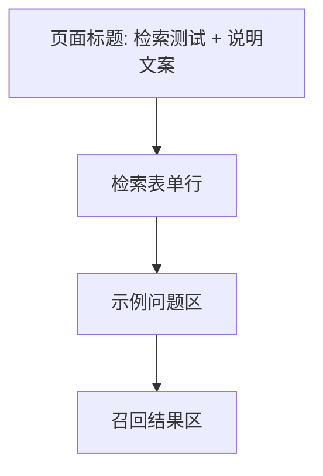

# 05 检索测试（RAG Recall Lab）

> 所属文档：AI 智能客服系统 需求功能说明书 v1.1
> 必读依赖：`00_总览.md`（全局上下文）、`01_前端总体设计.md`（设计规范）
> 原型截图：img10 / img13 / img14 / img15
> 本模块待确认问题：#9（模板与格式，影响检索样例）

---

## 1. 功能概述

评估知识库检索质量：输入问题、选择知识库与 TopK，查看召回命中的文档、页码、片段与相关度。

## 2. 路由与入口

- 路由：`/recall-test`；侧边栏“检索测试”。

## 3. 页面布局

## 4. 元素明细

### 4.1 检索表单行

| 元素 | 说明 |
| --- | --- |
| 知识库选择（变更） | 下拉多选（1~N），默认选中第一个（原型示例：售后知识库）；无权限的知识库不展示、提交时逐库校验 |
| 问题输入框 | 占位“请输入您的问题或关键词…”；支持示例填充；长度 ≤ 200 字 |
| Top K 下拉 | 默认 3，可选 1–10；修改后重新检索 |
| 标签过滤（新增） | 可选按标签过滤（如退货/退款/物流），未配置标签时隐藏该控件 |
| 检索方式（新增） | 下拉：向量检索 / 混合检索（默认）/ 混合+重排；切换后自动重新检索 |
| 搜索按钮 | 主色；空问题禁用；检索中显示 loading |

### 4.2 示例问题区

- 文案：“快速测试：”+ 3 个示例（商品签收后几天可以退货？/ 软件激活后还能退吗？/ 退款审核通过后多久到账？）；
- 点击示例：填充输入框并自动触发检索。

### 4.3 召回结果区

| 元素 | 说明 |
| --- | --- |
| 标题行 | “召回结果” + 命中数（如“3 条命中”） |
| 结果卡片 | 排名 + 来源知识库（多库时）+ 来源文档名 + 页码/行号 + 问题 + 答案片段 + 相关度 |
| 相关度展示（变更） | 分开展示检索分（retrieval_score）与重排分（rerank_score，混合+重排时）；颜色条/标签规则不变；排序按当前生效分数降序 |
| 卡片操作 | 点击卡片查看原文片段/定位对应 Chunk；建议支持勾选标记有效结果（评估用） |
| 对比视图（建议） | 提供“重排前后”TopK 序列对比（并排或切换），直观展示排序变化 |
| 未检索空态 | “提交问题后会返回片段” |
| 无命中空态 | “0 条命中 / 暂无召回结果” |
| 加载态 | 结果区骨架屏或 Spinner |

## 5. 状态设计

| 状态 | 表现 |
| --- | --- |
| 初始 | “提交问题后会返回片段”，结果区为空 |
| 加载中 | 结果区骨架屏/Spinner；搜索按钮 loading |
| 空结果 | “0 条命中 / 暂无召回结果” |
| 错误 | 错误提示 + 重试 |
| 成功 | 结果卡片列表 + 命中数 |

## 6. 交互规则

- TopK 变化、知识库切换后自动重新检索（或点击搜索）；
- （新增）多库检索时对每个知识库逐库做权限校验，无权限库从结果中剔除；
- （新增）标签过滤与知识库多选联动；检索方式切换自动重检；
- 检索期间禁止重复提交；结果按相关度降序排列；
- 相关问题重复检索时，结果应一致（建议结果可缓存）。

## 7. 验收要点

- 原型示例查询“商品签收后几天可以退货？”（TopK=3）返回 3 条：第 2 页 95%、第 5 页 11%、第 4 页 6%，顺序与相关度正确；
- TopK 动态调整生效；空态/加载态/错误态 UI 正确；
- 示例问题一键填充并检索；
- （新增）混合检索 + 重排生效：同一查询下 TopK 序列与分数可解释（95/11/6 案例在混合+重排后排序变化与预期一致）；
- （新增）多库选择、标签过滤、检索方式切换均触发正确检索且权限校验生效。
