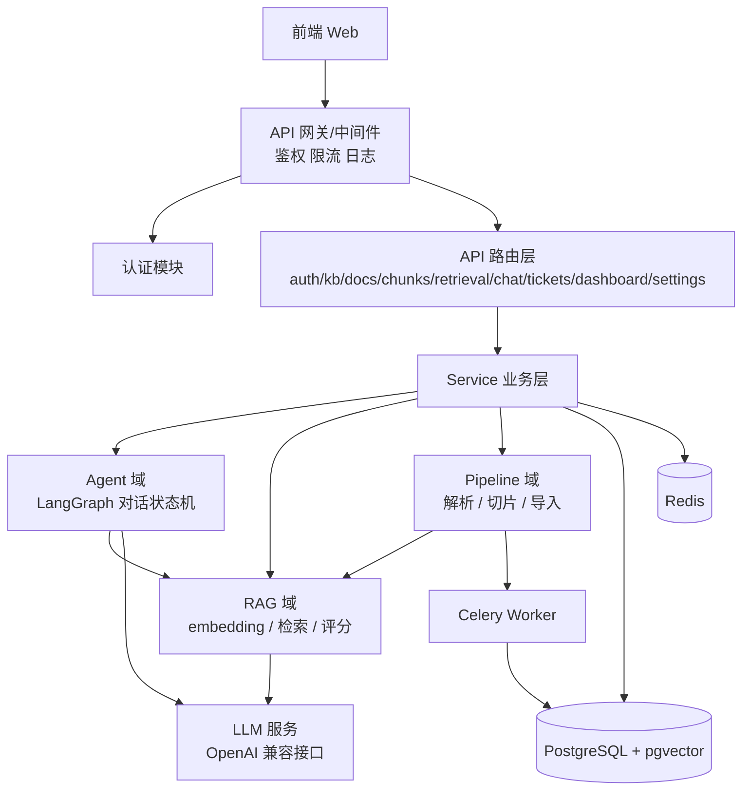
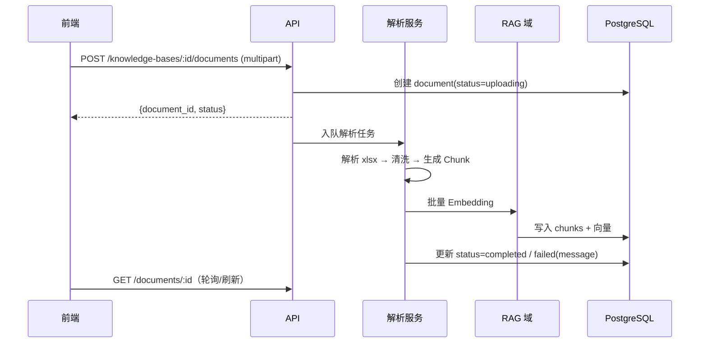
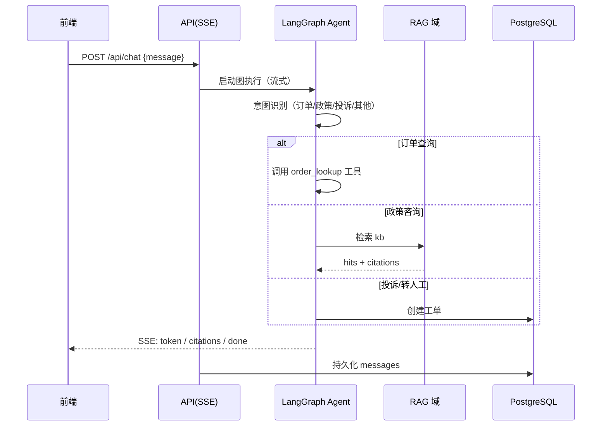
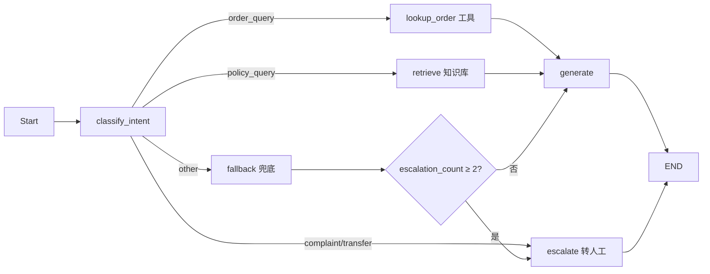
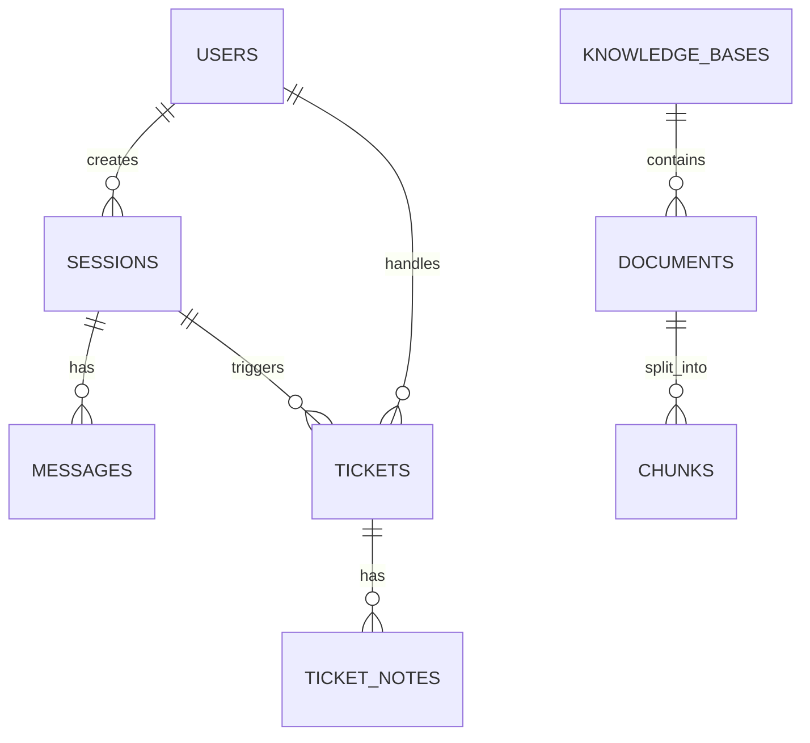
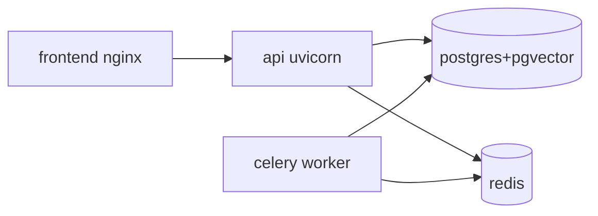

# 08 后端详细设计（草案 v1.0）

> 所属文档：AI 智能客服系统 需求功能说明书
> 文件状态：**详细设计草案 v1.1**，部分决策已确认（LLM/Embedding/向量库/订单查询，见 §2 与 §11），其余待评审
> 配套阅读：`00_总览.md`（全局上下文与非功能约束）、`03_智能客服.md`、`04_知识库.md`、`05_检索测试.md`、`06_客服工单.md`（业务口径）

---

## 目录

1. [设计目标与原则](#1-设计目标与原则)
2. [技术选型（推荐，待确认）](#2-技术选型推荐待确认)
3. [总体架构](#3-总体架构)
4. [模块详细设计](#4-模块详细设计)
5. [数据模型](#5-数据模型)
6. [API 设计](#6-api-设计)
7. [错误码规范](#7-错误码规范)
8. [安全设计](#8-安全设计)
9. [可观测性](#9-可观测性)
10. [部署方案](#10-部署方案)
11. [待确认决策点](#11-待确认决策点)
12. [开发顺序建议](#12-开发顺序建议)

---

## 1. 设计目标与原则

1. **AI 能力可替换**：LLM、Embedding、向量库全部抽象为可配置组件，避免被单一供应商绑定；
2. **分层清晰**：API（路由/校验）→ Service（业务）→ 数据访问 三层，Agent/RAG 独立成域；
3. **异步化耗时任务**：文档上传解析、向量化走任务队列，不阻塞 HTTP；
4. **数据安全与隔离**：知识库按租户/知识库隔离权限，敏感数据不出私有网络；
5. **全链路可观测**：对话、检索、工单均有 trace 与结构化日志；
6. **MVP 优先（变更）**：先跑通“上传 → 检索 → 对话 → 工单 → 统计 → 评测”闭环；混合检索与重排本期实现，SSO 等增强能力后续扩展。
7. **评测闭环（新增）**：以黄金样本评测驱动检索与生成优化，引用反馈与人工标注回流评测集。

---

## 2. 技术选型（推荐，待确认）

| 层面 | 推荐选型 | 备选 | 说明 |
| --- | --- | --- | --- |
| 语言/运行时 | Python 3.11+ | — | 与 LangGraph 生态深度一致 |
| Web 框架 | FastAPI + Uvicorn | Flask / Django | 异步、自动 OpenAPI 文档、Pydantic 原生 |
| 业务数据库 | PostgreSQL 15+ | MySQL | 事务、JSONB、全文检索 |
| 向量存储 | pgvector（已确认） | Milvus / FAISS / Qdrant | MVP 与业务库同库，事务一致；数据量上来再评估 |
| 缓存/队列 | Redis | — | 会话缓存、限流、任务队列 |
| 任务队列 | Celery（redis broker） | ARQ / BackgroundTasks | 上传解析、向量化、统计聚合 |
| ORM/迁移 | SQLAlchemy 2.0 + Alembic | — | 类型注解友好 |
| Agent 框架 | LangGraph | LangGraph.js | 对话状态机、工具调用 |
| LLM 接入 | 智谱 GLM 起步（免费版 glm-4-flash），抽象为多模型 Profile | DeepSeek / OpenAI / 本地 Ollama | 支持前后端自主切换模型（见 §4.7） |
| Embedding | bge-m3（1024 维，本地部署或 API 接入） | OpenAI 兼容 embedding | 维度决定 pgvector 索引配置 |
| 重排模型（新增） | ✅ 已确认：SiliconFlow `BAAI/bge-reranker-v2-m3`（OpenAI 兼容接口 `https://api.siliconflow.cn/v1`） | 本地部署 | 混合检索后精排（见 §11 #15） |
| 评测（新增） | LLM-as-judge：复用 model_profiles 对话模型 | 规则打分 | 指标：回答准确性 / 问题相关性 / 语义准确性（准确性先行） |
| 鉴权 | JWT（access + refresh）+ RBAC | Session | 无状态、易水平扩展 |
| 序列化/校验 | Pydantic v2 | — | FastAPI 集成 |
| 日志 | structlog + 可选 Sentry | logging | JSON 结构化日志 |
| 测试 | pytest + httpx + pytest-asyncio | — | 接口与单测 |
| 部署 | 暂缓（MVP 先本地运行，项目完成后统一部署） | Docker Compose / K8s | 见 §11 |

> 如果团队更熟悉 Node，Agent 层可用 LangGraph.js，但推荐 Python 保持与 LangGraph 能力一致（并行节点、checkpointer 等）。

> **模型切换能力（已确认需求）**：系统需支持管理员在“系统设置 → 模型配置”中维护多套模型配置（Provider / 模型名 / Base URL / API Key / 参数），并切换默认模型；对话页可选提供快速切换（便于对比测试）。详见 §4.7 与 §6.2。

---

## 3. 总体架构

### 3.1 分层架构



### 3.2 关键数据流：文档导入



### 3.3 关键数据流：对话



### 3.4 后端目录结构（建议）

```
backend/
├─ app/
│  ├─ main.py                 # FastAPI 入口
│  ├─ api/
│  │  ├─ deps.py              # 依赖注入（当前用户、RBAC、DB Session）
│  │  └─ routes/
│  │     ├─ auth.py
│  │     ├─ knowledge_bases.py
│  │     ├─ documents.py
│  │     ├─ chunks.py
│  │     ├─ retrieval.py
│  │     ├─ chat.py           # SSE 流式
│  │     ├─ tickets.py
│  │     ├─ dashboard.py
│  │     ├─ settings.py
│  │     ├─ evaluations.py    # 评测集/任务/报告（新增）
│  │     ├─ sessions.py       # 会话记录列表/详情（新增）
│  │     └─ feedbacks.py      # 引用反馈（新增）
│  ├─ core/
│  │  ├─ config.py            # pydantic-settings
│  │  ├─ security.py          # JWT、密码哈希、RBAC
│  │  ├─ logging.py
│  │  └─ exceptions.py        # 统一异常
│  ├─ models/                 # SQLAlchemy
│  ├─ schemas/                # Pydantic 请求/响应
│  ├─ services/               # 业务逻辑（含 evaluation.py 评测服务，新增）
│  ├─ agents/
│  │  ├─ state.py
│  │  ├─ nodes.py             # 各图节点
│  │  ├─ graph.py             # LangGraph 组装
│  │  └─ tools.py             # order_lookup / create_ticket
│  ├─ rag/
│  │  ├─ embeddings.py        # LLM 兼容 adapter
│  │  ├─ vector_store.py      # pgvector 读写
│  │  ├─ retriever.py         # 检索 + RRF 融合 + 评分
│  │  └─ reranker.py          # 重排 API 适配（新增）
│  ├─ pipeline/
│  │  ├─ parser.py            # xlsx/文本解析
│  │  ├─ chunker.py           # 切片规则
│  │  └─ importer.py          # 入库编排
│  ├─ workers/
│  │  └─ tasks.py             # Celery 任务（解析/向量化/评测任务，新增评测）
│  └─ db/
│     ├─ session.py
│     └─ base.py
├─ alembic/
├─ tests/
├─ docker-compose.yml
├─ .env.example
└─ pyproject.toml
```

---

## 4. 模块详细设计

### 4.1 认证与权限（Auth）

| 能力 | 设计 |
| --- | --- |
| 登录 | `POST /api/auth/login`，账密校验（bcrypt），签发 access token（建议 2h）+ refresh token（建议 7d） |
| 鉴权 | JWT 中间件/依赖注入；`GET /api/auth/me` 返回当前用户与角色 |
| 角色 | `admin`（全部）、`agent`（工单/会话）、`viewer`（只读） |
| RBAC | 路由级依赖 `require_roles(...)`；敏感操作（删库、改设置）仅 admin |
| 审计 | 登录成功/失败、权限变更写入 audit_logs |
| 待定 | 是否接入 SSO/企业微信（见 §11） |

### 4.2 知识库 / 文档 / Chunk

**知识库**

- CRUD；名称唯一（冲突返回 409）；删除采用软删除（`deleted_at`）并级联标记文档；
- 删除为高危操作：二次确认后，先清空该知识库的向量与文档，再标记删除。

**文档上传**

- `multipart/form-data` 上传；校验扩展名白名单（MVP：`.xlsx`；规划：`.csv/.md/.txt/.pdf/.docx`）与大小（≤ 20MB）；
- 落盘到对象存储抽象（MVP 本地目录，规划 S3/MinIO），创建 document 记录（status=uploading）后立即返回，解析异步执行；
- 状态机：`uploading → parsing → embedding → completed | failed(message)`；失败可重试/重新解析。

**解析与切片（FAQ 模板）**

- xlsx 模板列：`问题 | 答案 | 分类(可选)`；逐行生成 Chunk；
- 清洗规则：去空行、空问题跳过、去首尾空白、答案截断上限（建议 2000 字）；
- 每个 Chunk 记录：`chunk_index / question / answer / page / row / word_count`；
- 普通文本（规划）：按标题/段落/固定长度 + 重叠切分。

**向量化与入库**

- 解析完成后批量调用 Embedding（可分批，如 32 条/批），写入 pgvector；
- Chunk 编辑：更新文本后**仅重算该条向量**；文档删除/重新解析：先删旧向量再写新数据；
- 一致性：向量写入失败则文档状态置 failed，可重试。

### 4.3 RAG 检索（Retrieval）

| 环节 | 设计 |
| --- | --- |
| 向量检索 | pgvector 余弦相似度（`<=>`），必须携带 `kb_ids` 过滤（多库，变更） |
| 关键词检索（变更） | PostgreSQL 全文检索（tsvector），与向量结果按 RRF 融合（原“规划”转正式） |
| 重排（变更） | 混合检索结果取 top_n 候选（建议 20）调用重排 API（bge-reranker，见 §2），输出 top_k，记录 `rerank_score` |
| 标签过滤（新增） | `chunks.tags` 与请求 `tags` 取交集过滤（FAQ“标签”列导入） |
| 候选集 | `top_k` 候选（1–10，默认 3）；不做阈值过滤，展示全量相关度 |
| 相关度归一化 | 检索分：min-max 归一化到 0–100；重排分：服务商返回分数原样展示（待调参） |
| 检索模式（新增） | `retriever_mode`: `vector` / `hybrid` / `hybrid_rerank`（默认 `hybrid`；配置重排 Profile 后可用 `hybrid_rerank`） |
| 返回字段（变更） | `chunk_id / kb_id / document_name / page / row / question / answer / retrieval_score / rerank_score` |
| 接口 | `POST /api/retrieval/test {kb_ids, query, top_k, tags?, retriever_mode?}` |

### 4.4 对话 Agent（LangGraph）

**状态定义（示例）**

```python
class ChatState(TypedDict):
    messages: list          # 对话消息
    intent: str             # order_query / policy_query / complaint / transfer / other
    kb_ids: list            # 多知识库 ID 列表（变更）
    order_no: str | None
    form_data: dict | None  # 对话内表单收集结果（新增）
    escalation_count: int   # 连续失败次数
    citations: list         # 引用片段
    ticket: dict | None     # 转人工创建的工单
```

**图结构**



**节点职责**

| 节点 | 职责 |
| --- | --- |
| classify_intent | LLM（或规则）判定意图；抽取订单号 |
| lookup_order | 工具节点：MVP 返回 mock 物流信息；规划对接业务系统（见 §11） |
| collect_form（新增） | 工具节点：订单查询缺订单号等场景下发表单卡片（订单号/联系方式），收集结果写入 state |
| retrieve | 调用 RAG，将结果写入 `citations` |
| generate | LLM 生成回答（流式），引用编号与 citations 对应 |
| escalate | 创建工单（类型 human_service、优先级规则），返回系统消息含工单号 |
| fallback | 兜底话术，`escalation_count + 1` |

**转人工规则**

- 意图为 `complaint` / `transfer`，或 `escalation_count ≥ 2` 时触发转人工；
- 转人工后本会话 AI 不再接管（状态置 transferred），后续消息归人工。

**引用反馈（新增）**

- assistant 消息的引用支持三种反馈：`delete`（删除引用）/ `invalid`（标记无效，附原因）/ `add`（补充引用，从候选片段选择）；
- 反馈写入 `message_feedbacks`，定期汇入评测集候选（见 §4.9 与 `09_应用评测.md`）。

**多知识库与意图配置（新增）**

- 会话与检索使用 `kb_ids`（多库），引用标注来源 `kb_id`；
- 意图分类标签与规则在 `settings`（group=intent）中配置，classify_intent 节点优先读取配置。

**SSE 流式协议（POST /api/chat）**

```
event: message_start
data: {"session_id": "s_xxx"}

event: token
data: {"content": "您好，"}

event: citations
data: {"citations": [{"chunk_id": 1, "document_name": "FAQ知识库导入模板.xlsx", "page": 2, "score": 95}]}

event: done
data: {"message_id": "m_xxx", "intent": "policy_query"}

event: error
data: {"code": "50200", "message": "模型服务暂不可用"}
```

**上下文策略**

- 携带最近 10 条消息（或按 token 截断，max 可配）；会话在 Redis 缓存，落库持久化；
- 每次回复后同步持久化 user/assistant 消息，含 intent 与 cited_chunk_ids。

**模型选择**

- 对话默认使用 `model_profiles` 中标记为默认的配置；请求体可携带 `model_profile_id` 临时指定；
- 管理端对话页提供模型切换下拉（**仅 admin 角色**，便于 A/B 对比），切换仅影响后续消息；
- 用户端本期不做；后续版本接入时固定使用默认 Profile，无切换权限，接口层按角色拦截。

### 4.5 工单（Tickets）

| 能力 | 设计 |
| --- | --- |
| 自动创建 | Agent escalate 节点调用 `create_ticket` 工具：内容=用户诉求摘要 + 关联 session_id + 命中片段 |
| 编号 | `TK + yyyyMMddHHmmss + 6位随机`（唯一索引） |
| 状态机 | `open → processing → closed`；服务层校验流转合法性，禁止跳级/回退 |
| 优先级 | 默认 `high`（投诉/质量），其余 `medium/low`；支持人工调整 |
| 处理记录 | `ticket_notes`：处理人、备注、状态变更时间线 |
| 查询 | 列表筛选：status / priority / 时间范围 / 关键词（编号、内容），分页 |

### 4.6 工作台统计（Dashboard）

- 按日聚合表 `dashboard_stats`：每日 00:05 定时任务汇总昨日数据，另支持实时增量（可选）；
- 指标：今日会话数、AI 自动解决率、转人工数量、知识库命中率（口径见 `02_工作台.md` §7）；
- 趋势：近 7/30 日会话数（`dashboard/trend`）；
- 意图分布：按日汇总 `intent_distribution`（JSONB）；
- 接口：`GET /api/dashboard/stats`、`trend?days=7`、`intents?days=7`。

### 4.7 设置（Settings）

- `settings` 表（key-value JSONB）：Prompt、转人工规则、TopK 默认、相关度阈值等业务配置；
- 生效机制：启动时加载默认值 + DB 覆盖；API Key 标记 `is_secret`，接口返回脱敏（`sk-***`）；
- **模型配置管理（前后端自主切换）**：独立 `model_profiles` 表维护多套模型配置：
  - 字段：名称、Provider（智谱 GLM / OpenAI 兼容 / DeepSeek / SiliconFlow / 本地 Ollama，变更）、模型名、Base URL、API Key（加密存储）、temperature、top_p、max_tokens、用途（对话/Embedding/重排，变更）、is_default、enabled；
  - 能力：新增 / 编辑 / 删除 / 测试连通 / 设为默认；默认配置对对话与 Embedding 生效；
  - API Key 一律不返回明文；测试连接接口仅返回成功与否与耗时；
  - 删除默认 Profile 前必须先将默认切换到其他 Profile。

### 4.8 审计与日志（Audit）

- `audit_logs`：记录登录、删除知识库/文档、修改设置、创建/处理工单等敏感操作；
- 字段：user、action、target_type、target_id、detail(JSONB)、ip、created_at；
- 对话/检索日志脱敏（手机号、订单号），保留策略可配置。

### 4.9 应用评测与会话记录（新增）

**应用评测**

- 评测集（`eval_sets` + `eval_samples`）：30 条公开样例起步（问题/期望答案/期望引用），支持手动导入，并从引用反馈、人工标注回流新样本；
- 评测任务（`eval_tasks` + `eval_results`）：选择评测集与对话模型 Profile，Celery 批量执行问答，LLM-as-judge 打分；
- 指标：回答准确性（先行实现）/ 问题相关性 / 语义准确性（预留）；
- 报告：任务平均分、分样本明细（问题/回答/引用/各项得分/通过标记）。

**会话记录**

- 提供会话列表与详情查询（消息、引用、链路 trace、关联工单）；
- 支持人工标注（标签/备注/是否纳入评测集），标注写入评测集候选；
- 详情页展示 `trace_logs` 链路（intent → retrieval → rerank → generate，含耗时与得分）。

---

## 5. 数据模型

### 5.1 ER 概览



### 5.2 表结构

**users（用户）**

| 字段 | 类型 | 说明 |
| --- | --- | --- |
| id | uuid PK | — |
| username | varchar(50) UNIQUE | 登录名 |
| password_hash | varchar(255) | bcrypt |
| display_name | varchar(50) | 显示名 |
| role | enum(admin/agent/viewer) | 角色 |
| status | enum(active/disabled) | 状态 |
| last_login_at | timestamptz | — |
| created_at / updated_at | timestamptz | — |

**knowledge_bases（知识库）**

| 字段 | 类型 | 说明 |
| --- | --- | --- |
| id | uuid PK | — |
| name | varchar(50) UNIQUE | 名称 |
| description | varchar(200) | 描述 |
| created_by | uuid FK users | 创建人 |
| deleted_at | timestamptz NULL | 软删除 |
| created_at / updated_at | timestamptz | — |

**documents（文档）**

| 字段 | 类型 | 说明 |
| --- | --- | --- |
| id | uuid PK | — |
| kb_id | uuid FK | 所属知识库 |
| file_name | varchar(255) | 文件名 |
| file_type | varchar(20) | 扩展名 |
| file_size | bigint | 字节 |
| file_url | varchar(500) | 存储路径 |
| status | enum(uploading/parsing/embedding/completed/failed) | 解析状态 |
| error_message | varchar(500) NULL | 失败原因 |
| chunk_count | int | Chunk 数 |
| created_at / updated_at | timestamptz | — |

**chunks（切片）**

| 字段 | 类型 | 说明 |
| --- | --- | --- |
| id | uuid PK | — |
| doc_id | uuid FK | 所属文档 |
| kb_id | uuid FK | 冗余，检索过滤用 |
| chunk_index | int | 序号 |
| question | varchar(200) | 问题 |
| answer | text | 答案 |
| page / row | varchar(50) | 页码/行号（溯源） |
| word_count | int | 字数 |
| tags | jsonb | 标签列表（FAQ“标签”列导入，检索过滤用，新增） |
| embedding | vector(1536) | 向量（维度随模型） |
| created_at / updated_at | timestamptz | — |

**sessions（会话）**

| 字段 | 类型 | 说明 |
| --- | --- | --- |
| id | uuid PK | 会话 ID |
| user_id | uuid FK NULL | 关联用户 |
| channel | varchar(50) | 来源渠道（web 等） |
| status | enum(active/closed/transferred) | 状态 |
| kb_ids | jsonb | 知识库 ID 列表（多库检索，变更，替代原 kb_id 字段） |
| created_at / updated_at | timestamptz | — |

**messages（消息）**

| 字段 | 类型 | 说明 |
| --- | --- | --- |
| id | uuid PK | — |
| session_id | uuid FK | 所属会话 |
| role | enum(user/assistant/system) | 角色 |
| content | text | 内容 |
| intent | varchar(50) NULL | 意图 |
| cited_chunk_ids | jsonb | 引用的 Chunk ID 列表 |
| created_at | timestamptz | — |

**tickets（工单）**

| 字段 | 类型 | 说明 |
| --- | --- | --- |
| id | uuid PK | — |
| ticket_no | varchar(40) UNIQUE | 编号 |
| session_id | uuid FK | 来源会话 |
| user_id | uuid FK NULL | 用户 |
| type | varchar(50) | human_service |
| content | text | 诉求内容 |
| status | enum(open/processing/closed) | 状态 |
| priority | enum(high/medium/low) | 优先级 |
| assignee_id | uuid FK NULL | 处理人 |
| created_at / updated_at | timestamptz | — |

**ticket_notes（工单处理记录）**

| 字段 | 类型 | 说明 |
| --- | --- | --- |
| id | uuid PK | — |
| ticket_id | uuid FK | 工单 |
| operator_id | uuid FK | 操作人 |
| note | text | 备注 |
| status_from / status_to | enum | 状态变更 |
| created_at | timestamptz | — |

**dashboard_stats（每日统计）**

| 字段 | 类型 | 说明 |
| --- | --- | --- |
| stat_date | date PK | 统计日期 |
| sessions_count | int | 会话数 |
| ai_solved_count / ai_solved_rate | int / numeric | 自动解决 |
| transfer_count | int | 转人工数 |
| kb_hit_rate | numeric | 命中率 |
| intent_distribution | jsonb | 意图分布 |
| created_at / updated_at | timestamptz | — |

**settings（配置）**

| 字段 | 类型 | 说明 |
| --- | --- | --- |
| key | varchar(100) PK | 配置键 |
| value | jsonb | 配置值 |
| group | varchar(50) | 分组（model/prompt/escalation） |
| description | varchar(200) | 说明 |
| is_secret | boolean | 是否脱敏 |
| updated_at | timestamptz | — |

**model_profiles（模型配置）**

| 字段 | 类型 | 说明 |
| --- | --- | --- |
| id | uuid PK | — |
| name | varchar(50) UNIQUE | 配置名称（如“智谱免费 GLM”） |
| provider | varchar(20) | zhipu / openai / deepseek / ollama |
| model | varchar(100) | 模型名（如 glm-4-flash） |
| base_url | varchar(255) | API 地址（可为空，用默认） |
| api_key_enc | text | 加密后的 API Key |
| temperature / top_p | numeric | 生成参数 |
| max_tokens | int | 最大输出 |
| role | enum(chat/embedding/rerank) | 用途（变更：新增重排） |
| is_default | boolean | 是否默认 |
| enabled | boolean | 是否启用 |
| created_at / updated_at | timestamptz | — |

**audit_logs（审计）**

| 字段 | 类型 | 说明 |
| --- | --- | --- |
| id | uuid PK | — |
| user_id | uuid FK NULL | 操作人 |
| action | varchar(50) | 动作 |
| target_type / target_id | varchar | 目标 |
| detail | jsonb | 详情 |
| ip | varchar(50) | 来源 IP |
| created_at | timestamptz | — |

**eval_sets（评测集，新增）**

| 字段 | 类型 | 说明 |
| --- | --- | --- |
| id | uuid PK | — |
| name | varchar(100) UNIQUE | 名称 |
| description | varchar(200) | 描述 |
| source | enum(manual/public/feedback) | 来源：手动 / 公开样例 / 反馈回流 |
| created_by | uuid FK users | 创建人 |
| created_at / updated_at | timestamptz | — |

**eval_samples（评测样本，新增）**

| 字段 | 类型 | 说明 |
| --- | --- | --- |
| id | uuid PK | — |
| eval_set_id | uuid FK | 所属评测集 |
| question | varchar(500) | 问题 |
| expected_answer | text | 期望答案 |
| expected_chunks | jsonb | 期望引用的 Chunk ID 列表 |
| source | varchar(50) | 来源（feedback/annotation/import） |
| created_at | timestamptz | — |

**eval_tasks（评测任务，新增）**

| 字段 | 类型 | 说明 |
| --- | --- | --- |
| id | uuid PK | — |
| eval_set_id | uuid FK | 评测集 |
| model_profile_id | uuid FK | 使用的对话模型 Profile |
| status | enum(pending/running/completed/failed) | 状态 |
| progress / total | int | 进度 |
| score_avg | numeric | 平均分 |
| metrics | jsonb | 分指标得分（accuracy/relevancy/semantic） |
| created_by | uuid FK users | 创建人 |
| created_at / updated_at | timestamptz | — |

**eval_results（评测明细，新增）**

| 字段 | 类型 | 说明 |
| --- | --- | --- |
| id | uuid PK | — |
| task_id | uuid FK | 评测任务 |
| sample_id | uuid FK | 评测样本 |
| answer | text | 模型回答 |
| citations | jsonb | 引用片段 |
| scores | jsonb | 各项得分 |
| passed | boolean | 是否通过（可人工调整） |
| created_at | timestamptz | — |

**message_feedbacks（引用反馈，新增）**

| 字段 | 类型 | 说明 |
| --- | --- | --- |
| id | uuid PK | — |
| session_id | uuid FK | 会话 |
| message_id | uuid FK | 消息 |
| chunk_id | uuid FK NULL | 目标 Chunk |
| action | enum(delete/invalid/add) | 反馈动作 |
| reason | varchar(200) NULL | 原因/说明 |
| user_id | uuid FK NULL | 操作人 |
| created_at | timestamptz | — |

**trace_logs（会话链路日志，新增）**

| 字段 | 类型 | 说明 |
| --- | --- | --- |
| id | uuid PK | — |
| session_id / message_id | uuid FK | 会话与消息 |
| request_id | varchar(64) | 贯穿请求 ID |
| steps | jsonb | 链路步骤（intent/retrieval/rerank/generate，含得分与耗时） |
| latency_ms | int | 总耗时 |
| tokens | jsonb | token 统计 |
| created_at | timestamptz | — |

### 5.3 索引建议

- `documents(kb_id)`；`chunks(doc_id)`、`chunks(kb_id)`；
- `chunks.embedding` 使用 HNSW 向量索引（`vector_cosine_ops`）；
- `messages(session_id)`；`tickets(status, priority, created_at)`；`tickets(ticket_no)`；
- `dashboard_stats(stat_date)`；`audit_logs(created_at)`；
- （新增）`eval_tasks(eval_set_id, status)`；`eval_results(task_id)`；`message_feedbacks(message_id)`；`trace_logs(session_id, created_at)`。

---

## 6. API 设计

### 6.1 通用规范

- 统一响应：`{"code": 0, "message": "ok", "data": {...}}`；code 非 0 表示失败；
- 分页：请求 `page`（默认 1）、`page_size`（默认 10，≤ 100）；响应 `data: {items, total, page, page_size}`；
- 认证：请求头 `Authorization: Bearer <token>`；
- 时间：ISO 8601（UTC+8 展示由前端处理）。

### 6.2 关键接口示例

**POST /api/retrieval/test（检索测试，变更：多库 + 标签 + 检索模式）**

```json
// 请求
{"kb_ids": ["kb_001"], "query": "商品签收后几天可以退货？", "top_k": 3, "tags": ["退货"], "retriever_mode": "hybrid_rerank"}

// 响应 data
{
  "hits": [
    {"chunk_id": "c_01", "kb_id": "kb_001", "document_name": "FAQ知识库导入模板.xlsx", "page": 2, "row": 2,
     "question": "商品签收后几天可以退货？", "answer": "普通商品自签收之日起7天内…",
     "retrieval_score": 95, "rerank_score": 0.93},
    {"chunk_id": "c_05", "kb_id": "kb_001", "document_name": "FAQ知识库导入模板.xlsx", "page": 5, "row": 5,
     "question": "其他问题如何处理？", "answer": "如确认是商品质量问题…",
     "retrieval_score": 11, "rerank_score": 0.21},
    {"chunk_id": "c_04", "kb_id": "kb_001", "document_name": "FAQ知识库导入模板.xlsx", "page": 4, "row": 4,
     "question": "软件激活后还能退款吗？", "answer": "软件类、会员类…",
     "retrieval_score": 6, "rerank_score": 0.09}
  ],
  "query": "商品签收后几天可以退货？",
  "top_k": 3,
  "retriever_mode": "hybrid_rerank"
}
```

**POST /api/chat（对话，SSE 流式）**

```json
// 请求
{"session_id": null, "kb_ids": ["kb_001"], "message": "退款多久到账？"}   // 变更：kb_id → kb_ids
// 响应：见 §4.4 SSE 协议
```

**POST /api/knowledge-bases/:kbId/documents（上传）**

```json
// multipart: file=FAQ知识库导入模板.xlsx
// 响应 data: {"document_id": "doc_01", "file_name": "FAQ知识库导入模板.xlsx", "status": "uploading"}
```

**GET /api/dashboard/stats**

```json
// 响应 data
{"today_sessions": 2, "ai_solved_rate": 50.0, "transfer_count": 6, "kb_hit_rate": 50.0}
```

**GET /api/tickets（列表/筛选）**

```json
// 请求 query: ?status=open&priority=high&keyword=TK&page=1&page_size=10
// 响应 data: {"items": [{"ticket_no": "TK20260716182115ea280e", "type": "human_service",
//   "content": "转入人工", "status": "open", "priority": "high", "created_at": "..."}], "total": 6, "page": 1}
```

**POST /api/tickets/:id/action（处理）**

```json
// 请求: {"action": "start" | "close", "note": "已电话回访用户"}
// 校验：open→start→processing→close；记录 ticket_notes
```

**模型配置管理（前后端自主切换）**

```json
// GET /api/settings/model-profiles 列表（API Key 脱敏）
{"items": [{"id": "mp_01", "name": "智谱免费 GLM", "provider": "zhipu",
  "model": "glm-4-flash", "base_url": null, "api_key": "sk-***",
  "temperature": 0.7, "is_default": true, "enabled": true}]}

// POST /api/settings/model-profiles            新增
// PUT   /api/settings/model-profiles/:id       编辑
// DELETE /api/settings/model-profiles/:id      删除（默认项拒绝）
// PUT   /api/settings/model-profiles/:id/activate  设为默认
// POST  /api/settings/model-profiles/:id/test      测试连通
// 返回: {"ok": true, "latency_ms": 320}
```

对话请求可携带 `model_profile_id` 临时指定模型；不传则使用默认 Profile。

**应用评测（新增）**

```text
GET   /api/evaluations/sets                     # 评测集列表
POST  /api/evaluations/sets                     # 创建评测集 {name, description}
POST  /api/evaluations/sets/:id/samples         # 导入样本（30 条公开样例）{items: [{question, expected_answer, expected_chunks}]}
POST  /api/evaluations/tasks                    # 创建评测任务 {eval_set_id, model_profile_id}
GET   /api/evaluations/tasks/:id                # 任务状态与进度
GET   /api/evaluations/tasks/:id/report         # 报告：指标 + 样本明细
```

**会话记录与引用反馈（新增）**

```text
GET   /api/sessions?keyword&intent&status&date_range&page   # 会话列表
GET   /api/sessions/:id                           # 详情：消息 + 引用 + 链路 + 关联工单
POST  /api/sessions/:id/annotations               # 人工标注 {label, note, include_in_eval}
POST  /api/feedbacks                              # 引用反馈 {message_id, chunk_id, action: delete|invalid|add, reason?}
```

---

## 7. 错误码规范

| 错误码 | 含义 | 前端处理 |
| --- | --- | --- |
| 0 | 成功 | — |
| 40000 | 参数错误 | 表单校验提示 |
| 40100 | 未登录 | 跳转登录 |
| 40101 | token 过期 | 刷新 token / 重新登录 |
| 40300 | 无权限 | 提示无权限 |
| 40400 | 资源不存在 | 提示资源不存在 |
| 40900 | 冲突（名称重复等） | 表单提示 |
| 42200 | 校验失败 | 显示字段错误 |
| 50000 | 内部错误 | 通用错误提示 |
| 50200 | 上游服务错误（LLM/检索） | 友好提示 + 可重试 |
| 50400 | 上游超时 | 提示稍后重试 |

---

## 8. 安全设计

- **传输/存储**：全站 HTTPS；数据库连接加密；知识库文档（敏感数据）存储加密（规划）；
- **鉴权**：JWT access(2h) + refresh(7d)；RBAC 路由级校验；刷新令牌轮换；
- **上传安全**：扩展名白名单、MIME 校验、大小限制、存储路径随机化；恶意文件扫描（规划）；
- **Prompt 注入防护**：输入前置规则过滤（越权指令关键词）+ 可选 LLM 判定；系统提示词强化边界；
- **内容安全**：回答与文档过敏感词/内容审核服务（规划，可插拔）；
- **数据隔离**：所有检索/查询强制携带 kb_id（多库为 kb_ids）与权限校验，防止越权读取；
- （新增）**多库权限**：`kb_ids` 中每个知识库逐一校验可见性，任一越权即整请求拒绝或剔除该库；
- **日志脱敏**：手机号、订单号、API Key 脱敏后落日志；
- **密钥管理**：API Key、JWT Secret 走环境变量/密钥管理，不进代码库。

---

## 9. 可观测性

| 维度 | 方案 |
| --- | --- |
| 日志 | structlog JSON 输出；request_id 贯穿请求-对话-检索链路 |
| 指标 | HTTP 延迟/错误率、LLM token 消耗与成本、检索 P95、队列积压量 |
| Trace | 对话/检索链路 span（FastAPI middleware + Agent 节点埋点） |
| 告警 | LLM 失败率、5xx 比例、队列积压、任务失败数 |
| 审计 | 敏感操作审计日志（§4.8） |

---

## 10. 部署方案



**docker-compose 服务**：`api`、`worker`、`postgres(pgvector 镜像)`、`redis`、`frontend(nginx 静态托管 + 反代)`。

**环境变量（.env.example）**

| 变量 | 说明 |
| --- | --- |
| `DATABASE_URL` | PostgreSQL 连接串 |
| `REDIS_URL` | Redis 连接串 |
| `JWT_SECRET` / `JWT_EXPIRE_MINUTES` | 密钥与有效期 |
| `LLM_PROVIDER=zhipu` / `LLM_MODEL=glm-4-flash` / `LLM_API_KEY` / `LLM_BASE_URL` | LLM 默认配置（智谱 GLM 起步；运行时以 model_profiles 为准） |
| `EMBEDDING_MODEL=bge-m3` / `EMBEDDING_DIM=1024` / `EMBEDDING_API_KEY` | Embedding 默认配置 |
| `RERANK_MODEL=BAAI/bge-reranker-v2-m3` / `RERANK_API_KEY` / `RERANK_BASE_URL=https://api.siliconflow.cn/v1` | 重排默认配置（SiliconFlow，新增；API Key 存 .env 不入库） |
| `STORAGE_DIR` | 文件存储目录 |
| `CORS_ORIGINS` | 前端来源白名单 |
| `CELERY_BROKER_URL` | 任务队列 |

**迁移与备份**：Alembic 迁移（含 pgvector 扩展）；`pg_dump` 定时备份业务数据 + 文件存储快照；向量随库备份。

---

## 11. 待确认决策点

| # | 决策点 | 状态/结论 | 影响 |
| --- | --- | --- | --- |
| 1 | LLM 提供商/模型 | ✅ 已确认：智谱 GLM 起步（免费 glm-4-flash），支持多 Profile 切换 | 后续可加 DeepSeek/OpenAI |
| 2 | Embedding 模型与维度 | ✅ 已确认：bge-m3（1024 维） | 决定 pgvector 索引维度 |
| 3 | 向量库 | ✅ 已确认：pgvector | 大数据量再评估 Milvus |
| 4 | 业务数据库 | PostgreSQL 15+（确认是否已有实例/版本） | 环境准备 |
| 5 | 订单/物流查询 | ✅ 已确认：MVP mock，后续对接真实系统 | Agent 工具开发方式 |
| 6 | 部署形态 | ⏸ 暂缓：项目完成后统一部署，MVP 本地运行 | 后续决策 |
| 7 | 模型切换粒度 | 系统设置管理多 Profile（已定）；对话页是否提供快速切换待确认 | 前端交互范围 |
| 8 | 登录方式 | 账密 + JWT | 是否需 SSO/企业微信 |
| 9 | 内容审核/敏感词 | 规划可插拔 | 合规要求 |
| 10 | 会话历史/用户渠道 | 管理端内会话持久化 | 是否接网页/IM 渠道 |
| 11 | 混合检索/rerank | ✅ 已确认：本期实现；rerank 采用 API 接入（服务商待选，见 #15） | 检索质量 |
| 12 | 评测指标 | ✅ 已确认：回答准确性 / 问题相关性 / 语义准确性（准确性先行实现，其余预留） | 应用评测 |
| 13 | 评测样例来源 | ✅ 已确认：先造 30 条公开样例 | 应用评测 |
| 14 | MCP | ⏸ 本期不引入，后期评估 | Agent 工具层 |
| 15 | 重排 API 服务商 | ✅ 已确认：SiliconFlow `BAAI/bge-reranker-v2-m3`（OpenAI 兼容 `https://api.siliconflow.cn/v1`）；API Key 存本机 `.env`（已 gitignore），不入文档与代码库 | 检索 |
| 16 | 一级菜单 | ✅ 已确认：应用评测、会话记录作为一级菜单（侧边栏 7→9 项），后期不合适再调整 | 前端导航 |

---

## 12. 开发顺序建议

| 阶段 | 内容 | 产出 |
| --- | --- | --- |
| B1 基建 | 项目骨架、配置、DB 迁移、JWT 认证、统一错误处理 | 可运行 API 骨架 |
| B2 知识库 | 知识库 CRUD、上传、解析、Chunk 管理、向量化任务 | 知识库 API 可用 |
| B3 检索 | retrieval/test、相关度评分、混合检索（RRF）+ 重排（API） | RAG 检索接口 |
| B4 对话 | LangGraph 图、SSE 流式、引用、引用反馈、对话内表单、多知识库、转人工 | 对话链路跑通 |
| B4.5 评测（新增） | 30 条黄金样本导入、评测任务与报告、反馈回流 | 评测闭环 |
| B5 工单+统计 | 工单 CRUD/流转、dashboard 聚合、会话记录与标注 | 运营闭环 |
| B6 完善 | 设置、审计、可观测性、部署、安全加固 | 可上线版本 |

---

*本文档为草案，技术选型与字段定义需评审确认后定稿。*
