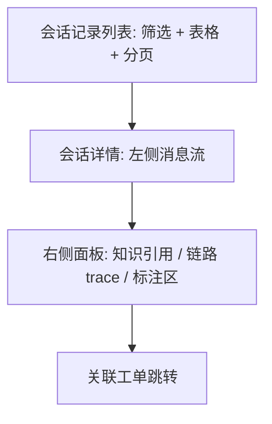

# 10 会话记录（Sessions）

> 所属文档：AI 智能客服系统 需求功能说明书 v1.1（新增模块）
> 必读依赖：`00_总览.md`（全局上下文）、`01_前端总体设计.md`（设计规范）、`03_智能客服.md`、`06_客服工单.md`
> 原型截图：HTML 原型 [`prototype/html/sessions.html`](../prototype/html/sessions.html)（新增，为工作台“今日会话数”跳转目标页；待真实截图替换）
> 本模块待确认问题：全局 #7（会话历史统计口径）

---

## 1. 功能概述

统一查阅管理端会话：会话消息、知识引用、调用链路（intent → 检索 → 重排 → 生成）与关联工单；支持人工标注并回流评测集，与工单、评测形成运营闭环。

## 2. 路由与入口

- 列表：`/sessions`；详情：`/sessions/:id`；侧边栏“会话记录”（一级菜单，新增，侧边栏 7→9 项）；
- 入口来源：工作台“今日会话数”KPI 跳转（`02_工作台.md` §4.1）、工单详情“查看会话记录”（`06_客服工单.md` §4.3）。

## 3. 页面布局

## 4. 元素明细

### 4.1 会话列表

| 元素 | 说明 |
| --- | --- |
| 筛选 | 时间范围、意图、状态（active/closed/transferred）、是否转人工、关键词（会话 ID/消息内容） |
| 表格 | 会话 ID、开始时间、意图、消息数、是否转人工、关联工单号、标注状态 |
| 操作 | 查看详情；空态“暂无会话记录” |

### 4.2 会话详情 - 消息流

| 元素 | 说明 |
| --- | --- |
| 消息流 | 用户/AI/系统消息按时间渲染；AI 消息保留引用编号 [1][2] |
| 引用面板 | 展示引用来源（知识库/文档/页码/分数），含引用反馈状态（正常/已删除/标记无效） |
| 转人工标识 | 转人工消息展示工单号，可跳转工单详情 |

### 4.3 会话详情 - 链路面板

| 元素 | 说明 |
| --- | --- |
| 链路展示 | 按会话/消息展示 `trace_logs`：intent → retrieval → rerank → generate，含各步得分与耗时 |
| 检索明细 | 召回片段、检索分与重排分（混合+重排时） |
| 日志脱敏 | 订单号、手机号、API Key 等脱敏展示 |

### 4.4 标注区

| 元素 | 说明 |
| --- | --- |
| 标注输入 | 标签（多选）、备注 |
| 纳入评测 | 勾选“纳入评测集”并选择目标评测集（或“待确认”） |
| 操作 | 保存后提示成功；标注写入评测集候选（见 `09_应用评测.md` §8） |

## 5. 状态设计

| 状态 | 表现 |
| --- | --- |
| 列表加载中/空态/错误 | 骨架屏 / 空态文案 / 错误提示 + 重试 |
| 详情加载中 | 消息流与链路面板骨架屏 |
| 链路缺失 | “该会话无链路日志”占位 |
| 标注保存中 | 按钮 loading，防重复提交 |

## 6. 交互规则

- 筛选条件组合查询，防抖 300ms；分页默认 10 条/页；
- 点击消息内引用编号联动右侧引用面板；
- 工单号点击跳转工单详情；工单详情反向跳转会话详情；
- 标注保存成功后提示，并可在标注状态下拉中筛选“已标注/未标注”（建议）。

## 7. 业务规则

- 会话数据来自 `sessions / messages / trace_logs`，只读为主，标注为唯一写操作；
- 权限：admin 查看全部会话；agent 仅查看与本人处理工单关联的会话（待确认，见全局 #4）；
- 会话保留策略与日志一致，可配置（见 `07_帮助文档与系统设置.md` §2-日志审计）。

## 8. 验收要点

- 列表筛选/分页正确；工作台 KPI 跳转定位到对应会话；
- 详情消息流、引用、链路、工单跳转正确；
- 标注保存生效，纳入评测集的样本出现在评测集候选；
- 敏感信息脱敏生效，无越权访问（admin/agent 权限校验）。
