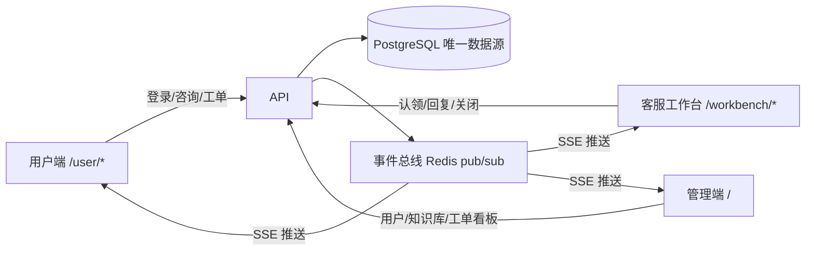

# 11 用户端与客服工作台设计方案

> 所属文档：AI 智能客服系统 需求功能说明 v1.2（增量）
> 前置依赖：`00_总览.md`、`01_前端总体设计.md`、`04_知识库.md`、`06_客服工单.md`、`08_后端详细设计.md`
> 目标：在现有管理端基础上新增「用户端（桌面 Web）」与「客服工作台」，并打通三端实时数据流通。

---

## 1. 背景与目标

现有系统是面向内部运营的管理端：admin 管理系统配置，agent 通过测试对话页验证效果。本方案新增两条业务线：

1. **用户端**：真实客户自助咨询。账号密码自助注册，桌面 Web 优先。
2. **客服工作台**：agent 处理用户转人工后的会话与工单，支持认领、回复、关闭。

核心目标：

- 用户端能发起 AI 对话、查看历史会话、查看工单状态并继续留言；
- 用户转人工后，客服能实时认领、回复，用户端实时收到；
- 管理端能看到并管理用户、客服账号、工单流转与运营数据；
- 三端数据以数据库为唯一事实源，通过事件总线 + SSE 实时同步，保证正确性与实时性。

---

## 2. 总体架构

逻辑三端、工程同一仓库（React + Vite + antd），后端单一 FastAPI 应用：



设计原则：

- **单一数据源**：所有业务数据存数据库，SSE 只通知“有变化，去刷新/拉增量”，不做双写；
- **按角色分流**：登录后按 `role` 跳转（admin→管理端、agent→工作台、user→用户端）；
- **权限下沉到服务层**：行级权限（用户只能看自己的会话/工单）与推送过滤共用同一套规则；
- **先简单后扩展**：MVP 不做复杂分配策略、不做附件、不做小程序，接口预留扩展点。

---

## 3. 账号与认证

### 3.1 角色扩展

`users.role` 增加 `user`：

```text
admin / agent / viewer / user
```

涉及迁移：修改 `users` 表 `ck_users_role` 检查约束；前端 `ROLE_LABELS` 增加 `user: 用户`。

### 3.2 自助注册

- 新增公开接口 `POST /api/auth/register`：账号 + 密码 + 确认密码 + 昵称（可选）；
- 注册默认 `role=user`、`status=active`；
- 用户名规则：长度 4~32，仅字母/数字/下划线/中文，全局唯一；
- 密码规则：长度 8~64，至少包含字母和数字（避免弱口令）；
- 防刷：注册接口独立限流（按 IP + 用户名）+ 简单图形/算术验证码（MVP 可先用算术验证码，后续换短信/图形滑块）；
- 注册成功后直接返回 token（自动登录），或跳转登录页（推荐直接登录，体验更好）。

### 3.3 登录与令牌

- 复用现有 `POST /api/auth/login`、`/api/auth/refresh`；
- 登录失败次数风控：同一用户名连续失败 N 次（建议 5 次）后锁定 15 分钟（记录 `failed_login_count`、`locked_until`）；
- 账号被 admin 禁用后登录直接拒绝；`token_version` 机制已支持改密/禁用后全量失效，用户端同样生效；
- 修改密码：用户端“个人中心”提供改密（校验旧密码），admin 可在管理端重置任意用户密码。

### 3.4 前端令牌隔离

现有前端 token 存在 `localStorage` 的 `ai_cs_access_token` / `ai_cs_refresh_token`。用户端与管理端同域部署时会互相覆盖，必须分开：

- 用户端使用 `ai_cs_user_access_token` / `ai_cs_user_refresh_token`；
- 管理端/客服端保持现有 key；
- axios 拦截器按“当前路由所属端”选择 key（或拆成两个 axios 实例）。

### 3.5 账号归属与行级权限

- 用户端所有会话/工单接口必须按 `session.user_id == current_user.id`（或工单关联会话）过滤；
- 管理端现有 `/sessions`、`/tickets` 接口保持 admin/agent 全量可见，**新增用户端专用接口**（`/api/user/...`），不要直接放开现有管理接口给 user，避免字段泄漏（内部字段如 intent、cited_chunk_ids、trace 不应暴露给用户端）。

---

## 4. 用户端设计（桌面 Web）

### 4.1 页面结构

```text
顶部导航：Logo | 在线咨询 | 我的工单 | 个人中心 | 用户名▾（退出）

在线咨询页（左右两栏）：
  左栏：最近会话列表 + [＋ 新会话]
  右栏：对话流（用户/AI/人工 气泡）+ 引用折叠 + 转人工状态条 + 输入框

我的工单页：
  列表：工单号 | 状态标签 | 优先级 | 最后更新时间
  详情：完整对话流 + 工单状态流转 + 满意度评价入口

个人中心：
  昵称/账号信息 | 修改密码 | 退出登录
```

### 4.2 会话流程

- 用户进入“在线咨询”即创建/恢复最近一个 active 会话（`channel=web_user`）；
- **用户端不选择知识库**：`kb_ids` 由后端按渠道配置决定（见 §8），chat 接口对 user 角色忽略前端传入的 `kb_ids`，防止越权指定库；
- 会话上限：同一用户同时最多 1 个 active 会话（可配置），避免刷会话；
- 消息限制：长度 ≤ 500 字（沿用现有），发送频率受 `chat_rate_per_minute` 限流约束；
- 引用展示：用户端折叠展示“来源：文件名”，不暴露 chunk 内部字段；
- 转人工后：沿用现有“可继续留言、AI 不再回复”的行为，输入区上方显示状态条。

### 4.3 状态与异常体验

- 加载中 / 空状态 / 网络错误要有明确反馈，SSE 断线自动重连并提示“连接已恢复”；
- 服务不可用（LLM/Embedding 故障）时，回复降级文案应友好（“暂时繁忙，请稍后再试”），不展示堆栈/内部错误；
- 内容审核命中时给出中性提示，不泄露审核细节。

### 4.4 满意度评价

- 工单关闭后，用户可对本次服务评价一次：1~5 星 + 可选文字；
- 新建表 `ticket_ratings`（ticket_id 唯一约束保证只能评一次）；
- 客服端/管理端可查看评分，运营侧可统计。

---

## 5. 客服工作台设计

### 5.1 页面结构

```text
顶部：队列筛选（全部 | 待处理 | 处理中 | 我负责的）+ 客服在线/离线切换 + 用户信息

左栏：工单/会话列表（工单号、用户、摘要、未读红点、优先级色标）
中栏：对话流（用户 / AI / 人工 三种角色气泡）+ 回复输入框
右栏：工单信息（状态、优先级、创建时间、用户资料、关闭原因、满意度）
```

### 5.2 工单状态机与认领

```text
open（待处理）--认领--> processing（处理中）--关闭--> closed（已关闭）
```

- **认领并发控制**：使用原子条件更新，防止两个客服同时认领同一单：

```sql
UPDATE tickets
SET assignee_id = :me, status = 'processing', claimed_at = now()
WHERE id = :ticket_id AND status = 'open';
```

影响行数为 0 时提示“该工单已被其他客服认领”，前端刷新队列；

- 关闭工单：仅 assignee 或 admin 可关闭，必须填写关闭原因（如“已解决/用户放弃/重复工单”）；
- 客服离线时：已认领的工单仍在“我负责的”队列；未认领工单继续留在“待处理”；
- 二期可扩展：转派（assignee 变更）、备注、快捷回复、话术库。

### 5.3 未读与通知

- 服务端记录“各端已读游标”：新表 `session_reads`（session_id, reader_role, reader_id, last_read_message_id）；
- 未读数 = `count(messages.created_at > last_read 且 role 属于对方)`；
- 用户端、客服端分别维护自己的游标；收到 `message.new` 事件后刷新未读数。

---

## 6. 管理端扩展

- 「账号权限」Tab：角色下拉增加 `user`；列表增加“渠道/最后登录时间”列（可选）；
- 「客服账号管理」：沿用现有用户管理，创建 agent 账号即可（无需新页面）；
- 「工单看板」：新增只读看板页（admin 可用），实时展示工单总量/待处理/处理中/今日关闭、认领超时提醒；
- 「渠道配置」：新增系统配置（见 §8），维护渠道→默认知识库、是否允许转人工、营业时间等；
- 现有仪表盘/评测/知识库/模型配置保持不变。

---

## 7. 数据模型变更清单

| 表 | 变更 | 说明 |
|---|---|---|
| users | role 加 `user`；新增 `failed_login_count`、`locked_until`（可选） | 约束迁移 |
| messages | role 加 `agent` | 约束迁移；人工回复 |
| tickets | 新增 `claimed_at`、`closed_at`、`close_reason`（可选） | 认领/关闭时间与原因 |
| session_reads（新） | 各端已读游标 | 未读计数 |
| ticket_ratings（新） | 满意度评价，ticket_id 唯一 | 工单关闭后评价 |
| settings | 渠道配置（channel→kb_ids、allow_human、business_hours） | 用户端默认知识库 |

> 迁移全部走 Alembic，与现有 `000x_*.py` 风格一致；修改 check 约束用 `ALTER TABLE ... DROP CONSTRAINT / ADD CONSTRAINT`。

---

## 8. 用户端知识库策略

- 后端维护“渠道 → 默认知识库列表”配置（MVP 用 `settings` 表或环境变量，一期先支持全局默认库）；
- 用户端会话创建时由后端写入 `session.kb_ids`，用户端接口不接受/忽略 kb_ids；
- 知识库 `visibility` 已有 `all/role/user` 三种模式：需要按用户差异化时配置 `visible_user_ids`，检索复用现有 `filter_accessible_kb_ids`；
- 用户端引用展示只输出“来源文件名”，chunk 详情仅管理端/客服端可见。

---

## 9. 实时性设计（事件总线 + SSE）

### 9.1 事件清单（第一版）

| 事件 | 触发 | 推送范围 |
|---|---|---|
| ticket.created | 用户转人工/建单 | 客服端、管理端 |
| ticket.claimed | 客服认领 | 用户端（状态变化）、管理端 |
| message.new | 用户/AI/客服发消息 | 会话相关方（用户端 + 该会话 assignee） |
| ticket.closed | 关闭工单 | 用户端、管理端 |
| ticket.updated | 优先级/状态等变更 | 相关方 |

### 9.2 订阅端点

`GET /api/stream/events?scope=user|agent|admin`（SSE）

- `scope=user`：只推当前用户相关会话/工单事件；
- `scope=agent`：推待处理工单 + 自己负责的工单事件；
- `scope=admin`：全量事件（可加筛选参数）。

服务端在事件发布时按 scope + 归属做过滤，杜绝跨用户泄漏。

### 9.3 可靠性要点

- **幂等**：事件带 `event_id`/`ticket_id`/`message_id`，前端按 event_id 去重；
- **断线重连**：浏览器 EventSource 自动重连，重连成功后前端拉一次增量（按 `updated_at > last_sync` 或本地游标）；
- **心跳**：SSE 每 15~30s 发 `ping` 注释行保持连接；
- **多实例**：单机用进程内事件总线；多实例部署切换 Redis pub/sub（接口不变），Redis 已有；
- **顺序**：同会话事件按 `created_at` 排序，前端插入时按时间兜底排序；
- 聊天消息本身仍走现有 chat SSE（流式），事件流只做“列表/未读/状态”的轻量同步，避免两套消息渲染冲突。

---

## 10. 安全与合规

1. **行级权限**：用户端只能访问自己的会话/工单；客服端只能访问待处理或自己负责的工单；所有“按 ID 查详情”接口都要校验归属；
2. **字段最小化**：用户端响应模型不包含 intent、cited_chunk_ids、trace、escalation_count 等内部字段；
3. **注册防刷**：注册限流 + 验证码 + 用户名唯一；
4. **密码安全**：bcrypt 哈希（现有）、强度校验、改密后 token_version+1；
5. **内容安全**：复用现有 `check_text` 内容审核与 `check_prompt_injection`，用户端输入更需严格（公开入口）;
6. **XSS**：前端 React 默认转义；SSE/JSON 内容不直接注入 HTML；富文本一律禁用；
7. **审计**：管理端操作审计已有；用户端关键操作（注册、改密、关闭工单）写入 audit_logs；
8. **日志脱敏**：日志不打印密码/API Key/token；用户手机号（二期）脱敏展示；
9. **注销/删除**（二期）：用户可申请注销，管理端可删除用户（软删 + 匿名化会话归属）。

---

## 11. 监控与运维

- 复用 Prometheus 指标：新增 ticket 认领/关闭、SSE 连接数/断线率、事件积压；
- 告警：待处理工单超过 N 分钟未认领（管理端横幅 + 可选邮件/Webhook，二期）；
- 日志：按会话/工单号关联检索（现有 trace_logs 机制扩展）；
- 灰度：先对内部测试用户开放 user 角色，稳定后再放开自助注册。

---

## 12. 测试策略

必须覆盖的用例：

| 场景 | 用例 |
|---|---|
| 并发认领 | 两个客服同时认领同一工单，仅一个成功 |
| 权限隔离 | 用户 A 无法读取/订阅用户 B 的会话与工单事件 |
| 转人工闭环 | 用户转人工 → 客服端出现事件 → 认领 → 回复 → 用户端实时收到 → 关闭 → 评价 |
| 实时性 | SSE 断线重连后未读/状态一致（幂等） |
| 注册防刷 | 同 IP 高频注册被限流 |
| 回归 | 现有管理端 chat/知识库/评测/设置全量回归 |

---

## 13. 分期实施计划

| 阶段 | 内容 | 交付物 |
|---|---|---|
| P0（MVP） | role=user、自助注册、用户端桌面页（登录/咨询/工单/个人中心）、chat 接口放开 user + 行级过滤、渠道默认知识库配置 | 用户端可用，AI 对话 + 历史会话 + 工单查看 |
| P1 | 客服工作台（队列/认领/回复/关闭）、message role=agent、事件总线 + SSE、未读游标、管理端工单看板 | 转人工闭环，三端实时 |
| P2 | 满意度评价、转派/备注/快捷回复、账号风控增强、小程序/多端、注销与合规完善 | 运营闭环 |

---

## 14. 待确认事项

1. 用户端是否需要“常见问题/公告”首页（MVP 可直接进在线咨询页）；
2. 注册验证码形式：算术验证码（最快）还是短信（需接服务商，二期）；
3. 是否限制用户同时活跃会话数（默认 1）；
4. 客服在线/离线状态是否纳入 MVP（影响用户端“当前人工是否可接入”的展示）；
5. 工单超时未认领提醒是否纳入 P1。

---

## 15. 变更记录（实施后追加）

> 与原始设计保持一致，仅记录实施阶段的【变更】【新增】决策。

- 【变更】登录入口：`/login` 升级为统一登录页，登录后按角色分流（user→/user/chat、agent→/workbench、admin→/dashboard），token 按角色写入对应端 localStorage key，令牌隔离（§3.4）不变；`/user/login` 保留为用户端品牌入口。
- 【新增】工单释放：`POST /api/agent/tickets/{id}/release`（assignee/admin）将处理中工单释放回待处理，清空负责人与认领时间，写 ticket_notes 留痕并发 ticket.updated 事件。
- 【变更】工单职责分离（默认硬隔离）：admin 不再参与认领/回复/关闭/释放等一线操作，仅只读（列表/详情/看板/统计）；配置项 `ALLOW_ADMIN_TICKET_OPS=true` 可临时开放（写审计）。管理端工单页改为只读 + 跳转客服工作台。
- 【变更】viewer 只读范围收敛：viewer 仅保留工作台与帮助，会话/工单读接口返回 403。
- 【新增】工单写操作（认领/回复/关闭/释放）统一写审计日志 `audit_logs`。
- 【变更】会话标注：客服标注仅产生评测集候选（pending），指定 `eval_set_id` 仅 admin。
- 【变更】agent 界面只读知识库：知识库/文档/Chunk 写按钮按角色隐藏（后端写权限本就仅 admin）。
